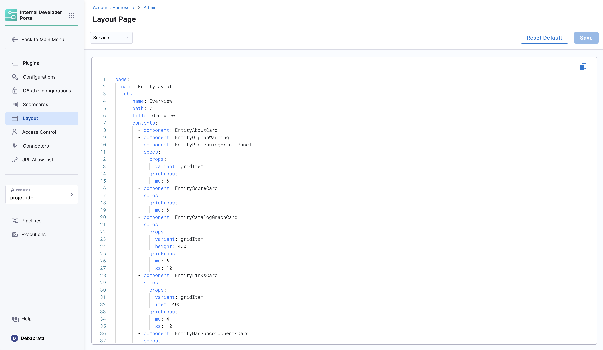

## Introduction

In Harness IDP we take care of the UI configuration for your plugins and core-features, unlike that of Backstage where you need to update the entity pages in the app. But while doing so we don't take away your ability to configure the catalog cards, tabs and side bar instead we auto-ingest most of the values once the plugins are enabled and those values can be further configured according to your needs. 

## Layout Page

The **Layout** page is under the **Admin** section and is a comprehensive and modular interface designed for plugins as well as core features, leveraging YAML for a dynamic and interactive user experience. This document provides detailed information about the layout, its components, and usage.



## Layout YAML Configurations

Layout YAMLs are customizable configurations used to control the rendering of different kinds of entity pages in the IDP. They offer a straightforward and declarative way of defining the layout. There are two primary types of layouts in Harness IDP:

1. `Entity Page Layouts`: These configurations are for different kinds of entity pages.
2. `Other Layouts`: This mainly includes sidenav configuration.

### Entity Page Layouts
Entity Page Layouts are defined in a hierarchical structure starting with the "page" key, representing the entity page. Each page consists of "tabs," an array that controls the rendered tabs for the entity page. Within each tab, there is a "contents" array responsible for rendering the contents within that specific tab.

- **"page"** represents the entity page and contains the configuration for the tabs.
- **"tabs"** is an array that defines the rendered tabs for the entity page.
- **"contents"** is an array that specifies the components rendered within a tab.
- **"component"** represents an individual component to be rendered.
- **"specs"** contains additional properties and configurations for the component.
- **"props"** specifies the props (properties) for the component.
- **"gridProps"** provides grid-related properties for arranging items in a grid structure.
- **"cases"** is a property specific to the "EntitySwitch" component, allowing conditional rendering based on specified conditions.

### Example of Entity Page Layout

```YAML
page:
  name: EntityLayout
  tabs:
    - name: Overview
      path: /
      title: Overview
      contents:
        - component: EntityOrphanWarning
        - component: EntityProcessingErrorsPanel
        - component: EntityAboutCard
          specs:
            props:
              variant: gridItem
            gridProps:
              md: 6
        - component: EntityCatalogGraphCard
          specs:
            props:
              variant: gridItem
              height: 400
            gridProps:
              md: 6
              xs: 12
    - name: TechDocs
      path: /docs
      title: Docs
      contents:
        - component: EntityTechdocsContent
          specs:
            children:
              - component: TechDocsAddons
                specs:
                  children:
                    - component: ReportIssue
```
#### Overview Tab

```YAML
Path: /
Title: Overview
Components:
    EntityAboutCard: Provides a brief about the entity.
    EntityOrphanWarning: Displays warnings for orphan entities.
    EntityProcessingErrorsPanel: Shows processing errors in a panel layout.
Props: 
  variant: gridItem
GridProps: 
  md: 6
EntityScoreCard: Displays scores and metrics related to the entity.
GridProps: 
  md: 6
```
### CI/CD Tab

```YAML
Path: /ci-cd
Title: CI/CD
Components:
EntitySwitch: Dynamically displays CI/CD information based on service availability.
```
#### Additional Tabs
API, Deps, Scorecard, TechDocs, EntityGithubPullRequestsContent, EntityKubernetesContent, DynatraceTab: Each of these tabs follows a similar structure, containing components specific to their functionality.

### Side Nav Layout

The Side Nav Layout configuration file also follows a hierarchical structure, starting with the **"page"** key.

- **"page"** represents the main page container.
- **"children"** is an array that defines the components or sections to be rendered within the page.
- **"name"** can be SidebarItem or SidebarDivider.
- **"to"** is the URL.
- **"text"** is the text that will be shown in the sidenav.

### Example of Side Nav Layout

```YAML
page:
  children:
    - name: SidebarDivider
    - name: SidebarItem
      props:
        to: overview
        text: Overview
```
## Entity Kind & Type Mapping in Layouts

You can find all the layout configurations in the IDP Admin layout section. Here is a mapping of the entity kind to layout:


|     **Entity Kind & Type**        |     **Configuration in Layouts Page**     |
| --------------------------------- | ----------------------------------------- |
| kind: Component & type: service   | Service                                   |
| kind: component & type: website   | Website                                   |
| kind: group                       | Group                                     |
| kind: user                        | User                                      |
| kind: system                      | System                                    |
| kind: domain                      | Domain                                    |
| default                           | Default                                   |

## Understanding md Units in Grid Layouts
- Grid System: We use a 12-column grid system for responsive layouts. Where md is the recommended unit, and `md: 1` stands for 1/12th of the grid. Alos you can used lg as well. 
- Optimal Sizes: For medium devices, common sizes are md: 4, md: 6(half of the page), or md: 8. 

## Best Practices
- Use md to ensure components are appropriately sized on different devices.
- Combine different size units for comprehensive coverage across devices.

## Troubleshooting
- Component Not Rendering: Check for correct `props`.
- Layout Issues: Adjust `gridProps` for responsive design.
