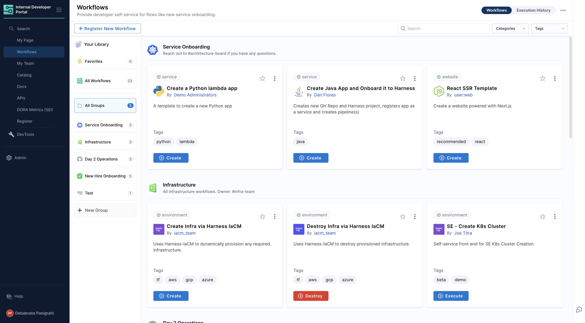
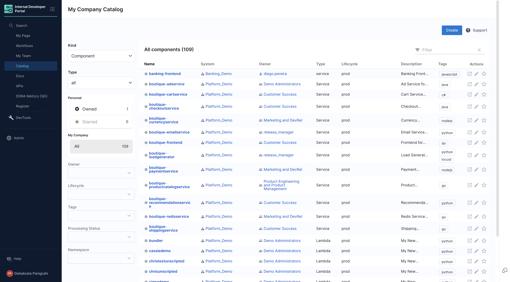
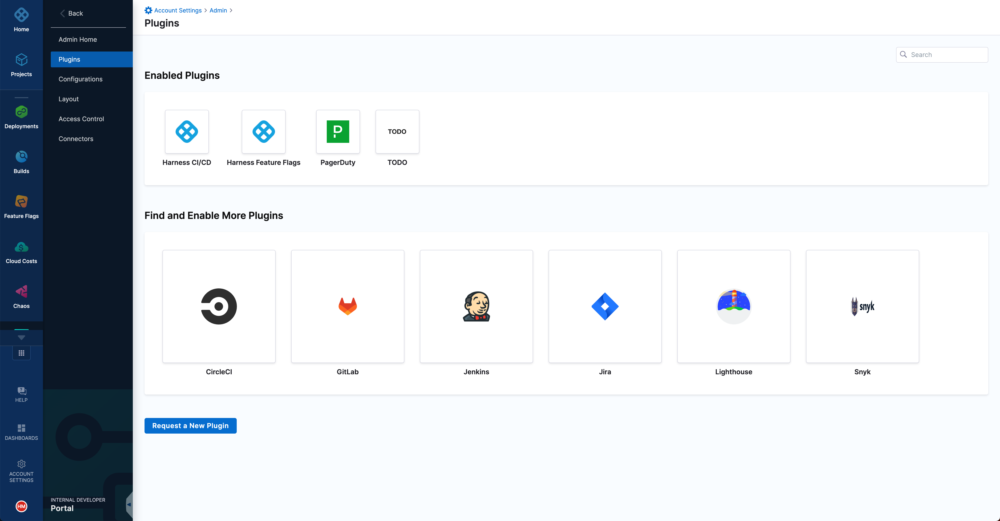
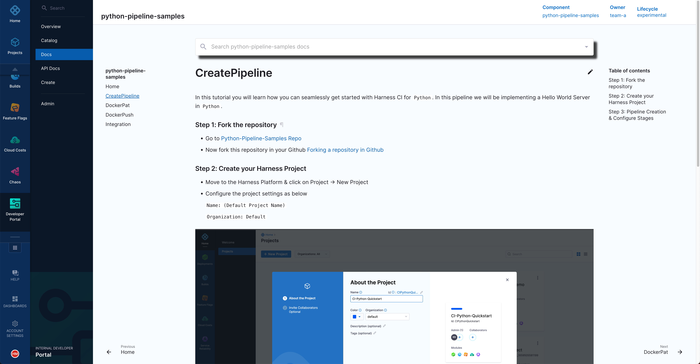
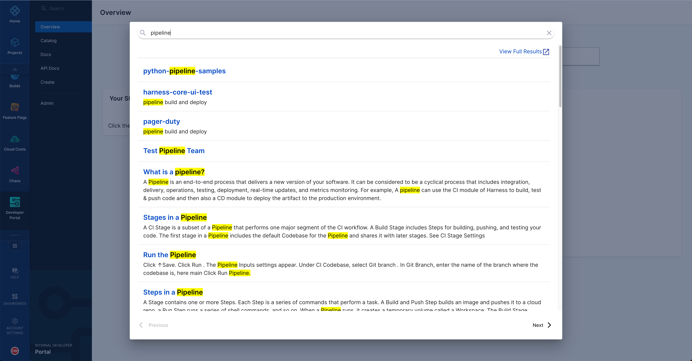

# Harness IDP Overview

Harness IDP enables you to create new software components quickly while adhering to your company’s best practices. It enables you to manage the software you own by presenting a developer-centric view of all relevant information such as service health, deployments, and alerts. It also enables you to explore the internal software ecosystem of the company, discover technical documentation, APIs, and services, all of which enable better collaboration.

Fully integrated into the Harness platform, IDP reduces the maintenance overhead and investment required from platform engineering teams and is enterprise ready.

<DocVideo src="https://www.youtube.com/embed/sVnI93bCr38?si=MpENxU9qv3me28cv" />

## Demo

Here is a short 4-minute demo of the Harness Internal Developer Portal (IDP) module and all its features.

<DocVideo src="https://www.youtube.com/embed/r9urqE--aNs?si=GsophnYs-IlLfao2" />

For a live and in-depth demo, please [reach out](https://www.harness.io/demo/internal-developer-portal?utm_source=harness_io&utm_medium=cta&utm_campaign=idp&utm_content=hero) to us.

# Key features

## Workflows

As a platform engineer, you can orchestrate the onboarding of services by creating pipelines in the Harness Pipeline Studio. On the other hand, as a developer, you can create a new backend service, API, or website by submitting a few details as configured by your platform engineering. Developers focus on what they do best, which is writing features, while Platform engineers focus on creating software templates, automating processes, and enforcing standards.

## Software catalog

The software catalog is a centralized registry for all your software (services, websites, libraries, data pipelines, and so on), and it helps you track their ownership, metadata, and dependencies. The catalog is built from metadata YAML files, each of which is stored with its code and owned by a team.

## Scorecards

Scorecards play a pivotal role in ensuring software components are developed and utilized while adhering to organizational and industry standards. They provide a quantifiable measure of software maturity and adherence to best practices, thereby aiding developers in enhancing quality and assisting teams in making informed decisions regarding software adoption.

## Extensibility through plugins

Harness IDP includes curated plugins. You can choose the plugins you need based on the tools that you use. The plugins enable you to customize a software component on the basis of its type, and to present all information relevant to developers in a single view. Harness IDP’s plugin library is based on the hundreds of open-source Backstage plugins available in the marketplace.

## Technical documentation

The ability to use the docs-like-code approach enables developers to deliver documentation alongside their software component. As a developer, you write your documentation in Markdown and commit it with your code. Other developers can then find your documentation with little effort. The docs-like-code approach ensures that documentation does not get outdated, and the Docs tab in the software catalog makes it discoverable and accessible by a single click.

## Search

As a developer, you can use the search functionality in Harness IDP to explore your entire software ecosystem and find the services, APIs, libraries, metadata, and documentation you need. When you know who owns the resource you need, you no longer have to rely on rumor-driven development.
