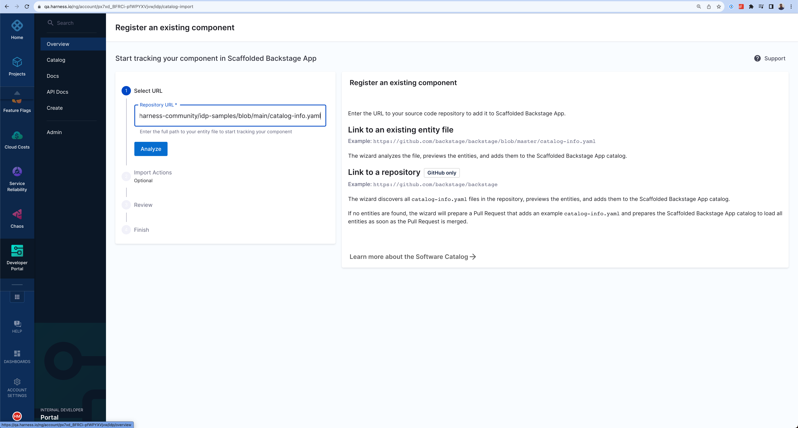
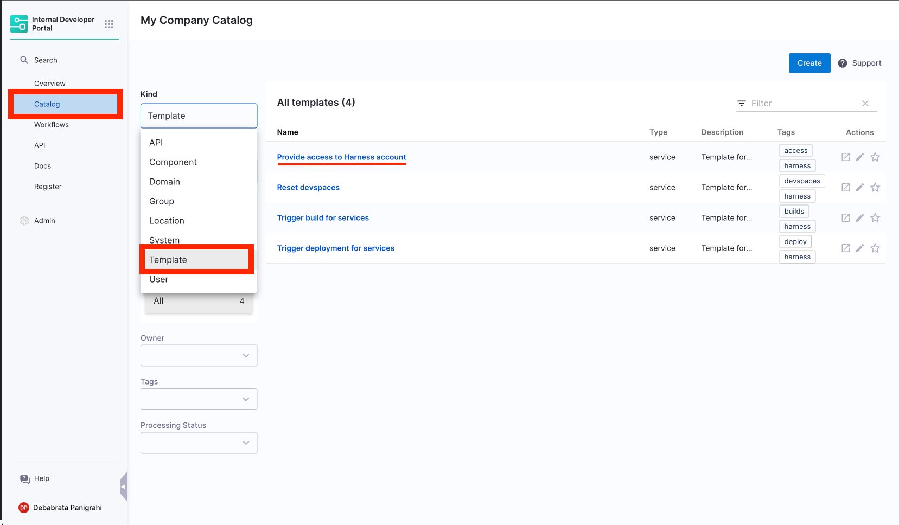

<DocsTag  backgroundColor= "#cbe2f9" text="Tutorial"  textColor="#0b5cad"  />

Let's start with adding your software components to IDP. You can do so by creating a `catalog-info.yaml` file in your Git repository and then registering its URL.

<DocVideo src="https://www.youtube.com/embed/YgtIMDGMzJE?si=AYnisVn-lHX-4STw" />

## Create a new catalog-info.yaml

1. If you want to register an existing software component, navigate to its repository. If it is a mono-repo, navigate to its directory and create a `catalog-info.yaml` at the root of the directory. The file can technically live anywhere (for example, `.harness/catalog-info.yaml`). You can use the following YAML code:

```yaml
apiVersion: backstage.io/v1alpha1
kind: Component
metadata:
  name: my-new-service
  description: Description of my new service
  annotations:
    pagerduty.com/integration-key: <sample-service-integration-key>
  tags:
    - java
  links:
    - url: https://admin.example-org.com
      title: Admin Dashboard
      icon: dashboard
      type: admin-dashboard
spec:
  type: service
  lifecycle: production
  owner: team-a
  system: project-x
```

Following are the key fields that you must update:

- `metadata.name`. This should be a unique name for your component. Usually, it is the name of the service.
- `metadata.description` - A description for your new component.
- `spec.type` - The new software component could be a `service`, `library`, `website`, or any other type.
- `spec.owner` - The user group identifier of the team that owns the component.

2. Once the file is created in your Git repo, copy the full URL to the file. For example, `https://github.com/harness-community/idp-samples/blob/main/catalog-info.yaml`.

## Register the software component

3. In the left navigation, select **Register**.


import Tabs from '@theme/Tabs';
import TabItem from '@theme/TabItem';


<Tabs queryString="Git-Provider">
<TabItem value="other-git-provider" label="Other Git Providers">

4. Enter the URL to your new `catalog-info.yaml`.



</TabItem>
<TabItem value="harness-code-repo-enabled" label="Harness Code Repository">

4. Copy the URL for `catalog-info.yaml` and paste it on the field to Register the component. 


> Note: In case of vanity URLs, once you copy the URL for `catalog-info.yaml` from Harness Code Repository, make sure to replace vanity URL domain with `accounts.eu.harness.io`


</TabItem>
</Tabs>


5. Select **Import**.


The new component will be available in your catalog.


## Register multiple software components together

We can register multiple `catalog-info.yaml` in the following ways.

1. If all your `catalog-info.yaml` are in the root of the same repo you can add the extensions in the target, as shown in the example below and it will register all the components.

```YAML
apiVersion: backstage.io/v1alpha1
kind: Location
metadata:
  name: example-all
  description: A collection of all Backstage example entities, except users, groups, and templates
spec:
  targets:
    - ./all-apis.yaml
    - ./all-components.yaml
```

2. If the `catalog -info.yaml` is scattered across repos and you want to register them together then mention the absolute path in the git provider. Please make sure the **connector** you have created has **account level permissions** and all the repos mentioned under targets are under that **same account**.

```YAML
apiVersion: backstage.io/v1alpha1
kind: Location
metadata:
  name: food-delivery
  description: A collection of all example entities, except users, groups, and templates
spec:
  targets:
    - https://github.com/account-name/location-service/blob/main/catalog-info.yaml
    - https://github.com/account-name/member-service/blob/main/catalog-info.yaml
    - https://github.com/account-name/delivery-service/blob/main/catalog-info.yaml
    - https://github.com/account-name/order-service/blob/main/catalog-info.yaml
    - https://github.com/account-name/menu-service/blob/main/catalog-info.yaml
```

## Delete/Unregister Software Components

1. Navigate to the **Catalog** page, and select **Component** under Kind, here we are de-registering a template



2. Select the Workflow Name you want to Unregister.
3. Now on the Workflow overview page, click on the 3 dots on top right corner and select **Unregister Entity**.


4. Now on the Dialog box select **Unregister Location**.


5. This will delete the Workflow.

## Troubleshooting: Failed to register

If, after registering an entity, you're unable to find the same in your catalog, check the Devtools Plugin for Unprocessed Entities. If it's under the **Pending** tab, wait a few minutes for registration to complete. If it's under the **Failed** tab. Try re-registering the entity.


