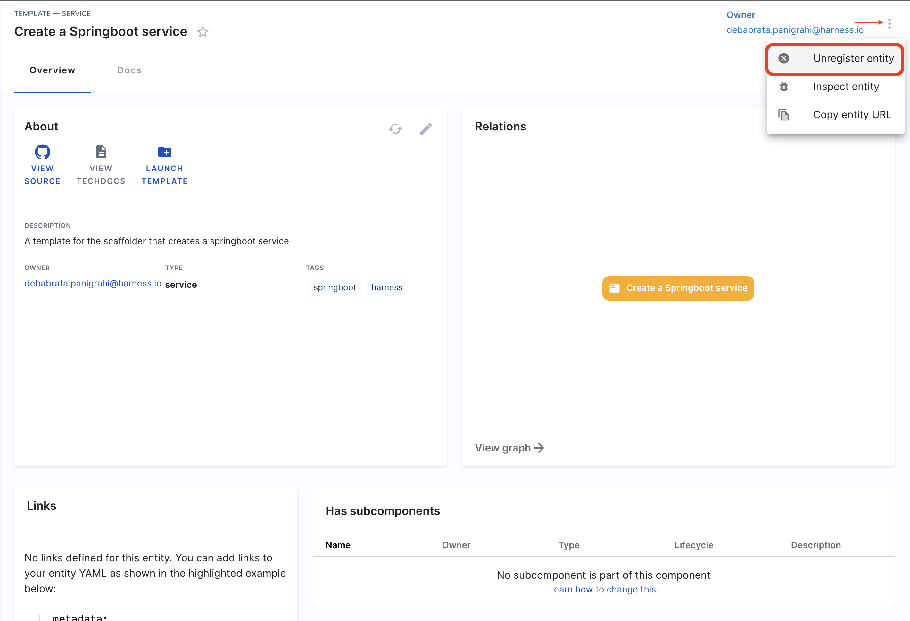

## Introduction

In Harness IDP, software components represent entities within your organization's ecosystem, such as services, libraries, APIs, or other resources. These components are defined in a `catalog-info.yaml` file, which describes their metadata, ownership, relationships, and lifecycle.

Let's start by adding your software components to IDP. To do this, create a `catalog-info.yaml` file in your Git repository and register its URL to add the component to your catalog.

<DocVideo src="https://www.youtube.com/embed/YgtIMDGMzJE?si=AYnisVn-lHX-4STw" />

## Create a new catalog-info.yaml

1. To add a software component, you need to create a `catalog-info.yam` file in its repository. In the case of a mono-repo, this file should be created at the root of the repository. While the file can technically reside anywhere (e.g., `.harness/catalog-info.yaml`), placing it in a standard location ensures consistency. You can use the following YAML code as a template:

```YAML
apiVersion: backstage.io/v1alpha1
kind: Component
metadata:
  name: my-new-service
  description: Description of my new service
  tags:
    - java
  links:
    - url: https://admin.example-org.com
      title: Admin Dashboard
      icon: dashboard
      type: admin-dashboard
spec:
  type: service
  lifecycle: production
  owner: team-a
  system: project-x
```

Following are the key fields that you must update:

- `metadata.name`. This should be a unique name for your component. Usually, it is the name of the service.
- `metadata.description` - A description for your new component.
- `spec.type` - The new software component could be a `service`, `library`, `website`, or any other type.
- `spec.owner` - The user group identifier of the team that owns the component.

2. Once the file is created in your Git repo, copy the full URL to the file. For example, `https://github.com/harness-community/idp-samples/blob/main/catalog-info.yaml`.

## Register the software component

1. Next, navigate to your Harness IDP module, and from the left navigation menu, select **Register**.


import Tabs from '@theme/Tabs';
import TabItem from '@theme/TabItem';


<Tabs queryString="Git-Provider">
<TabItem value="other-git-provider" label="Other Git Providers">

2. Enter the URL to your new `catalog-info.yaml`.


</TabItem>
<TabItem value="harness-code-repo-enabled" label="Harness Code Repository">

2. Copy the URL for `catalog-info.yaml` and paste it on the field to Register the component. 


</TabItem>
</Tabs>

3. Select **Import**.


The new component will be available in your catalog.


 

## Delete/Unregister Software Components

// Update the images 

1. Navigate to the Catalog page and select Component under Kind. Here, we will deregister the software component registered above.


2. Select the component name you want to Unregister from the list
3. Now on the component overview page, click on the 3 dots on top right corner and select **Unregister Entity**.



4. Now on the Dialog box select **Unregister Location**.


5. This will delete the software component.

## Troubleshooting 

#### Failed to register

If, after registering an entity, you're unable to find the same in your catalog, check the Devtools Plugin for Unprocessed Entities. If it's under the **Pending** tab, wait a few minutes for registration to complete. If it's under the **Failed** tab. Try re-registering the entity.


#### Missing required fields/Invalid YAML schema.

In case of a `InputError`, check for `missingProperty` details and add the required property to your `catalog-info.yaml`.


