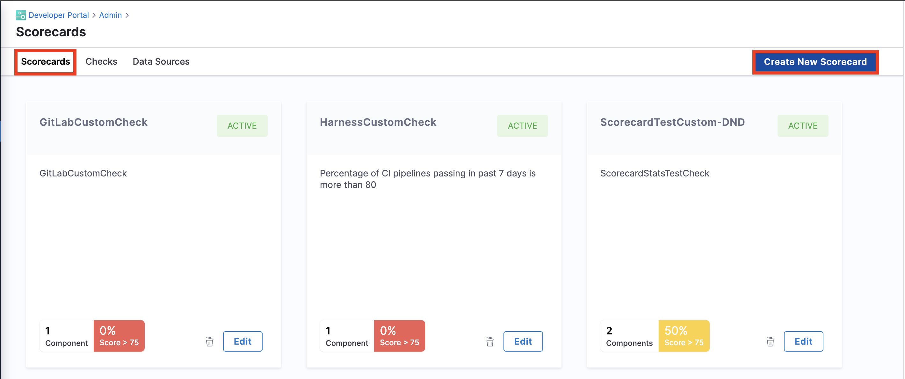
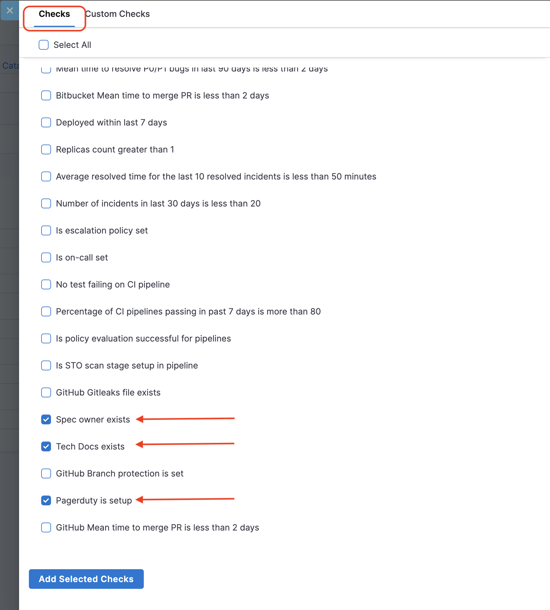
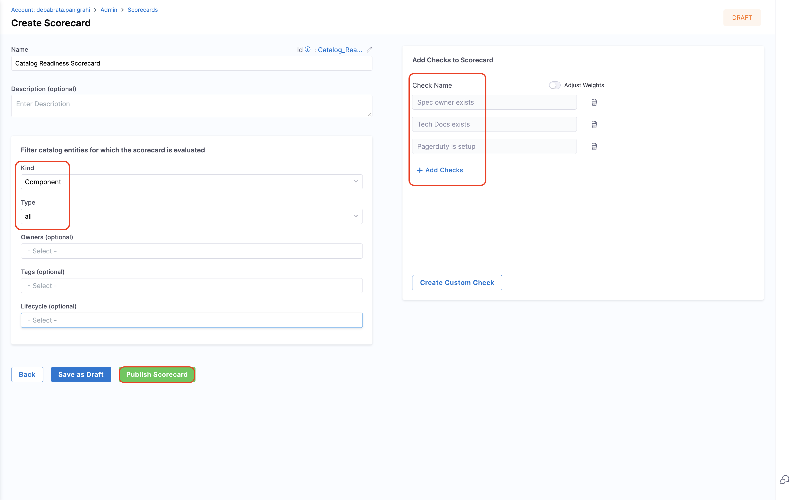
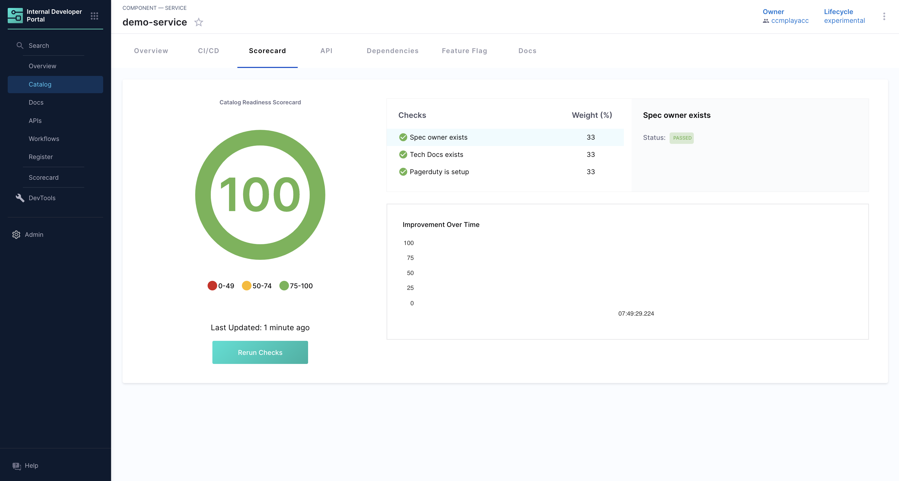
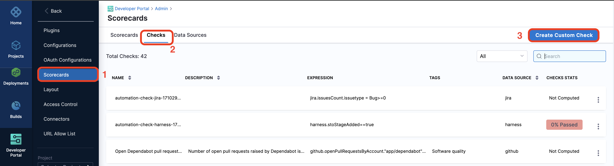
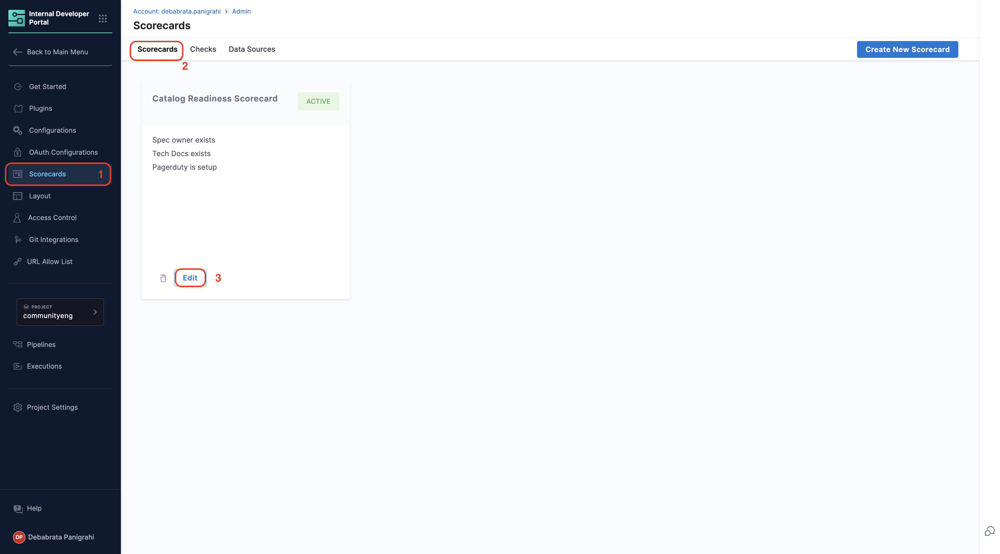
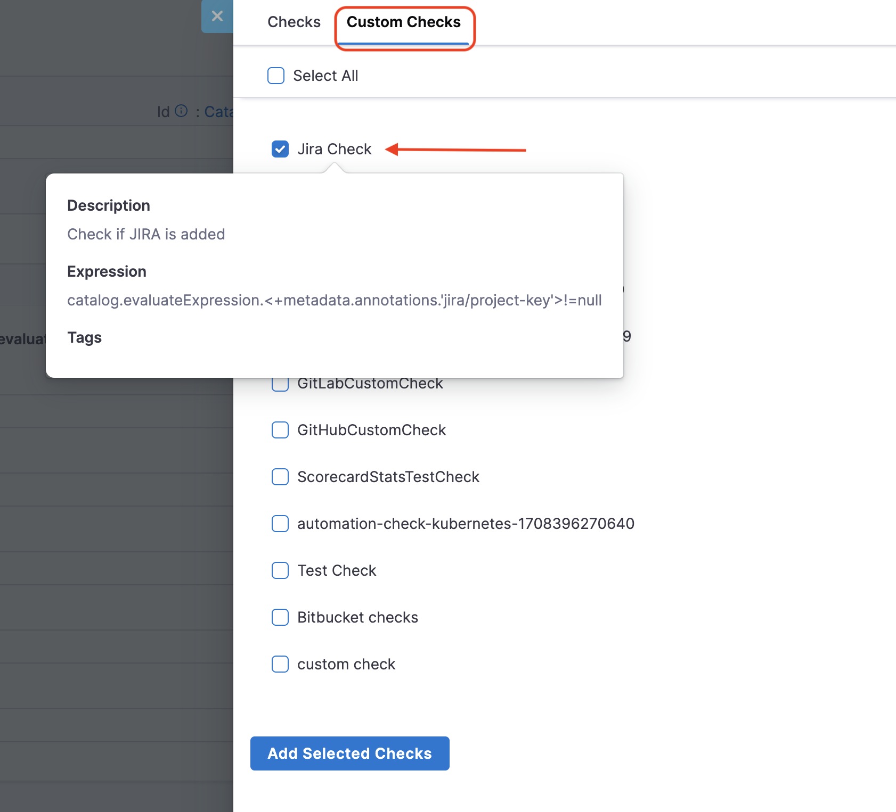
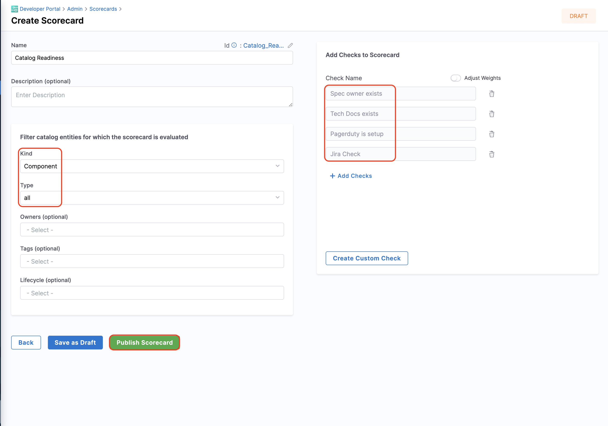
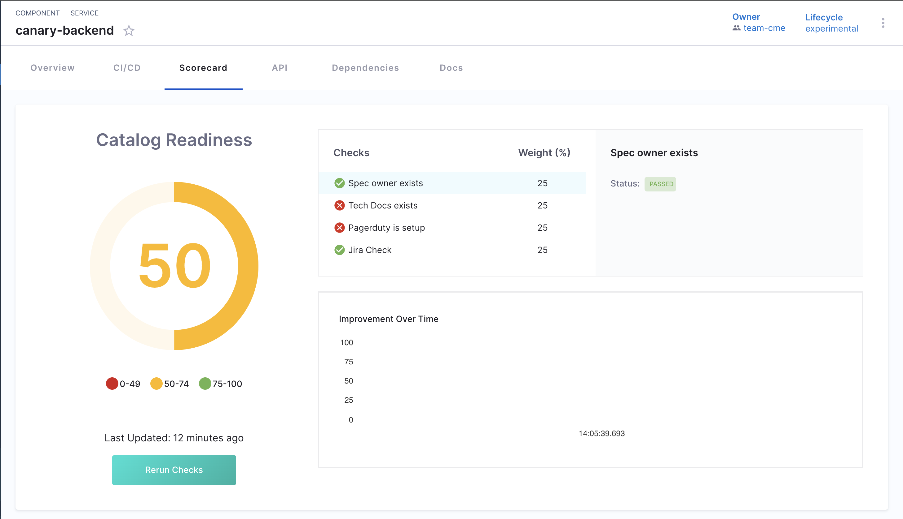

## Introduction

With your [catalog populated with software components](/docs/internal-developer-portal/get-started/register-a-new-software-component) and [plugins enabled](/docs/internal-developer-portal/get-started/enable-a-new-plugin), it's time to create a scorecard. Using the [catalog datasource](https://developer.harness.io/docs/internal-developer-portal/scorecards/checks-datasources#catalog), you can monitor the existence of essential root fields and integrations defined through annotations in the catalog-info.yaml metadata. Tracking this information within the catalog helps to enforce organizational engineering standards.

## Create a catalog readiness Scorecard

The Catalog Readiness Scorecard evaluates the completeness and quality of metadata for software components within the catalog. It helps teams ensure that their components adhere to best practices, meet organizational standards, and provide the necessary information for discoverability, integration, and automation.

Key aspects of the Catalog Readiness Scorecard:

1. Metadata Completeness:
The scorecard assesses if required fields like `name`, `owner` and `annotations` are present in the component's `catalog-info.yaml`. These fields enable proper categorization and ownership tracking.

2. Custom Checks:
Organizations can define custom criteria for readiness, such as ensuring the presence of specific annotations (e.g., Jira Plugin annotations for integration) or required relationships (e.g., linked APIs or documentation).

### Pre-requisite

1. Make sure you have the [IDP Admin](https://developer.harness.io/docs/internal-developer-portal/rbac/resources-roles#1-idp-admin) or [IDP Platform Engineer](https://developer.harness.io/docs/internal-developer-portal/rbac/resources-roles#2-idp-platform-engineer) role assigned to you with permissions to view, create and edit [scorecards](https://developer.harness.io/docs/internal-developer-portal/rbac/resources-roles#1-scorecards)

2. Register a software component following the steps mentioned [here](https://developer.harness.io/docs/internal-developer-portal/catalog/register-software-component), if you already have software components registered in your catalog you can move directly to creating a Scorecard. Here's an example of `catalog-info.yaml` we will be using for this tutorial.

<details>
<summary>Example YAML</summary>

```YAML
#Example
apiVersion: backstage.io/v1alpha1
kind: Component
metadata:
  name: demo-service
  description: pipeline build and deploy
  annotations:
       harness.io/project-url: https://app.harness.io/ng/account/vpCkHKsDSxK9_KYfjCTMKA/cd/orgs/default/projects/PREQA_NG_Pipelines/
       jira/project-key: IDP
       github.com/project-slug: Debanitrkl/backstage-test
       backstage.io/techdocs-ref: url:https://github.com/backstage/backstage/tree/master/plugins/techdocs-backend/examples/documented-component
       pagerduty.com/service-id: QWERTY
       pagerduty.com/integration-key: ASDFGHJKL
  tags:
    - java
  
  links:
    - url: https://example.com/cloud
      title: Link with Cloud Icon
      icon: cloud
    - url: https://example.com/dashboard
      title: Dashboard
      icon: dashboard
    - url: https://example.com/help
      title: Support
      icon: help
    - url: https://example.com/web
      title: Website
      icon: web
    - url: https://example.com/alert
      title: Alerts
      icon: alert
spec:
  type: service
  lifecycle: experimental
  owner: idp-dev
```
</details>

### Create Scorecard

1. Go to **Scorecards** under **Admin** and **Create a New Scorecard**.



2. Now add the following available checks
    - Spec owner exists
    - Tech Docs exists
    - Pagerduty is setup



3. For **Filter catalog entities for which the scorecard is evaluated** select the kind as **Component** and type **all**

4. Now Publish the **Scorecard**. 



5. Go to your catalog and check for your software component you'll find the scores for catalog readiness. 



## Create a Custom Check  

Now that the scorecard has been created, let’s update it by adding a Custom Check to track Jira configurations (whether the Jira Plugin annotation exists or not). Custom checks are user-defined checks that can be created in addition to the default checks provided. These are built using the available [data sources](https://developer.harness.io/docs/internal-developer-portal/scorecards/checks-datasources) and data points.

1. Go to **Scorecards** under **Admin**.
2. Select **Create Custom Check** under **Checks**. 



3. Now we will be creating a custom check to check for Jira annotation.
4. Add the **Name** and **Description**
5. Now under Rules select **All Of** and the Datasource as **Catalog Info YAML**.
6. Select the Datapoint as **Annotation exists**, with annotation value as `jira/project-key` to be mentioned on your `catalog-info.yaml`. 
7. Now add the operator as `Equal to` with value as `True`.
8. Save the changes.


### Update the Scorecard with Custom Check

Let's edit the previously created catalog readiness scorecard to add the custom check we created above along with the already added default checks. 

1. Go to Scorecards and select **Edit**.



2.  Now add the Custom Check **Jira Check** you created above. 



3. For **Filter catalog entities for which the scorecard is evaluated** select the kind as **Component** and type **all**

4. Now Publish the **Scorecard**. 



5. Go to your catalog and check for your software component you'll find the scores for catalog readinesss. 



