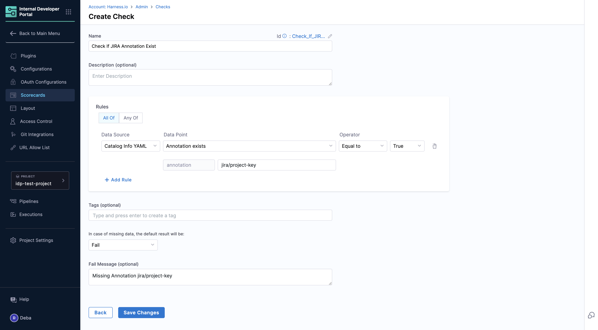

<DocsTag  backgroundColor= "#cbe2f9" text="Tutorial"  textColor="#0b5cad"  />

## Introduction

Now that you have [Catalog populated with Software Components](/docs/internal-developer-portal/get-started/register-a-new-software-component) [Plugins enabled](/docs/internal-developer-portal/get-started/enable-a-new-plugin), let's create a scorecard utilizing the [Catalog Datasource](https://developer.harness.io/docs/internal-developer-portal/scorecards/checks-datasources#catalog) to monitor the existence of root fields and integrations via annotations within `catalog-info.yaml` metadata. Effectively tracking information within the catalog can serve as the initial step towards enforcing organizational engineering standards.

## Register a Software Component

1. Register a software component following the steps mentioned [here](https://developer.harness.io/docs/internal-developer-portal/catalog/register-software-component), if you already have software components registered in your catalog you can move directly to create custom checks. Here's an example of `catalog-info.yaml` we will be using for this tutorial.

```YAML
#Example
apiVersion: backstage.io/v1alpha1
kind: Component
metadata:
  name: demo-service
  description: pipeline build and deploy
  annotations:
       harness.io/project-url: https://app.harness.io/ng/account/vpCkHKsDSxK9_KYfjCTMKA/cd/orgs/default/projects/PREQA_NG_Pipelines/
       jira/project-key: IDP
       github.com/project-slug: Debanitrkl/backstage-test
       backstage.io/techdocs-ref: url:https://github.com/backstage/backstage/tree/master/plugins/techdocs-backend/examples/documented-component
       pagerduty.com/service-id: QWERTY
       pagerduty.com/integration-key: ASDFGHJKL
  tags:
    - java
  
  links:
    - url: https://example.com/cloud
      title: Link with Cloud Icon
      icon: cloud
    - url: https://example.com/dashboard
      title: Dashboard
      icon: dashboard
    - url: https://example.com/help
      title: Support
      icon: help
    - url: https://example.com/web
      title: Website
      icon: web
    - url: https://example.com/alert
      title: Alerts
      icon: alert
spec:
  type: service
  lifecycle: experimental
  owner: idp-dev
```

## Create a catalog readiness Scorecard

### Pre-requisite

Make sure you have the [IDP Admin](https://developer.harness.io/docs/internal-developer-portal/rbac/resources-roles#1-idp-admin) or [IDP Platform Engineer](https://developer.harness.io/docs/internal-developer-portal/rbac/resources-roles#2-idp-platform-engineer) role assigned to you with permissions to view, create and edit [scorecards](https://developer.harness.io/docs/internal-developer-portal/rbac/resources-roles#1-scorecards)

### Create Scorecard

1. Go to **Scorecards** under **Admin** and **Create a New Scorecard**.


2. Now add the following available checks
    - Spec owner exists
    - Tech Docs exists
    - Pagerduty is setup


3. For **Filter catalog entities for which the scorecard is evaluated** select the kind as **Component** and type **all**

4. Now Publish the **Scorecard**. 


5. Go to your catalog and check for your software component you'll find the scores for catalog readiness. 


## Create a Custom Check  

1. Go to **Scorecards** under **Admin**.
2. Select **Create Custom Check** under **Checks**. 


3. Now we will be creating a custom check to check for Jira annotation.
4. Add the **Name** and **Description**
5. Now under Rules select **All Of** and the Datasource as **Catalog Info YAML**.
6. Select the Datapoint as **Annotation exists**, with annotation value as `jira/project-key` to be mentioned on your `catalog-info.yaml`. 
7. Now add the operator as `Equal to` with value as `True`.
8. Save the changes.



### Create a Scorecard with Custom Check

Let's create a scorecard for catalog using the custom check we created above and some default checks available. 

1. Go to Scorecards and **Create a New Scorecard**.


2.  Now add the Custom Check **Jira Check** you created above, ignore this step if you have skipped creating a custom check. 


3. For **Filter catalog entities for which the scorecard is evaluated** select the kind as **Component** and type **all**

4. Now Publish the **Scorecard**. 


5. Go to your catalog and check for your software component you'll find the scores for catalog readinesss. 


## Next Steps

1. Learn more on [Scorecards](https://developer.harness.io/docs/category/scorecards).  
2. Follow this [tutorial](https://developer.harness.io/docs/internal-developer-portal/scorecards/track-migrations) to track migrations using scorecards 
