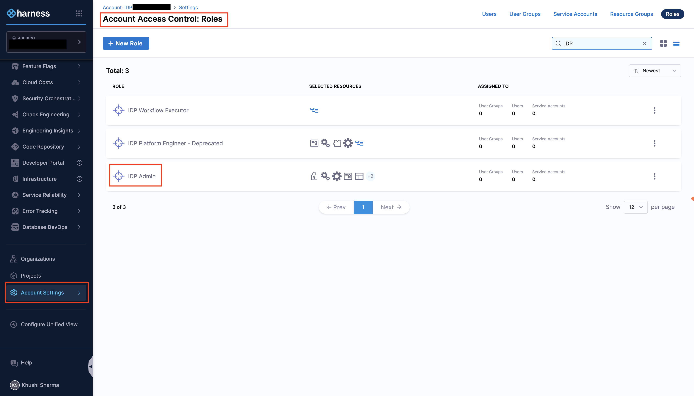
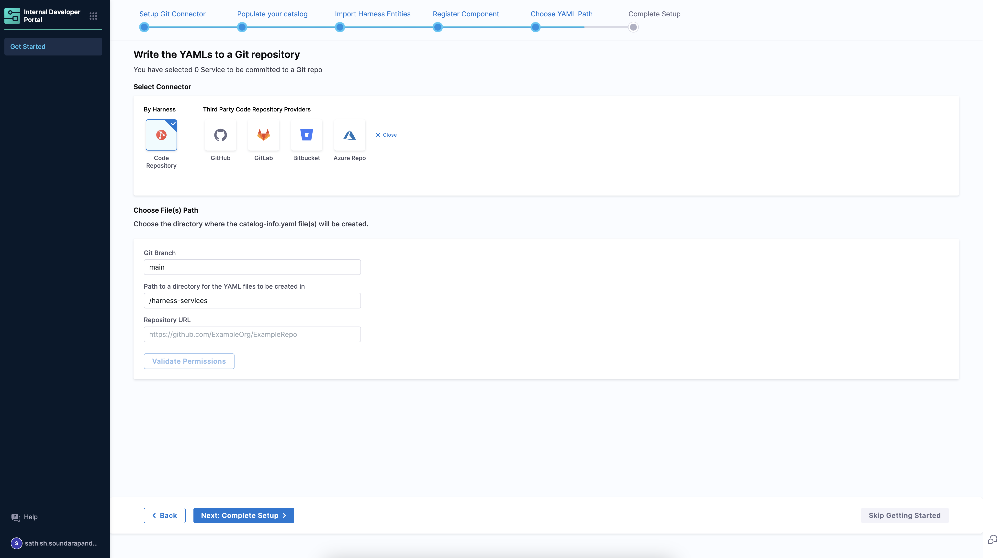

import Tabs from '@theme/Tabs';
import TabItem from '@theme/TabItem';

This guide will walk you through the first steps of onboarding to Harness IDP, including enabling the module, configuring Git connectors, populating your catalog, and importing Harness entities.

Here's a quick onboarding pathway for Harness IDP: 
1. **Setup and configure Git connectors**: This is required to store your Catalog and Workflow YAMLs. 
2. **Populate your Catalog**: This is required to onboard your software components.
3. **Import Harness entities**: This is required to import your Harness entities into Harness IDP directly.

---

## Prerequisites

### 1. Enable the Harness IDP Module

<Tabs groupId="idp-version">
<TabItem value="idp-2" label="IDP 2.0" default>

Ensure your team is ready for IDP 2.0 onboarding by reviewing the [breaking changes](/docs/internal-developer-portal/idp-2o-overview/2-0-overview-and-upgrade-path.md) list and understanding the key [essentials of upgrading to IDP 2.0](/docs/internal-developer-portal/idp-2o-overview/migrating-idp-2o.md).

> ⚠️ Rollback is not straightforward, so it's critical to thoroughly understand the scope and impact of these changes.

Once you're confident about upgrading:

* **Submit a Support Ticket**: 
  Raise a ticket with [Harness Support](https://support.harness.io) to enable the `IDP_2_0` feature flag on your account.

* **Join an Upgrade Call (Early Access Customers)**: 
  Our team will schedule a call with you to walk through the upgrade process and enable the feature flag.

* **Enable in a Test Environment First (Recommended)**: 
  If you have a **test or staging environment**, enable IDP 2.0 there first. This allows your team to safely explore the new experience before enabling it in production.

</TabItem>
<TabItem value="idp-1" label="IDP 1.0">

Harness IDP is currently available to a limited set of customers. To get started, send an email to idp-interest@harness.io for a demo and a Harness specialist will get you going.

Once Harness IDP is enabled in your account, an account administrator can onboard your services and configure the required plugins.

</TabItem>
</Tabs>

### 2. Provision the IDP Admin Role 

- **Harness IDP** must be provisioned for the given account.
- Only users with the **Harness Account Admin** role or assigned **IDP Admin** role can configure IDP. Go to [Assign Roles and Resource Groups](https://developer.harness.io/docs/platform/role-based-access-control/add-user-groups/#assign-roles-and-resource-groups) to assign roles.

---

## Get Started with Harness IDP
You land on the IDP module by navigating from the sidebar after logging into your Harness account. We strongly recommend users to follow the onboarding guide by selecting **Get Started**, for a seamless onboarding resulting in a catalog with software components.

<DocVideo src="https://app.tango.us/app/embed/e910ff06-1277-4812-aed3-0f5c7f70bc8d" title="Get Started with IDP" />

Now that you're on the onboarding wizard, let's get started with setting up Git connectors to onboard the software components.

### Step 1. Setup Git Connectors

#### Connector Setup

The software components in IDP are defined using YAML files, which are typically stored in your Git repositories. Configuring a connector for these Git providers is essential to fetch and manage these YAML files.

The following set of Git providers are supported:

- [Harness Code Repository](https://www.harness.io/products/code-repository)
- GitHub ([Cloud](https://developer.harness.io/docs/platform/connectors/code-repositories/connect-to-code-repo#connect-to-github) & [Enterprise](https://docs.github.com/en/enterprise-server@3.14/admin/overview/about-github-enterprise-server))
- [GitLab](https://developer.harness.io/docs/platform/connectors/code-repositories/connect-to-code-repo#connect-to-gitlab) (Cloud & Self Hosted)
- [Bitbucket](https://developer.harness.io/docs/platform/connectors/code-repositories/connect-to-code-repo#connect-to-bitbucket)

> **Note:** Multiple Connectors with different hostnames can be used for a single Git Provider at once. While setting up the connector, both Account & Repo type URLs are supported. Connection through Harness platform and delegate is supported.

#### Setting up Git Connectors

1. Select **Harness Code Repository** if enabled, or choose your preferred **Git Provider** from the available options.

2. From the dropdown under **Select Connector**, either select an already present connector or create **+New Connector**.
3. Configure the Connector as per the [documentation](https://developer.harness.io/docs/platform/connectors/code-repositories/connect-to-code-repo).
4. Select **Apply Selected** to use the connector.
5. After the connection test runs, select **Finish** to save the connector.

<DocVideo src="https://app.tango.us/app/embed/76371411-0ce5-49f6-82f8-7aa90098d559" title="Integrate GitHub with Harness Platform" />

### Step 2. Populate Your Catalog

After setting up the connector, you'll be presented with two onboarding paths:

#### Start with Sample Service

- You will be shown a demo service metadata in the form of the `catalog-info.yaml`.

- This will be added to the Git provider with the same configuration options as described below.

**For Harness Code Repository:**
- **Connector** - The connector is selected by default.
- **Directory Path** - Give a path for the directory in which you want to write the `catalog-info.yaml` files.

**For Other Git Providers:**
- **Connector** - Select the connector of the Git provider you want to use.
- **Repo** - Enter the full path to your repo. Example: `https://github.com/user-name/onboarding-test.git`
- The provided repo URL should belong to the same organization/project for which the connector has been setup.
- **Path** - Defaults to `harness-services`. Can be changed as well.

<DocVideo src="https://app.tango.us/app/embed/69e37f8a-d4c2-477d-9da8-1d2e89ad8082" title="Populate your Catalog" />

### Step 3. Import Harness Entities

#### Import Harness Services

- This option imports all the services from your Harness account into IDP. This includes all the services from all the projects in your account.
- The services are imported as **Component** entities in IDP. The metadata for these entities is derived from the service configuration in Harness.
- The entities are created with metadata including Name, Description, Owner, Type, and Lifecycle stage.
- Once imported, you can view and manage these entities in the IDP catalog.

**For Harness Code Repository:**
- **Repo Path** - Go to the Code Repository and under files select **Clone** and copy the repository path.

**For Other Git Providers:**
- **Connector** - Select the connector of the Git provider you want to use.
- **Repo** - Enter the full path to your repo. Example: `https://github.com/user-name/onboarding-test.git`
- The provided repo URL should belong to the same organization/project for which the connector has been setup.
- **Path** - Defaults to `harness-services`. Can be changed as well.

### Step 4. Complete the Setup

Once you've configured your Git connector and chosen your onboarding path, select **Complete Setup** to finish the initial configuration. Your catalog will now be populated with the entities you've imported or created.

## Next Steps

Now that you've completed the initial setup:

- [Create and manage catalog entities](/docs/internal-developer-portal/get-started/catalog-2o.md)
- [Set up workflows for self-service](/docs/internal-developer-portal/get-started/workflows-2o.md)
- [Enable plugins to extend IDP functionality](/docs/internal-developer-portal/plugins/enable-a-new-plugin)
