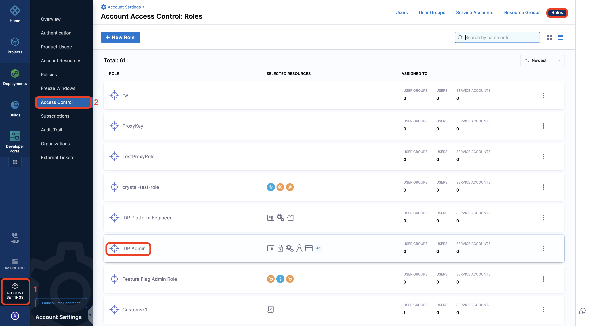
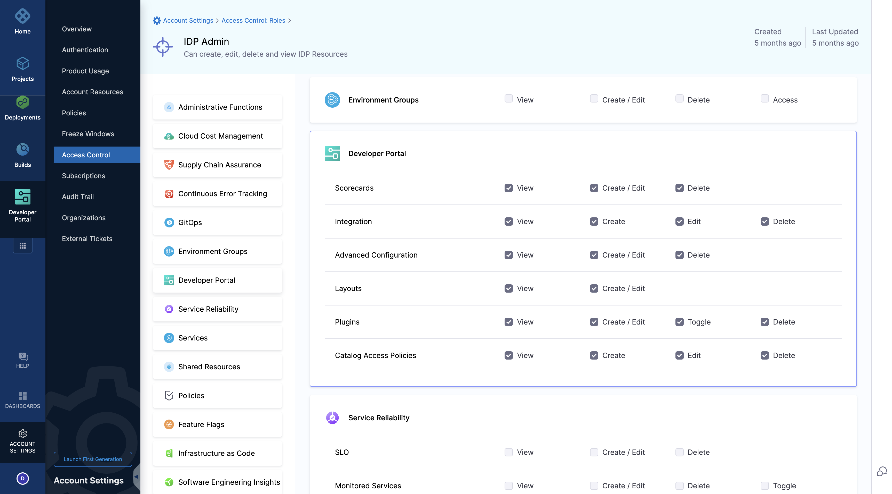
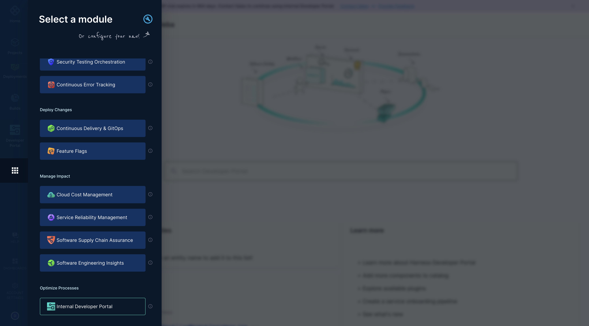
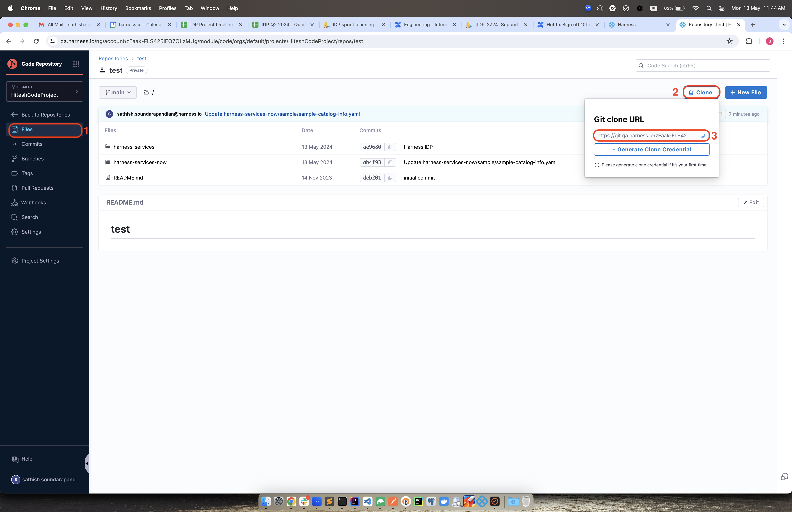
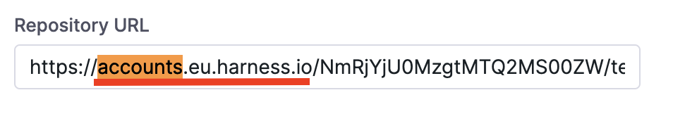

<DocsTag  backgroundColor= "#cbe2f9" text="Tutorial"  textColor="#0b5cad"  />

This guide describes the steps a Harness account admin can take to set up the IDP module. Presently, the module needs to be enabled on request. [Read more](./enabling-module.md).

**Prerequisite**: IDP should be provisioned for the given account. The required resources, services, configurations etc. should be in place before starting the harness catalog onboarding flow

- Only users who are **Harness Account Admin** or assigned with **IDP Admin** role having the permission as displayed below can perform the onboarding. Here's the detailed [documentation on how to assign roles](https://developer.harness.io/docs/platform/role-based-access-control/add-user-groups/#assign-roles-and-resource-groups) 





## Getting Started

1. User lands on IDP module by navigating from sidebar after logging into their Harness account.




2. We strongly recommend users to follow the onboarding guide selecting the **Get Started**, for a seamless onboarding resulting in a catalog with software components. 


## Connector Setup

3. Connector setup

:::warning

### Limitations

- Only the following set of connectors are supported
  
  - Harness Code Repository
  - GitHub
    - GitHub Enterprise
    - GitHub App
  - GitLab
  - Bitbucket
    - Bitbucket Cloud
    - Bitbucket Server
  - Azure Repository

- API access is needed in the connector for the IDP catalog setup.

- Only HTTP mode is supported. SSH connection type is not supported.

Backstage doesn't support SSH auth type for integrations, hence only HTTP connection is supported for all the git provider based connectors in IDP.

API calls in IDP are used to fetch YAML data, last commit SHA, and detect any new changes. SSH authentication cannot be used for making these API calls; it is only used for cloning repositories. Therefore, the main Git connector for IDP Git integration must support API requests, hence HTTP is only supported

:::

:::info

- **Multiple Connectors with different hostname can be used for a single Git Provider at once**.
- While setting up connector, both Account & Repo type for URL is supported.
- Connection through harness platform and delegate is supported.
- You can provide the repository URL to verify repository read permission with the given host and credentials before saving the Git integration.

:::

import Tabs from '@theme/Tabs';
import TabItem from '@theme/TabItem';


<Tabs queryString="Git-Provider">
<TabItem value="harness-code-repo-enabled" label="Harness Code Repository Enabled">


4. In case you are already using Harness Code Repository, a default connector with only **Read Permission** would be available for the code repo set-up under the same account as that of IDP. Note this connector is uneditable and managed by Harness.


5. You can as well create a new connector for other git-providers under the **+New Integration**.  If you already have a connector available which you want to use in IDP to save your `catalog-info.yaml`, then select the connector under **Select Git Connector**, use a URL to validate and save the connector. If you don't have your connector configured already follow the steps mentioned below. 


</TabItem>
<TabItem value="other-git-provider" label="Harness Code Repository Not Enabled">

4. Select the **Git Provider** you want to configure from the available options.


5. If you already have a connector available which you want to use in IDP to save your `catalog-info.yaml`, then select the connector under **Select Git Connector**, use a URL to validate and save the connector. If you don't have your connector configured already follow the steps mentioned below. 


</TabItem>
</Tabs>


<Tabs queryString="Connector">
<TabItem value="harness-code-repo" label="Harness Code Repository">

:::warning

## Limitations

At present we only support [repositories](https://developer.harness.io/docs/code-repository/config-repos/create-repo#create-a-repository) created at **project** [scope](https://developer.harness.io/docs/platform/role-based-access-control/rbac-in-harness#permissions-hierarchy-scopes), the support for account and organization level repositories will be available in upcoming releases. 

:::

1. **We don't allow to create a new connector for Harness Code Repository.**

</TabItem>
<TabItem value="azure-connector" label="Azure Repository">

1. Select **Azure Repo** icon followed by **Create or Select a Connector**.
2. From the dropdown under **Select Azure Repo Connector** and either select an already present connector or create **+New Connector**.
3. [Connect to Azure Repos](https://developer.harness.io/docs/platform/connectors/code-repositories/connect-to-a-azure-repo). You can also add multiple organizations as different connectors and use them together.
4. After the connection test runs, select Finish to save the connector.


</TabItem>
<TabItem value="bitbucket-connector" label="Bitbucket">

1. Select **Bitbucket** icon followed by **Create or Select a Connector**.
2. From the dropdown under **Select Bitbucket Connector** and either select an already present connector or create **+New Connector**.
3. Configure the [Bitbucket connector settings](https://developer.harness.io/docs/platform/connectors/code-repositories/ref-source-repo-provider/bitbucket-connector-settings-reference).

:::info

Same secret can't be configured for both **Password & Personal Access token** as backstage makes use of API token to fetch data.
Create a secret with token and configure in the Personal Access token field. [Reference for creating token](https://confluence.atlassian.com/bitbucketserver/personal-access-tokens-939515499.html)


For **Bitbucket Cloud** the url needs to have **src** instead of **blob**. for eg. `https://bitbucket.org/org-name/repo-name/src/branch/harness-services/Organization/default.yaml`

:::

4. After the connection test runs, select **Finish** to save the connector.

</TabItem>
<TabItem value="github-connector" label="GitHub">

1. Select **GitHub** icon followed by **Create or Select a Connector**.
2. From the dropdown under **Select GitHub Connector** either select an already present connector or create **+New Connector**.
3. Configure the [GitHub connector settings](https://developer.harness.io/docs/platform/connectors/code-repositories/ref-source-repo-provider/git-hub-connector-settings-reference). You can configure connectors for both `github.com` and `GitHub Enterprise` and use them at once to fetch `catalog-info.yaml` from both the sources at same time.
4. After the connection test runs, select **Finish** to save the connector.

:::warning

While using GitHub App, you need a **private key for your GitHub app** to configure your Harness GitHub connector, follow the instructions mentioned [here](https://developer.harness.io/docs/platform/connectors/code-repositories/git-hub-app-support/#generate-a-private-key) **to convert the key file to the necessary format for the Harness GitHub connector**

:::

More instructions on [using github app in github connector](https://developer.harness.io/docs/platform/connectors/code-repositories/git-hub-app-support).

</TabItem>
<TabItem value="gitlab-connector" label="GitLab">

1. Select **GitLab** icon followed by **Create or Select a Connector**.
2. From the dropdown under **Select GitLab Connector** either select an already present connector or create **+New Connector**.
3. Configure the [GitLab connector settings](https://developer.harness.io/docs/platform/connectors/code-repositories/ref-source-repo-provider/git-lab-connector-settings-reference). You can configure connectors for both `gitlab.com` and `GitLab on-prem` and use them at once to fetch `catalog-info.yaml` from both the sources at same time.
4. After the connection test runs, select **Finish** to save the connector.

</TabItem>
</Tabs>

:::info

The scope is tied to URL format `https://gitprovider.com/org-name`, so all the Git Providers must provide the URL until at least the org name. Further, it can be scoped down to the repository or project level as well.

:::

6. Once the connectors are created, you can see all the git providers configured for IDP. 


## Onboard Services

7. Users will now have option to onboard existing harness services into IDP, or start with a sample service.  


<Tabs queryString="Import Harness Services">
<TabItem value="import-harness-services" label="Import Harness Services">

8. User will be shown the list of services in their account. It will be defined in terms of IDP entity i.e harness organization is a domain, harness project is a system and harness service is a component in the IDP world. This list includes services at all scopes.

9. User can choose all the services / individual services / no services

- ALL - All the harness services will be imported into IDP
- INDIVIDUAL - Selected harness services will be imported into IDP
- NO - One sample entity will be imported into IDP for the user to get started.


10. User gets a view on how the entity definition looks like


12. Now add the details on where the entities will be created in git:

<Tabs queryString="set-up-path">
<TabItem value="path-to-save-yaml" label="Harness Code Repository YAML Path">

- **Connector** - The connector is selected by default.

- **Directory Path** - Give a path for the directory in which you want to write the `catalog-info.yaml` files.


- **Repo Path** - Go to the Code Repository and under files select **Clone** and copy the repository path. 





Validate the permission and the catalog-info.yaml files would be created in your directory in Code repository. 


</TabItem>
<TabItem value="other-git-provider-yaml-path" label="Other Git Providers YAML Path">


- **Connector** - Select the connector of the git provider you want to use. 

- **Repo** - Enter the full path to your repo. Example

```
https://github.com/sathish-soundarapandian/onboarding-test.git
https://github.com/sathish-soundarapandian/onboarding-test
```

- The provided repo in the repo URL should belong to the same organization / project for which the connector has been setup. Ex -

**In connector** - The account path is `https://github.com/sathish-soundarapandian`. So the repo url in IDP onboarding flow should be `https://github.com/sathish-soundarapandian/{SOME_REPO}`. It cannot be `https://github.com/{SOMETHING_ELSE}/{SOME_REPO}` - this will not work.

- Provided repo should exist with a valid default HEAD branch. Ideally this will be case when the repo is initialized with README file

- Branch - Can be new branch / some existing branch. In both the cases, the commit will be done on top of the base HEAD branch.

- Path - Defaults to harness-services. Can be changed as well.


</TabItem>
</Tabs>


</TabItem>
<TabItem value="sample-service" label="Start with Sample Service">

8. User will be shown a demo service metadata in the form of the `catalog-info.yaml`.


9. Now this will be added to the git provider: 

<Tabs queryString="set-up-path">
<TabItem value="path-to-save-yaml" label="Harness Code Repository YAML Path">

- **Connector** - The connector is selected by default.

- **Directory Path** - Give a path for the directory in which you want to write the `catalog-info.yaml` files.


- **Repo Path** - Go to the Code Repository and under files select **Clone** and copy the repository path. 

:::info

Once you copy the repository path replace the `git.eu.harness.io` with `accounts.eu.harness.io`.



:::


Validate the permission and the catalog-info.yaml files would be created in your directory in Code repository. 


</TabItem>
<TabItem value="other-git-provider-yaml-path" label="Other Git Providers YAML Path">


- **Connector** - Select the connector of the git provider you want to use. 

- **Repo** - Enter the full path to your repo. Example

```
https://github.com/sathish-soundarapandian/onboarding-test.git
https://github.com/sathish-soundarapandian/onboarding-test
```

- The provided repo in the repo URL should belong to the same organization / project for which the connector has been setup. Ex -

**In connector** - The account path is `https://github.com/sathish-soundarapandian`. So the repo url in IDP onboarding flow should be `https://github.com/sathish-soundarapandian/{SOME_REPO}`. It cannot be `https://github.com/{SOMETHING_ELSE}/{SOME_REPO}` - this will not work.

- Provided repo should exist with a valid default HEAD branch. Ideally this will be case when the repo is initialized with README file

- Branch - Can be new branch / some existing branch. In both the cases, the commit will be done on top of the base HEAD branch.

- Path - Defaults to harness-services. Can be changed as well.


</TabItem>
</Tabs>

</TabItem>
</Tabs>

## Create and Register Entities

11. Once the required details are entered and submitted for importing, we will push the generated entity yaml files to the repo and path provided. You will be seeing two commits - One is done during the sync flow and other commit which will consist of remaining entities will be pushed in an async manner. Time frame for async operation will depend on how big the repo size is and how many revisions the provided repo has.

12. In the background, the catalog are also imported into IDP along with their associated configs.


## Catalog

13. User can navigate to the IDP homepage to get started. Catalog will be start showing up once the async operation is completed.

14. Since during the onboarding flow harness will not be able to discover the complete metadata of the entity, the owner field will be set to Unknown. As part of the IDP provisioning, harness users and groups are imported to IDP. With this in place, customers can start editing the catalog info yaml definition to update the owner for each of the entity.


15. Post onboarding, users can import any number of entities into harness-idp using the [register component flow](https://developer.harness.io/docs/internal-developer-portal/catalog/register-software-component). This flow expects you to provide the complete url where the entity definition is hosted.

**Recommendations**

If using GitHub connector, customers can go with App based authentication which provides higher number of API requests in an hour window. Read more about [GitHub Apps - GitHub Docs.](https://docs.github.com/en/apps/creating-github-apps/setting-up-a-github-app/rate-limits-for-github-apps)

## Next steps

Check out the [IDP tutorials](/docs/category/idp-tutorials) for walkthroughs and deep dives into specific IDP use cases.
