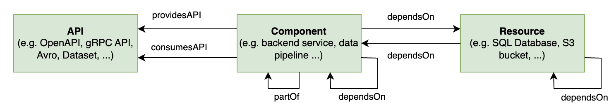

The systems model, as inspired by this [RFC](https://github.com/backstage/backstage/issues/390) from Backstage.io, is an approach to managing and understanding complex software ecosystems. This model is particularly relevant in the context of DevOps and microservices architectures, where the large number of interdependent components can be overwhelming.

In the context of IDP, the systems model is used to describe and organize the various software components, services, and tools that make up an organization's technical landscape. It is structured around five key concepts: Domains, Systems, APIs, Components, and Resources.

## Concepts

### 1. Domain
#### Definition: 
A Domain is a high-level organizational unit in the Backstage model, grouping together systems that share common characteristics such as business goals, domain models, terminology, or documentation.
#### Purpose: 
To create a bounded context for easier management and understanding of related systems.
#### Example: 
The "Payments" Domain includes systems related to payment processing, sharing common documentation, API entity types, and integration standards.

### 2. System
#### Definition: 
A System is an abstraction layer encapsulating the implementation details of specific functionalities. It consists of a collection of resources and components and exposes one or several APIs.
#### Purpose: 
To reduce complexity by allowing consumers to interact with functionalities without needing to understand the underlying implementation details.
#### Example: 
A playlist management system includes backend services for playlist management and a database, exposing functionalities through various APIs like RPC, datasets, and event streams.

### 3. API
#### Definition: 
APIs are the primary means of interaction within the software ecosystem. They are implemented by components and define the boundaries between different components and systems.
#### Purpose: 
To facilitate interaction and discovery within the software ecosystem, ensuring scalability and manageability.
#### Example: 
A public API exposed by a system for other Spotify components, documented and discoverable in Backstage.

### 4. Component
#### Definition: 
A Component is a discrete unit of software, such as a mobile feature, website, backend service, or data pipeline.
#### Purpose: 
To implement specific functionalities and APIs, encapsulating code dependencies and interacting with system resources.
#### Example: 
A backend service for user data processing, implementing specific APIs and relying on system resources like databases.

### 5. Resource
#### Definition: 
Resources are the infrastructure elements required for a system's operation, including databases, cloud storage, CDN services, etc.
#### Purpose: 
To support the operational needs of systems, allowing for a clear visualization of resource usage and facilitating targeted tooling development.
#### Example: 
Cloud storage buckets and CDN services used by a video streaming system.

## Conclusion 

In practice, implementing a systems model like the one used by Backstage, involves creating a centralized catalog or repository where all the information about systems, components, and their relationships is stored and managed.

