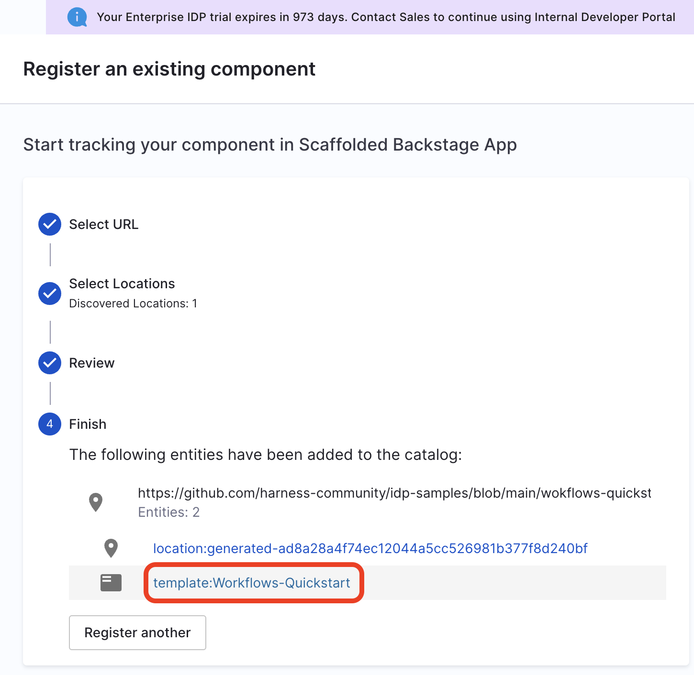
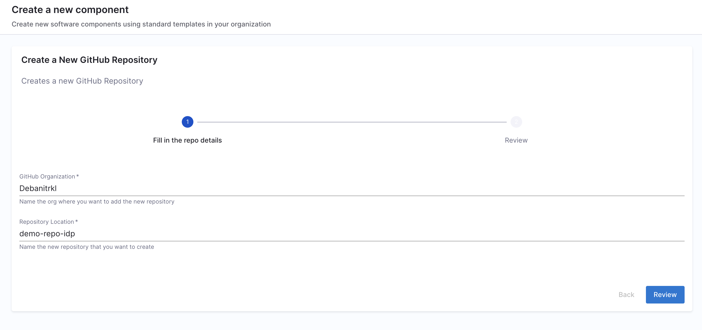

<DocsTag  backgroundColor= "#cbe2f9" text="Tutorial"  textColor="#0b5cad"  />

## Goal

This will help you setup a Workflow in IDP which automates GitHub Repo Onboarding for users.

## Pre-requisite

### Add Connector

1. Go to **Admin -> Git Integrations**.
2. Add a **New Git Integration** with type as **GitHub**.
3. Now Select the GitHub **Connector** and **Save Changes**, [follow the steps to add a new connector](https://developer.harness.io/docs/internal-developer-portal/get-started/setup-git-integration#connector-setup) 

:::info

Make sure the Connector URL used here is pointed towards the org where you want to create the new repo and the token used have write permission for the repo also **Enable the API** while creating connector.

:::

### Create Harness Pipeline with IDP Stage

1. Go to **Admin -> Pipelines**.
2. Now start with **Create a Pipeline**.


3. Add a **Name**, select the type as **Inline** and **Continue**.


4. **Add Stage** and **Select Stage Type** as **Developer Portal**. 


5. Select the infrastructure as **Harness Cloud**. 


6. Now let's create some variables which we will be using in further steps, add the following **Custom Variables** (stick to the exact naming convention for variables as provided as these will be used as a reference to input values into the pipeline)
    - `github_org`
    - `github_repo`
    - `github_username`
The variables are of **Type** `String` and the **Values** are set to `Runtime Input`. 

Add another variable `github_token` as **Type** `Secret` and add the GitHub PAT for  **Values**. 

Apply the changes


7. Now **Continue** to **Execution** and **Add Step**, under Git Repository Setup select **Create Repo**. 


8. Under **Step Parameters**, select the **Repository Type** as **Public** if the connector you have created use a token generated by your GitHub admin, else you might not have access to the **private** repo created. 

9. Add the **Connector** you created under Select codebase repo connector. 

10. Now under **Organization** and **Repository Name** add the variables you created as **Expressions** (`<+pipeline.variables.github_org>` and `<+pipeline.variables.github_repo>` ).

11. Add a **Repository Description**, **Apply Changes**. 


12. Now add a **Run** Step to add your username as an admin to the repo created, with the following curl command, make sure to add a [container registry and image](https://developer.harness.io/docs/continuous-delivery/x-platform-cd-features/cd-steps/containerized-steps/run-step/#container-registry-and-image), under optional configuration.  

```sh
curl -L \
  -X PUT \
  -H "Accept: application/vnd.github+json" \
  -H "Authorization: Bearer <+pipeline.variables.github_token>" \
  -H "X-GitHub-Api-Version: 2022-11-28" \
  https://api.github.com/repos/<+pipeline.variables.github_org>/<+pipeline.variables.github_repo>/collaborators/<+pipeline.variables.github_username> \
  -d '{"permission":"admin"}'
```


## Create Template

**If you want to use our sample templates you can skip this step and go to register template step**

The template is defined in a YAML file named `template.yaml`. The [syntax](https://developer.harness.io/docs/internal-developer-portal/flows/service-onboarding-pipelines#how-to-write-idp-templates) of the template definition is owned by [backstage.io](https://backstage.io/docs/features/software-templates/writing-templates) while the workflow runs on a Harness pipeline of your choice.

The following is the example template with [custom action](https://developer.harness.io/docs/internal-developer-portal/flows/custom-actions#1-triggerharness-custom-pipeline) to create a new repository. 

```YAML
apiVersion: scaffolder.backstage.io/v1beta3
kind: Template
# some metadata about the template itself
metadata:
  name: Workflows-Quickstart
  title: Create a New GitHub Repository
  description: Creates a new GitHub Repository 
spec:
  owner: service.owner
  type: service
  # these are the steps which are rendered in the frontend with the form input
  parameters:
    - title: Fill in the repo details
      required:
        - github_org_name
        - github_repo_name
        - github_username
      properties:
        github_org_name:
          title: GitHub Organization
          type: string
          description: Name the org where you want to add the new repository
        github_repo_name:
          title: Repository Location
          type: string
          description: Name the new repository that you want to create 
        github_username:
          title: GitHub Username
          type: string
          description: Add Your GitHub Username 
        token:
          title: Harness Token
          type: string
          ui:widget: password
          ui:field: HarnessAuthToken       
  # here's the steps that are executed in series in the scaffolder backend
  steps:
    - id: trigger
      name: Onboarding a New GitHub Repository
      action: trigger:harness-custom-pipeline
      input:
        url: "URL_of_the_Harness_Pipeline_Created_Above"
        inputset:
          github_org: ${{ parameters.github_org_name }}
          github_repo: ${{ parameters.github_repo_name }}
          github_username: ${{parameters.github_username}}
        apikey: ${{ parameters.token }}
    # The final step is to register our new component in the catalog.

  output:
    links:
      - title: Pipeline Details
        url: ${{ steps.trigger.output.PipelineUrl }}

```

In the above template we have used the [Harness Trigger Custom Action](https://www.npmjs.com/package/@backstage/plugin-scaffolder-backend-module-github), which takes the **exact variable name** `github_org` and `github_repo` you created for your pipeline as input and a **token** as `apikey`

11. Copy the above template file in your git provider, and save it as `workflow.yaml`. 

## Register Template in IDP

12. In the left navigation, select **Create**, and then select **Register Software Component**.


13. Enter the URL to your new `workflow.yaml`.


14. Select **Import**.


15. Now click on the template name



## Use Workflows to Create a Repo

16. Once you're on the entity page for template, **Launch the Template**.


17. Now fill the fields as:
    - Repository Location: Add a name for the repository you wanted to create. 
    - GitHub Organization: Add the org where you want add your new repository, usually GitHub URL are of the format `https://github.com/org_name/repo_name/` 



18. Now Trigger the flow, it will create a new GitHub repo. 


## Delete the Template

If you want to unregister or delete the template follow the steps mentioned [here](https://developer.harness.io/docs/internal-developer-portal/flows/service-onboarding-pipelines#deleteunregister-template). 

## Further Reading

Self Service Onboarding in IDP is powered by scaffolder templates and Harness Pipeline([IDP Stage](https://developer.harness.io/docs/internal-developer-portal/flows/idp-stage)) . Follow the tutorials to learn more about it. 

1. [Create a service onboarding pipeline (using IDP Stage)](https://developer.harness.io/docs/internal-developer-portal/flows/create-a-new-service-using-idp-stage)

2. [Getting started with service onboarding pipeline (using Custom Stage)](https://developer.harness.io/docs/internal-developer-portal/flows/create-a-service)

3. [Use Harness IDP for self serviced Harness CI/CD onboarding](https://developer.harness.io/docs/internal-developer-portal/flows/self-service-onboarding-pipeline-tutorial)
