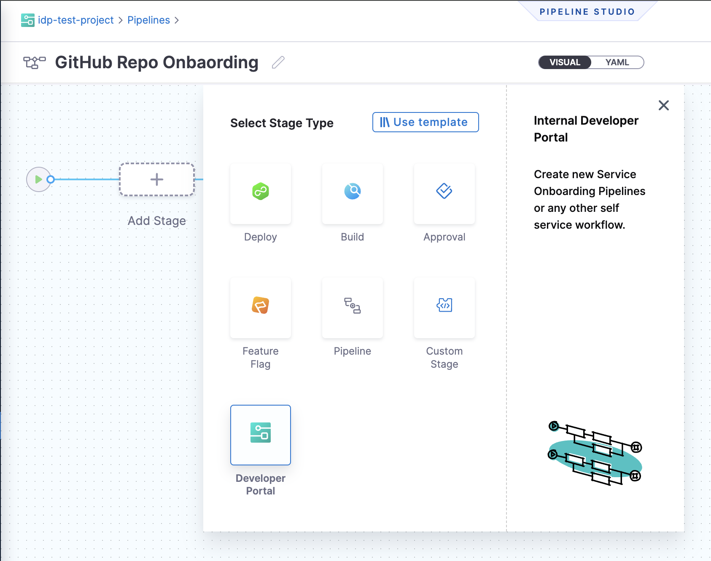
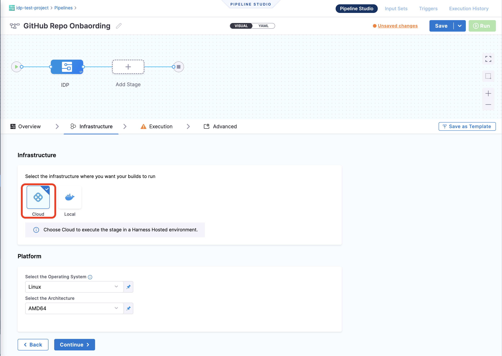
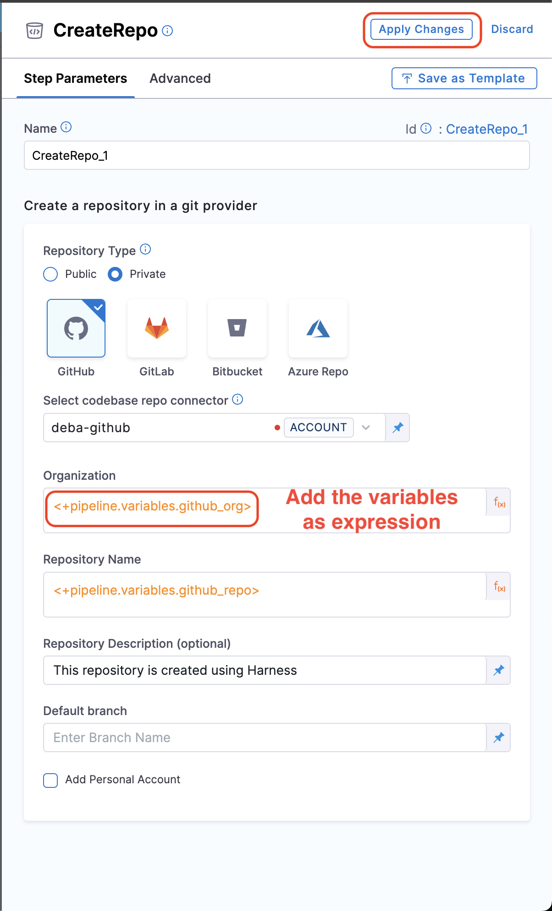
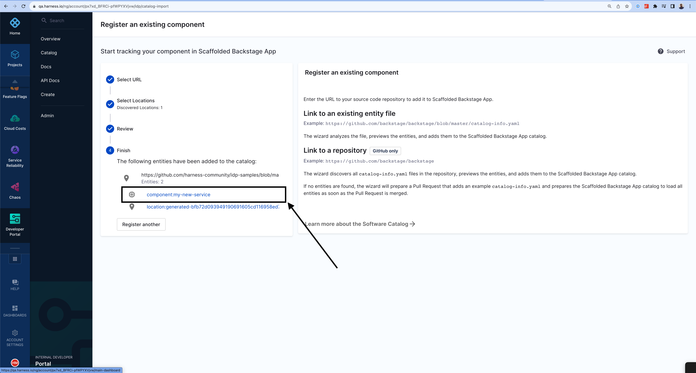

import Tabs from '@theme/Tabs';
import TabItem from '@theme/TabItem';

<Tabs queryString="version">
<TabItem value="IDP 2.0 (New)" label="IDP 2.0 (New)">

**Service and Infrastructure onboarding** in today’s world is slow, manual and tedious. Developers often spend days—or even weeks—setting up new software and completing Day-2 operations. This inefficiency arises from either waiting for ticket resolutions (TicketOps) or manually handling repetitive tasks, which results in a poor developer experience and decreased productivity.

Harness IDP addresses these challenges with **Self-Service Workflows**.

Workflows enable developer self-service by automating manual tasks and processes. Using Workflows, platform engineering teams can:
- Automate new service onboarding.
- Simplify Day 2 operations for developers.
- Provide developers with **golden paths** to production that include guardrails and best practices.

This guide will take you through the journey of creating, configuring and executing a Workflow.

## What's new for Workflows in IDP 2.0?
Harness IDP 2.0 represents a major evolution of the Internal Developer Portal, built on a Harness-native data model designed for enterprise-scale environments and robust access control. Here's what’s changing in IDP 2.0 for **Workflows**:

- **Harness-native Platform Hierarchy:** Workflows now support Account, Org, and Project scopes, with built-in, fine-grained RBAC.

- **No YAML Required:** Create and modify Workflows directly within the UI—no need to manage YAML files or deal with Git operations

## Prerequisites
Before getting started with **Workflows** in IDP 2.0, ensure you have the following prerequisites: 
- **IDP 2.0** is deployed behind the `IDP_2_0` Feature Flag in Harness IDP. Please ensure you have enabled the same in your account before you get started with the IDP 2.0 features. To enable this feature, contact Harness Support.
- You must have an understanding of **Managing Workflows** and **Workflow YAML** to understand the components of a Workflow.
- You can/should have a Harness Pipeline. This serves as an orchestrator for Self Service Workflows. Read more about setting up Harness IDP Pipelines here. 

## Create a Harness IDP Pipeline

## Create a Workflow
In IDP 2.0, you can create **Workflows** directly from the Harness IDP UI —eliminating the need to manually manage YAML files. With this release, "inline workflows" are fully supported, allowing you to manage the entire workflow lifecycle through the UI or APIs—no Git operations required. Learn more about Self Service Workflows here. 

There are two ways for you to add and create a new Workflow in your IDP:
- **Create a Workflow via the Harness IDP UI**: Use the Harness UI to create Workflows directly—no YAML required. This method offers a streamlined, code-free experience for adding entities.
- **Create a Workflow using your Workflow YAML**: You can still create Workflows using your existing Workflow YAML files. Harness will automatically convert legacy Backstage YAML into the new Harness-native Data Model and register the corresponding Workflow.

Let's try creating a **Workflow** using both the methods: 

<Tabs>
  <TabItem value="UI" label="Harness IDP UI">
  To create a new **Workflow**, navigate to the Harness IDP portal and click on **“Create”** from the side-bar menu. Choose **Workflow** from the panel, and follow these steps:
  1. You’ll be redirected to the **"Visual View"**, where you can input basic Workflow details and begin the creation process.
  2. Enter the required Workflow information. The **Visual view** is synced in real-time with the **YAML view** for full transparency.
  3. Define the **Workflow scope** — choose whether the Workflow should reside at the Account, Project, or Organization level. For this use-case, let's select the Account scope. Read more about Workflow RBAC.
  4. Click on **“Review YAML”** to view the auto-generated YAML. Since there's a live sync between the Visual and YAML views, changes in one will reflect in the other. 
  5. You can make changes to the Workflow YAML and configure it accordingly. You can configure different inputs, add backend actions and outputs to configure the Workflow. Read more about the components of a Workflow and Workflow YAML here. 
  
  :::info
  **Note:** **YAML validation** is performed to ensure compatibility with the **Harness-native Data Model**. Any errors will be shown in the Validation logs.
  :::
  6. Once everything is set, click **“Create Workflow”** to finalize and create the Workflow.
  </TabItem>
  <TabItem value="YAML" label="Workflow YAML">
  To create a new entity using the Workflow YAML, navigate to the Harness IDP portal and click **“Create”** from the side-bar menu. Choose **Workflow** from the panel.
  
  :::info
  If you have a **legacy Backstage YAML**, you can still use it to create a **Workflow**. Harness will automatically convert it into the **Harness-native Data Model** format.
  :::

1. You’ll be redirected to the **Visual View**. You can switch to the **YAML View** using the toggle at the top of the screen. This allows you to directly edit the Workflow's YAML definition.
2. If you’re using a **legacy Backstage YAML**, paste it into the YAML view. Harness will convert it into the **Harness-native format** automatically. You can then proceed to finalize and create the Workflow. Since the Visual and YAML views are **live-synced**, changes made in one view will reflect in the other.
3. You can select the scope of the Workflow by either switching to the **Visual View** and selecting the scope from there. Or you can add **projectId** or **orgId** in the YAML to specify the project / org scope of the Workflow. Read more about the same here. 
4. You can make changes to the **Workflow YAML** and configure it accordingly. You can configure different inputs, add backend actions and outputs to configure the Workflow. Read more about the components of a Workflow and Workflow YAML here. 

:::info
Note: **YAML validation** is automatically performed to ensure compatibility with the **Harness-native Catalog YAML model**. Any validation errors will be displayed in the Validation Logs.
:::

5. Once all details are complete, click **“Create Workflow”** to finalize and register your Workflow in the catalog.
  </TabItem>
</Tabs>


## Execute Workflows
Once you've created a Workflow, you can **execute** the Workflow by going to the Workflow details page. You can access the Workflow from two places: 
1. You can find the respective Workflow from the Catalog, and click on it to go to the Workflow details page. Click on "Launch" from there to execute the Workflow. 
2. You can go to the "Workflows" page and access the Workflow from there. Click on "Launch" to execute the Workflow. 

## Delete a Workflow
You can also delete a Workflow by going to the **Workflows** page, clicking on the three dots on the top right corner of the Workflow you want to delete and selecting "Delete Workflow". 

## Next Steps

</TabItem>
<TabItem value="IDP 1.0" label="IDP 1.0">

## Introduction

This quickstart tutorial will guide you through setting up a Workflow in IDP to automate GitHub repository onboarding for users. While this tutorial uses GitHub as the git provider, the same steps can be applied to other git providers as well.

:::info

We now have a [new Workflows homepage](/docs/internal-developer-portal/layout-and-appearance/workflows-page-customization) which is behind a Feature Flag `IDP_ENABLE_WORKFLOWSV2`. To enable the feature flag, please contact [Harness Support](mailto:support@harness.io)

:::

## Pre-requisite

### Add Connector

A connector with Git credentials that has appropriate write permissions is required to create a repository in your GitHub organization.

1. Go to **Admin -> Git Integrations**.
2. Add a **New Git Integration** with type as **GitHub**.
3. Now Select the GitHub **Connector** and **Save Changes**, [follow the steps to add a new connector](https://developer.harness.io/docs/internal-developer-portal/get-started/setup-git-integration#connector-setup) 

:::info

Make sure the Connector URL used here is pointed towards the org where you want to create the new repo and the token used have write permission for the repo also **Enable the API** while creating connector.

:::

### Create Harness Pipeline with IDP Stage

A Harness Pipeline serves as an orchestrator for IDP Workflows. 

1. Go to **Admin -> Select Project**.
2. Now start with **Create a Pipeline**.


3. Add a **Name**, select the type as **Inline** and **Continue**.


4. **Add Stage** and **Select Stage Type** as **Developer Portal**. 



5. Select the infrastructure as **Harness Cloud**. 



6. Now let's create some variables that we will use in further steps. Navigate to the **Variables tab** in the right corner of the Pipeline Studio, and add the following **Custom Variables** (stick to the exact naming convention for variables as provided, as these will be used as a reference to input values into the pipeline). The variables are of **Type** `String`, and their **Values** are set to `Runtime Input`.
    - `github_org`
    - `github_repo`
    - `github_username`


Add another variable `github_token` as **Type** `Secret` and add the GitHub PAT for **Values**. 

Apply the changes


7. Now **Continue** to **Execution** and **Add Step**, under Git Repository Setup select **Create Repo**. 


8. Under **Step Parameters**, select the **Repository Type** as **Public** if the connector you have created use a token generated by your GitHub admin, else you might not have access to the **private** repo created. 

9. Add the **Connector** you created [above](#add-connector).

10. Now under **Organization** and **Repository Name** add the variables you created as **Expressions** (`<+pipeline.variables.github_org>` and `<+pipeline.variables.github_repo>`).

11. Add a **Repository Description**, **Apply Changes**. 



12. Now add a **Run** Step to add your username as an admin to the repo created, with the following curl command, make sure to add a [container registry and image](https://developer.harness.io/docs/continuous-delivery/x-platform-cd-features/cd-steps/containerized-steps/run-step/#container-registry-and-image), under optional configuration. **Container Registry** is a Harness Docker Registry Connector used to specify the image on which Harness will run commands, such as images from Docker Hub. 

```sh
curl -L \
  -X PUT \
  -H "Accept: application/vnd.github+json" \
  -H "Authorization: Bearer <+pipeline.variables.github_token>" \
  -H "X-GitHub-Api-Version: 2022-11-28" \
  https://api.github.com/repos/<+pipeline.variables.github_org>/<+pipeline.variables.github_repo>/collaborators/<+pipeline.variables.github_username> \
  -d '{"permission":"admin"}'
```


## Create Workflow

The Workflow is defined in a YAML file named `workflow.yaml`. The [syntax](https://developer.harness.io/docs/internal-developer-portal/flows/service-onboarding-pipelines#how-to-write-idp-templates) of the template definition is owned by [backstage.io](https://backstage.io/docs/features/software-templates/writing-templates) while the workflow runs on a Harness pipeline of your choice.

The following is the example Workflow with [Workflows Action](https://developer.harness.io/docs/internal-developer-portal/flows/custom-actions#1-triggerharness-custom-pipeline) to create a new repository. 

```YAML
apiVersion: scaffolder.backstage.io/v1beta3
kind: Template
# some metadata about the template itself
metadata:
  name: Workflows-Quickstart
  title: Create a New GitHub Repository
  description: Creates a new GitHub Repository 
spec:
  owner: service.owner
  type: service
  # these are the steps which are rendered in the frontend with the form input
  parameters:
    - title: Fill in the repo details
      required:
        - github_org_name
        - github_repo_name
        - github_username
      properties:
        github_org_name:
          title: GitHub Organization
          type: string
          description: Name the org where you want to add the new repository
        github_repo_name:
          title: Repository Location
          type: string
          description: Name the new repository that you want to create 
        github_username:
          title: GitHub Username
          type: string
          description: Add Your GitHub Username 
        token:
          title: Harness Token
          type: string
          ui:widget: password
          ui:field: HarnessAuthToken       
  # here's the steps that are executed in series in the scaffolder backend
  steps:
    - id: trigger
      name: Onboarding a New GitHub Repository
      action: trigger:harness-custom-pipeline
      input:
        url: "URL_of_the_Harness_Pipeline_Created_Above"
        inputset:
          github_org: ${{ parameters.github_org_name }}
          github_repo: ${{ parameters.github_repo_name }}
          github_username: ${{parameters.github_username}}
        apikey: ${{ parameters.token }}
    # The final step is to register our new component in the catalog.

  output:
    links:
      - title: Pipeline Details
        url: ${{ steps.trigger.output.PipelineUrl }}

```

In the above Workflow we have used the [Harness Trigger Workflow Action](https://developer.harness.io/docs/internal-developer-portal/flows/custom-actions#1-triggerharness-custom-pipeline), which takes the **exact variable name** `github_org` and `github_repo` you created for your pipeline as input and a **token** as `apikey`

:::warning
The **token** property used to fetch the **Harness Auth Token** is hidden on the Review Step using ``ui:widget: password``. However, for this to function correctly in a **multi-page workflow**, the token property must be included under the **first page**.

```YAML {12}
parameters:
  - title: <PAGE-1 TITLE>
    properties:
      property-1:
        title: title-1
        type: string
      property-2:
        title: title-2
    token:
      title: Harness Token
      type: string
      ui:widget: password
      ui:field: HarnessAuthToken
  - title: <PAGE-2 TITLE>
    properties:
      property-1:
        title: title-1
        type: string
      property-2:
        title: title-2
  - title: <PAGE-n TITLE>  
```
:::

11. Copy the above Workflow file in your git provider, replace the value of `input.url` under `steps` with the Harness pipeline URL you created and save it as `workflow.yaml`. 

## Register Workflow in IDP

12. In the left navigation, select **Workflows**, and then select **Register New Workflow**.


13. Enter the URL to your new `workflow.yaml`.


14. Select **Import**.



15. Now click on the Workflow name


## Use Workflows to Create a Repo

16. Once you're on the entity page for Workflow, **Launch the Workflow**.


17. Now fill the fields as:
    - Repository Location: Add a name for the repository you wanted to create. 
    - GitHub Organization: Add the org where you want to add your new repository, usually GitHub URL are of the format `https://github.com/org_name/repo_name/` 


18. Now Trigger the flow, it will create a new GitHub repo. 


## Delete the Workflow

If you want to unregister or delete the Workflow follow the steps mentioned [here](https://developer.harness.io/docs/internal-developer-portal/flows/service-onboarding-pipelines#deleteunregister-template). 

</TabItem>
</Tabs>