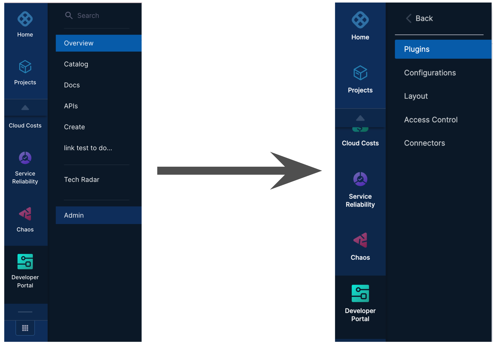
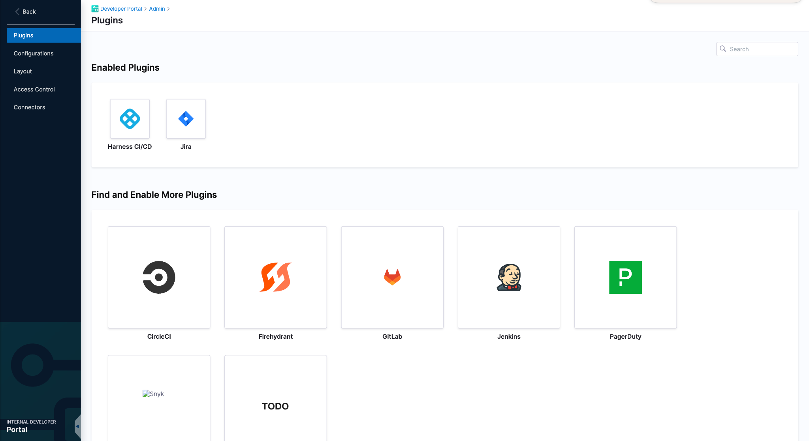
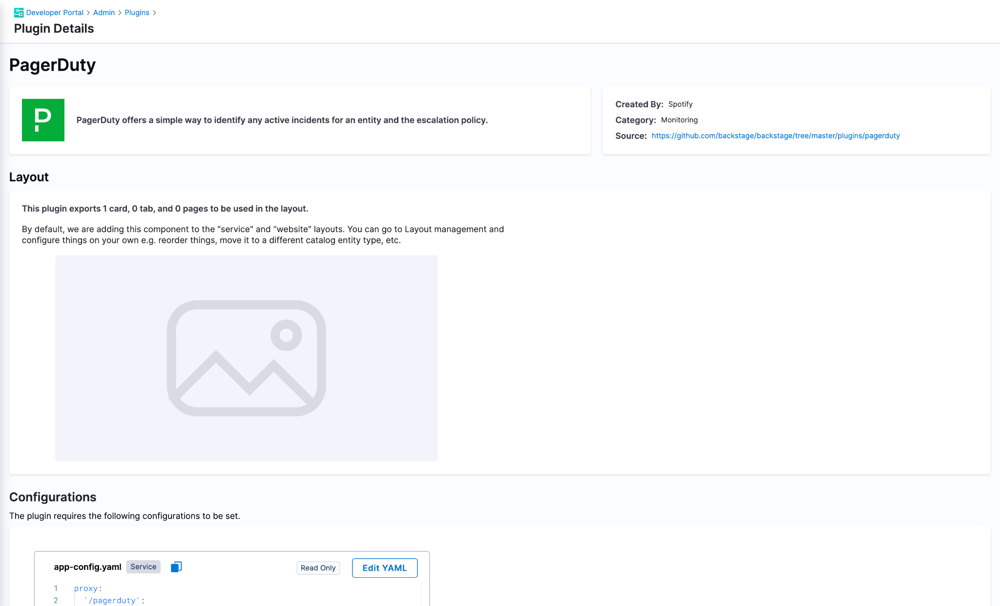
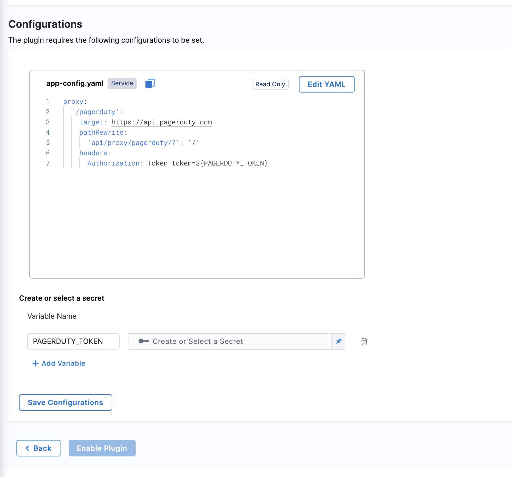
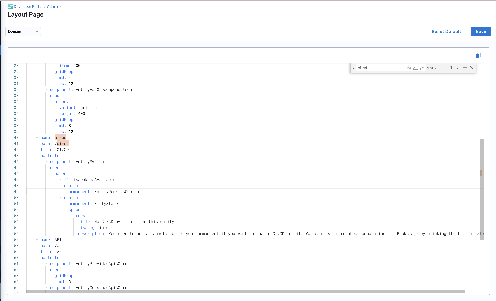

You can use plugins to extend the functionality of Harness IDP and to customize IDP to suit your needs. This article provides step-by-step instructions on how to enable a plugin in Harness IDP.

**Prerequisites**

Before you enable a new plugin, ensure that the following prerequisites are met:

- Harness IDP is provisioned and accessible.
- Onboarding for your Harness account is completed.

**Plugin types**

Harness IDP offers a set of curated plugins that you can enable. Here are some plugin types that you can consider:

- A card in the software catalog. For example, PagerDuty.
- A plugin with a tab in the catalog. For example, GitHub Insights.
- A plugin with both cards and tabs (multiple components).
- (Optional) A plugin with both UI and backend parts.
- A plugin with both UI and backend parts and a database. For example, a TODO plugin.
- A full page plugin. For example, GraphQL.

These are just a few examples of plugin types available in Harness IDP. Depending on your requirements, you can choose the plugin type that best aligns with your needs and enables the desired functionality.

Once you have selected the desired plugin type, follow the documented instructions for enabling the plugin. The process might involve configuration, activation, and layout update steps that vary by plugin.

**Enable a plugin**

To enable a plugin, follow these steps:

1. Log on to Harness, and then select **Developer Portal** > **Admin** > **Plugins**. 
All administrative configurations, such as plugins, layouts, connectors, configurations, and access control are provided on the **Admin** page, and require administrative permissions. The **Plugins** page showcases a collection of curated plugins categorized as enabled and disabled plugins.

2. The **Plugins** navigation option directs the user to the plugins list page, which showcases a collection of curated plugins. On this page, there are distinct sections dedicated to both enabled and disabled plugins, providing a clear differentiation between the two categories.

3. Select the desired plugin card. 
The **Plugin details** page is displayed. The page provides information such as the plugin's name, details, layout, and configurations. It also includes an option to add a plugin secret. The plugin's layout section is read-only and displays the exported cards, tabs, or pages provided by the plugin.

  The plugin's layout section is read-only and displays the exported cards, tabs, or pages provided by the plugin.

4. (Optional) If you want to customize the plugin's configuration, in the **Configurations** section, edit the default configuration YAML. 

5. Update the plugin secret token value as specified in the configuration YAML. Make sure that the secret token name is the same as given in the configuration YAML.

6. After verifying all the configurations and secret details, save the configuration. 
If the configuration YAML is valid, the plugin configuration is saved. Otherwise, appropriate messages are displayed.

7. To enable the plugin, select **Enable Plugin**. 
The plugin is moved to the **Enabled Plugins** section on the **Plugins** page.

8. To return to the **Plugins** page, select **Back**.

9. Ingest the layout by using plugin layout management. The layout should be modified according to the elements that are exported from the plugin. The elements might include cards, tabs, and pages.

For instance, if the Jenkins plugin exports one card and one tab, in order to display them in your catalog entity, you must update the layout accordingly. To add a dedicated tab for the Jenkins plugin, follow these steps:

- From the dropdown menu, select the domain option.
- Search for the "ci-cd" component within the domain.
- Inside the **Entity Switch** case, insert the following code snippet:

You should now be able to view the enabled plugins in the catalog section of Harness IDP. To see the enabled plugins, register the plugin catalog info YAML.
