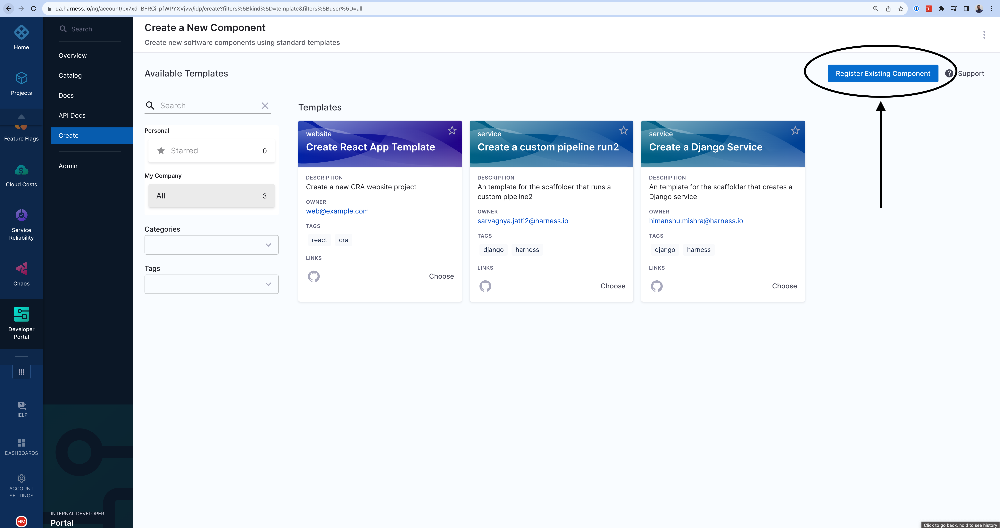

You can register any new software component with the software catalog by creating a `catalog-info.yaml` file in your Git repository and then registering its URL.

## Create a new `catalog-info.yaml`

If you want to register an existing software component, navigate to its repository. If it is a mono-repo, navigate to its directory and create a `catalog-info.yaml` at the root of the directory. The file can technically live anywhere (for example, `.harness/catalog-info.yaml`). You can use the following YAML code:

```yaml
apiVersion: backstage.io/v1alpha1
kind: Component
metadata:
  name: my-new-service
  description: Description of my new service
  annotations:
    pagerduty.com/integration-key: <sample-service-integration-key>
  tags:
    - java
  links:
    - url: https://admin.example-org.com
      title: Admin Dashboard
      icon: dashboard
      type: admin-dashboard
spec:
  type: service
  lifecycle: production
  owner: team-a
  system: project-x
```

Following are the key fields that you must update:

1. `metadata.name`. This should be a unique name for your component. Usually, it is the name of the service.
2. `metadata.description` - A description for your new component.
3. `spec.type` - The new software component could be a `service`, `library`, `website`, or any other type.
4. `spec.owner` - The user group identifier of the team that owns the component.

Once the file is created in your Git repo, copy the full URL to the file. For example, `https://github.com/harness-community/idp-samples/blob/main/catalog-info.yaml`.

In the left navigation, select **Create**, and then select **Register Software Component**.




Enter the URL to your new `catalog-info.yaml`.


Click import.


The new component will be available in your catalog.


