This guide describes the steps a Harness account admin can take to set up the IDP module. During the Beta phase, the module needs to be enabled on request. [Read more](./enabling-module.md).

**Prerequisite**: IDP should be provisioned for the given account. The required resources, services, configurations etc. should be in place before starting the harness catalog onboarding flow

## Process

1. User lands on IDP module by navigating from sidebar after logging into their Harness account.

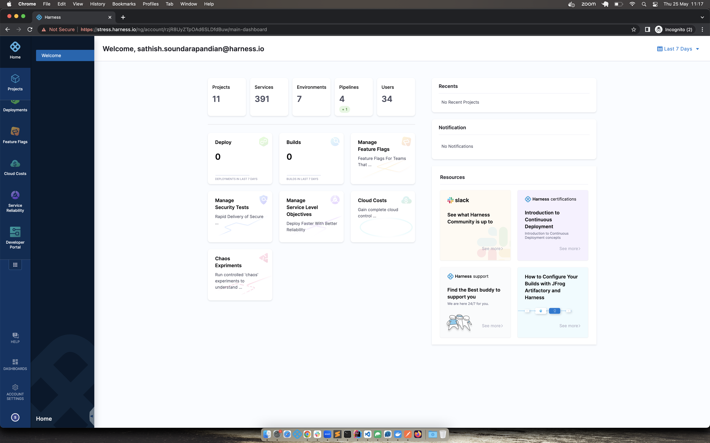
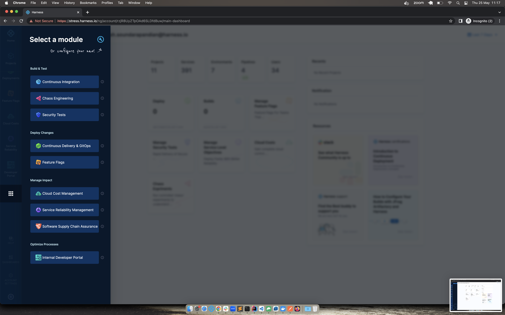

2. If the required prerequisite is full-filled, user can proceed with the harness catalog onboarding. Else user will be at the same page till the prerequisite is full-filled.

3. Only Harness account admins and users having the "Manage" permission for the "Developer Portal" resource can perform the onboarding. We recommend creating an "IDP Admin" role with the above mentioned permission and assign it to your team who will be responsible for configuring IDP.

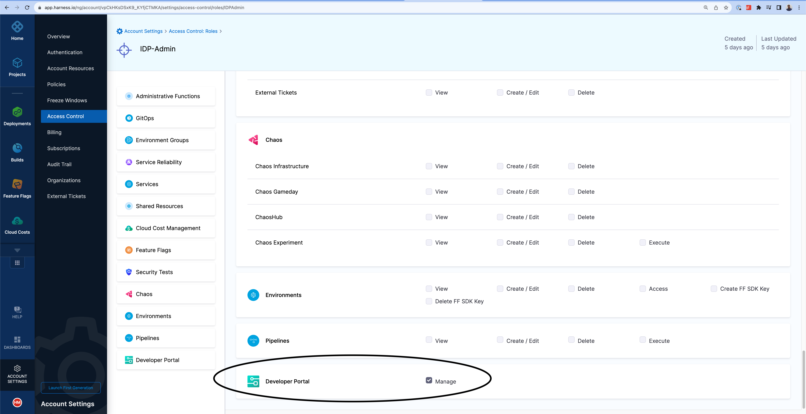

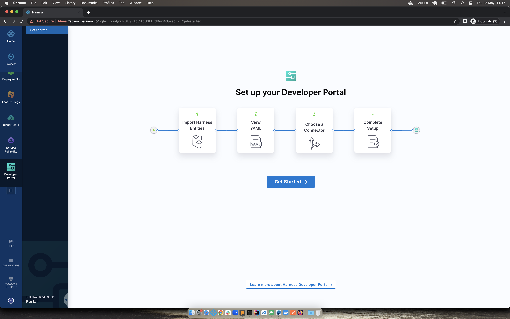

4. User will be shown the list of services in their account. It will be defined in terms of IDP entity i.e harness organisation is a domain, harness project is a system and harness service is a component in the IDP world. This list includes services at all scopes.

5. User can choose all the services / individual services / no services

- ALL - All the harness services will be imported into IDP
- INDIVIDUAL - Selected harness services will be imported into IDP
- NO - One sample entity will be imported into IDP for the user to get started.

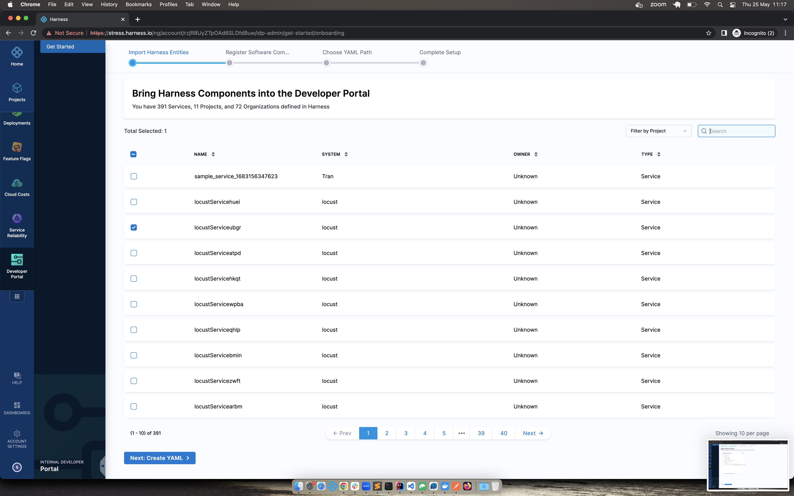
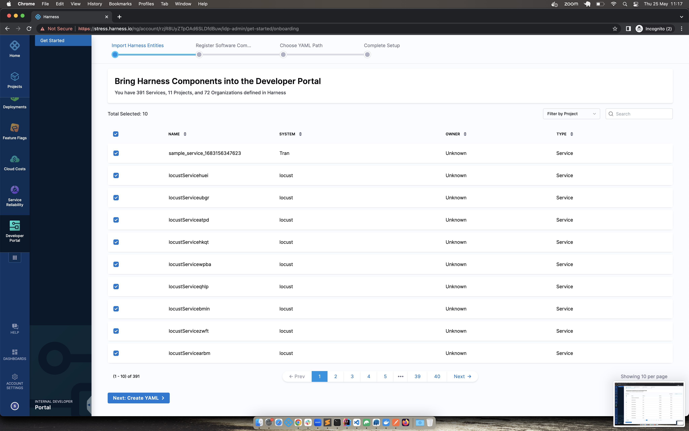

6. User gets a view on how the entity definition looks like


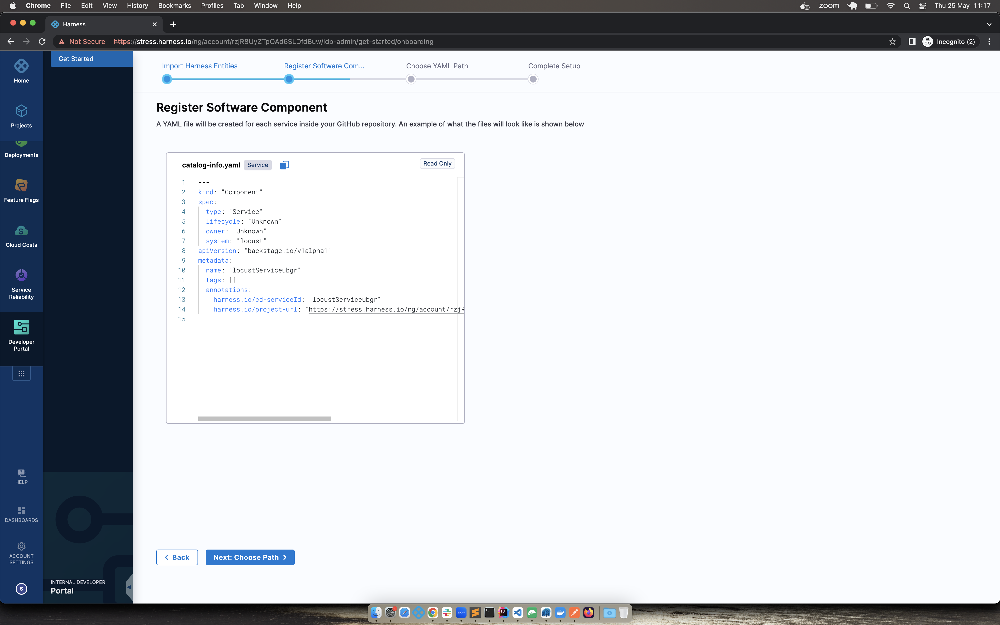
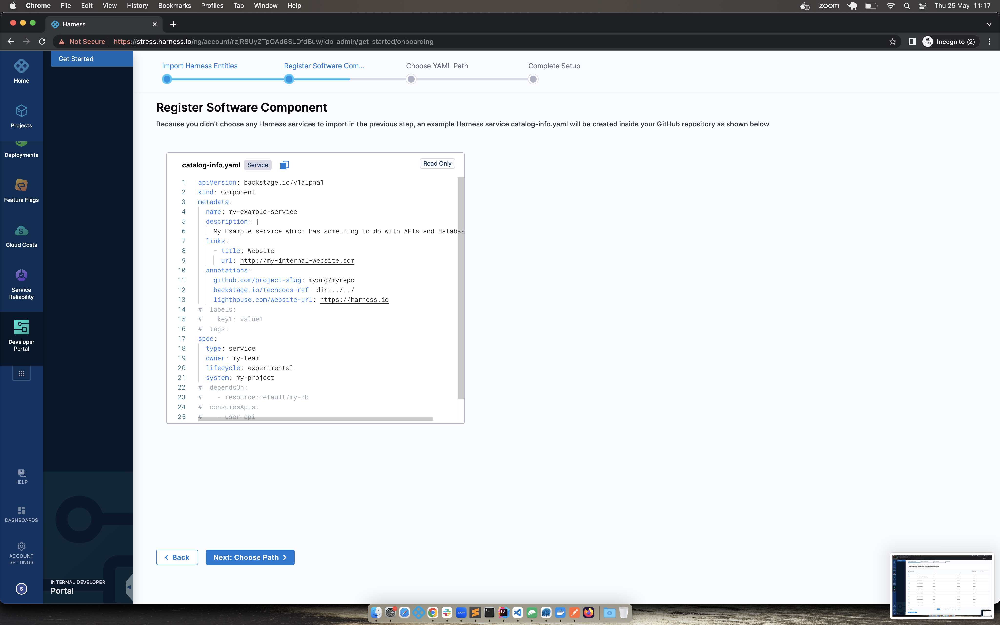

7. Connector setup -

- GitHub, Gitlab, Bitbucket and Azure Repository connectors are supported.
- Sub variants on above connectors - GitHub Enterprise, GitHub App, Bitbucket Cloud, Bitbucket Server
- While setting up connector, both Account & Repo type for URL is supported.
- Only HTTP mode is supported. SSH connection type is not supported.
- API access is needed in the connector for the IDP catalog setup
- Connection through harness platform and delegate is supported.
- Validate the connection before using it in the IDP flow

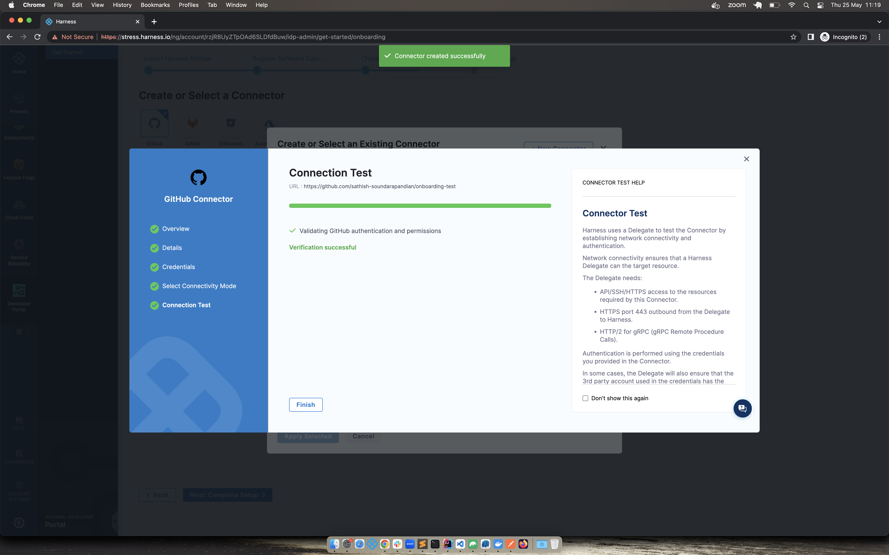
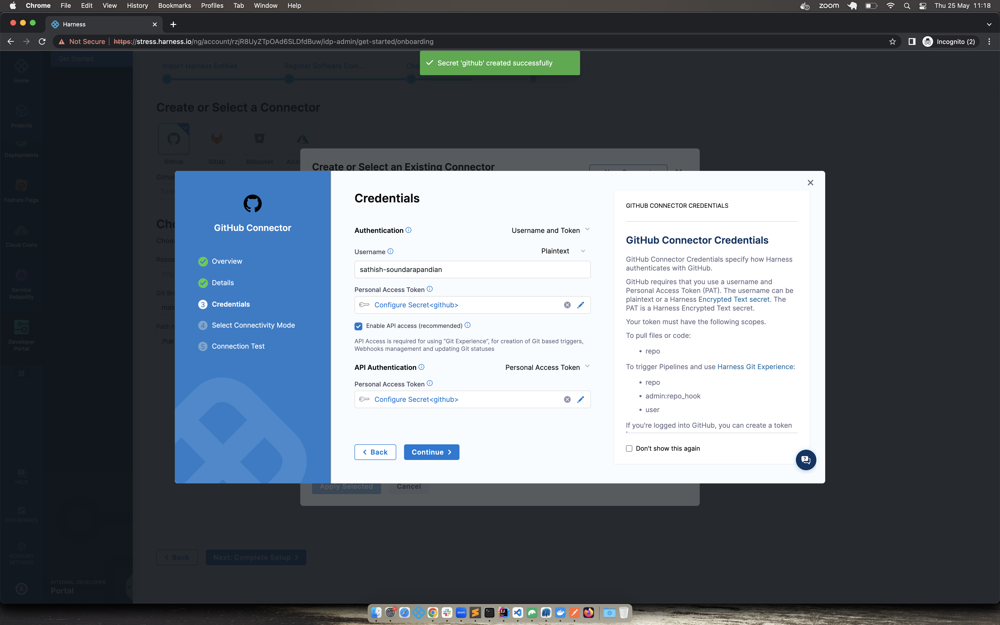

8. Details on where the entities will be created in git -

- **Repo** - Enter the full path to your repo. Example

```
https://github.com/sathish-soundarapandian/onboarding-test.git
https://github.com/sathish-soundarapandian/onboarding-test
```

- The provided repo in the repo URL should belong to the same organisation / project for which the connector has been setup. Ex -

In connector - The account path is `https://github.com/sathish-soundarapandian`. So the repo url in IDP onboarding flow should be `https://github.com/sathish-soundarapandian/{SOME_REPO}`. It cannot be `https://github.com/{SOMETHING_ELSE}/{SOME_REPO}` - this will not work.

- Provided repo should exist with a valid default HEAD branch. Ideally this will be case when the repo is initialised with README file

- Branch - Can be new branch / some existing branch. In both the cases, the commit will be done on top of the base HEAD branch.

- Path - Defaults to harness-services. Can be changed as well.

9. Once the required details are entered and submitted for importing, we will push the generated entity yaml files to the place provided in step 8. You will be seeing two commits - One is done during the sync flow and other commit which will consist of remaining entities will be pushed in an async manner. Time frame for async operation will depend on how big the repo size is and how many revisions the provided repo has.

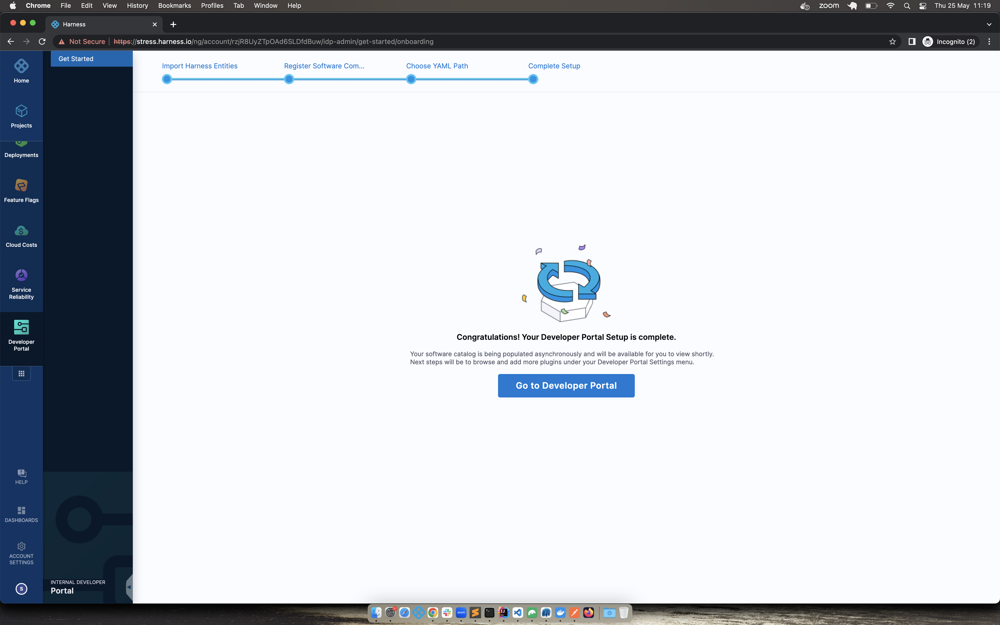

10. In the background, the catalog are also imported into IDP along with their associated configs.

11. User can navigate to the IDP homepage to get started. Catalog will be start showing up once the async operation is completed.

12. Since during the onboarding flow harness will not be able to discover the complete metadata of the entity, the owner field will be set to Unknown. As part of the IDP provisioning, harness users and groups are imported to IDP. With this in place, customers can start editing the catalog info yaml definition to update the owner for each of the entity.

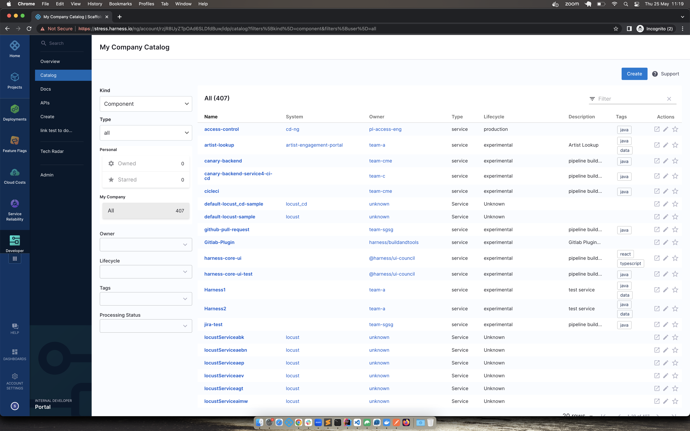

13. Post onboarding, users can import any number of entities into harness-idp using the register component flow. This flow expects you to provide the complete url where the entity definition is hosted.

**Recommendations**

If using GitHub connector, customers can go with App based authentication which provides higher number of API requests in an hour window. Read more about [GitHub Apps - GitHub Docs.](https://docs.github.com/en/apps/creating-github-apps/setting-up-a-github-app/rate-limits-for-github-apps)
