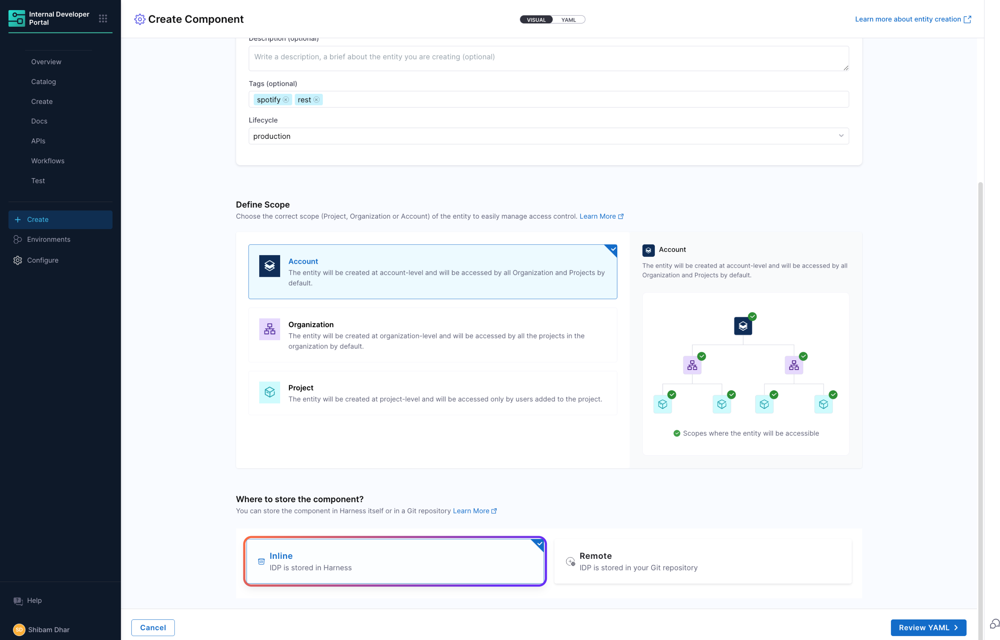
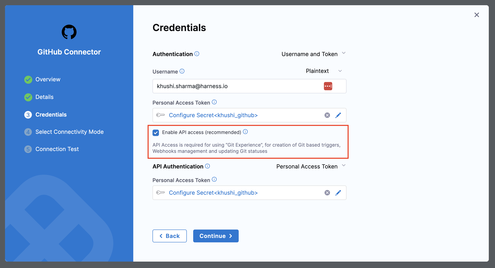
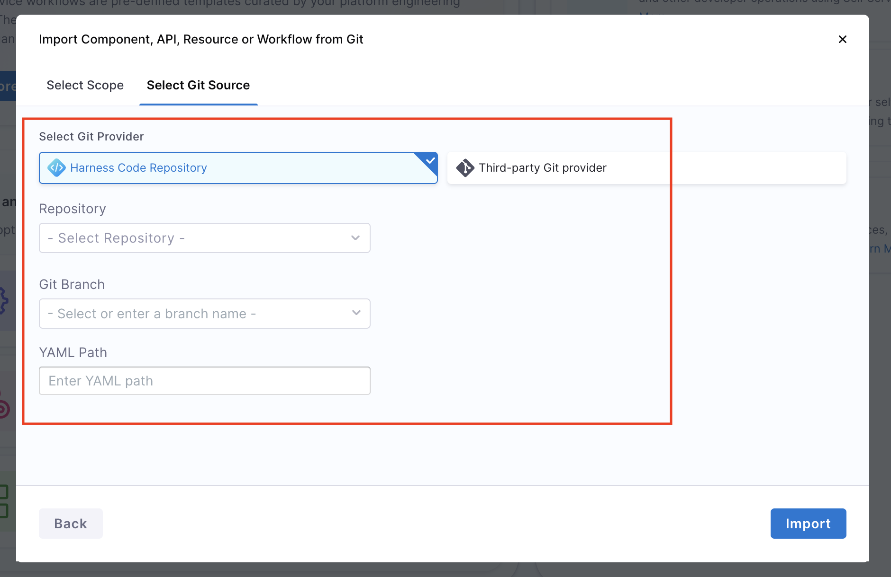
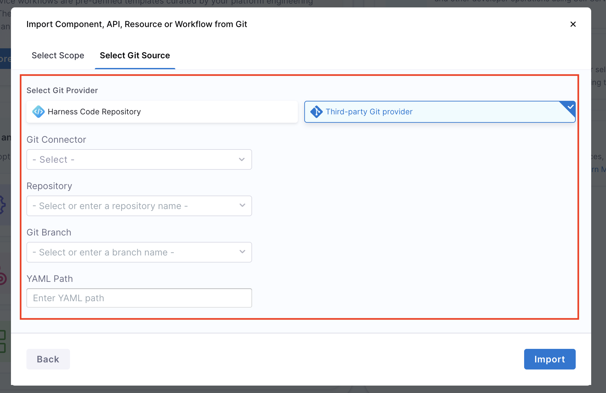
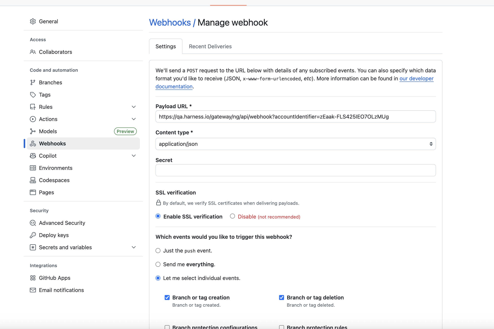
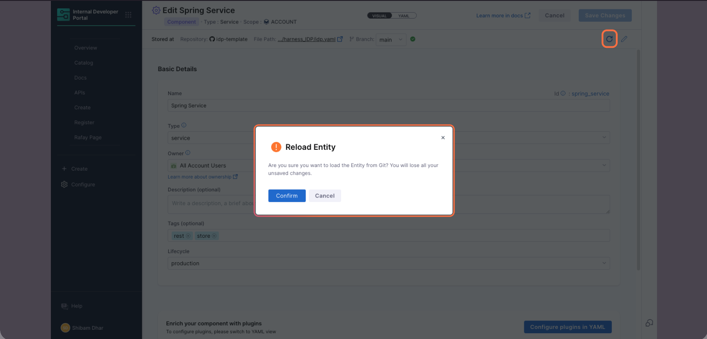

import Tabs from '@theme/Tabs';
import TabItem from '@theme/TabItem';

:::info For IDP 1.0 Customers
This Git Experience document is applicable **only to IDP 2.0 customers**, as the Harness IDP Git Experience is available exclusively in IDP 2.0. To learn how to upgrade, refer to the [IDP 2.0 Upgrade Guide](/docs/internal-developer-portal/idp-2o-overview/migrating-idp-2o.md).
:::

Harness Internal Developer Portal (IDP) integrates with the Platform Git Experience (GitX) to enable **bi-directional Git-backed entity management**. Harness Git Experience allows you to store and track your entity YAMLs in Git Repositories with bi-directional updates. This document outlines how developers and platform engineers interact with Git Experience throughout the entity lifecycle.

### Supported IDP Entities in Git Experience

IDP Catalog entity YAMLs (Component, API, Resource) and Workflow YAMLs can be stored in Git using Git Experience. However, configuration of other resources such as Scorecards, Plugin configurations, Layouts, etc. can only be done using the UI or API.

### Supported Git Providers in Harness IDP Git Experience

Harness IDP Git Experience integrates with the following **Git Providers**:

- GitHub (Cloud & Enterprise)
- GitLab (Cloud & Self Hosted)
- Bitbucket
- Azure Repos
- Harness Code

## Storing Entity YAMLs

Harness Git Experience with IDP 2.0 allows you to store your Catalog entity YAMLs and Workflow YAMLs in the following two ways:

1. **Inline**: Your entity YAML is stored in the Harness database, and the entity exists as an **Inline Entity**.
2. **Remote**: Your entity YAML is pushed to Git, and the entity exists as an **Remote Entity**.

Read more about [Harness Platform Git Experience Requirements](https://developer.harness.io/docs/platform/git-experience/configure-git-experience-for-harness-entities#git-experience-requirements). To learn more about Harness-native Catalog entity YAML, go to [Catalog YAML](/docs/internal-developer-portal/catalog/catalog-yaml.md).

### Creating Inline Entities

With Inline Entities, your entity's YAML is stored in the Harness database. You can edit and manage your entity's YAML from the Harness UI directly.

### Creating Remote Entities

With Remote Entities, you can store your entity YAMLs in your Git repositories with bi-directional real-time sync support.

<iframe
  src="https://app.tango.us/app/embed/c2f6dd37-2805-426f-a004-11c15836244c?skipCover=false&defaultListView=false&skipBranding=false&makeViewOnly=true&hideAuthorAndDetails=false"
  style={{ minHeight: '640px' }}
  sandbox="allow-scripts allow-top-navigation-by-user-activation allow-popups allow-same-origin"
  security="restricted"
  title="Create and Configure Onboarding Component"
  width="100%"
  height="100%"
  referrerPolicy="strict-origin-when-cross-origin"
  frameBorder="0"
  webkitallowfullscreen="true"
  mozallowfullscreen="true"
  allowFullScreen
/>

Let's get started, so when a user creates a new Catalog entity - they can choose to store the YAML inline or in a remote Git repository. This selection is available upfront in the entity creation form.

Once Git is selected, users can configure the repository details, connector, branch, and YAML file path.
Changes made in the entity via the Harness UI are committed to the Git repo (either directly or through a pull request).

:::note
Changes made to the YAML file in Git are **automatically reflected** in the entity using **webhook-triggered updates**. To understand more about this feature, please refer to [Updating and Syncing Entities with Git](/docs/internal-developer-portal/git-experience/gitx-journey.md#updating-and-syncing-entities-with-git)
:::

### Converting Inline to Remote Entity

Users who initially created an entity as **Inline** (stored in the Harness database) can convert it to a **Remote Entity** (Git-backed) at any time using the **Edit** page in the Harness UI.

You can do this in two ways:

- **Manually via the UI**: Navigate to the entity’s **Edit** screen, configure the Git settings (connector, repo, branch, and file path), and save the changes. This moves the entity YAML to Git and enables Git-based tracking.

<iframe
  src="https://app.tango.us/app/embed/548b060b-2600-472e-ad46-c9a6974a3316?skipCover=false&defaultListView=false&skipBranding=false&makeViewOnly=true&hideAuthorAndDetails=false"
  style={{ minHeight: '640px' }}
  sandbox="allow-scripts allow-top-navigation-by-user-activation allow-popups allow-same-origin"
  security="restricted"
  title="Move Workflow to Git Repository"
  width="100%"
  height="100%"
  referrerPolicy="strict-origin-when-cross-origin"
  frameBorder="0"
  webkitallowfullscreen="true"
  mozallowfullscreen="true"
  allowFullScreen
/>

- **In Bulk using a Script**: For larger migrations, Harness provides a script that helps automate the conversion of multiple entities from Inline to Remote, storing their YAMLs in a Git repo following a structured format.
  To learn how to use this script and view complete steps, refer to the official migration guide - [Store Entity YAMLs in Git](../idp-2o-overview/migrating-idp-2o#step-7-store-entity-yamls-in-git)

### Managing Multiple Branches

You can also switch branches from Git to view an alternate version of the entity's YAML. This action does not create a new entity; instead, it updates the existing one. This is especially useful in scenarios where direct commits to the main branch are restricted due to organizational policies, and changes need to go through a pull request workflow.

<iframe
  src="https://app.tango.us/app/embed/8dcee9d3-bde1-487d-8b8e-f6b9bbcf2e50?skipCover=false&defaultListView=false&skipBranding=false&makeViewOnly=true&hideAuthorAndDetails=false"
  style={{ minHeight: '640px' }}
  sandbox="allow-scripts allow-top-navigation-by-user-activation allow-popups allow-same-origin"
  security="restricted"
  title="Update Metadata and Commit in Harness"
  width="100%"
  height="100%"
  referrerPolicy="strict-origin-when-cross-origin"
  frameBorder="0"
  webkitallowfullscreen="true"
  mozallowfullscreen="true"
  allowFullScreen
/>

<!-- Remove this when the feature is released. -->

:::info note

Note that the final entity page view in IDP will still render the main/default branch. Only the Edit view will render the YAML contents from the alternate branch.

:::

## Importing an Entity from Git (using YAML)

In Harness IDP, users can also create new entities and Workflows by importing their YAML definitions stored in Git repositories directly into Harness IDP.
This feature allows teams to reuse pre-defined configurations, onboard services faster, and migrate from automation workflows or existing repositories.

### Pre-requisites

- **Enable API Access**: For connection types and authentication methods where API access is not already enabled by default, you'll have to enable it from the Git connector settings. API Access is required for using Harness Git Experience. Refer to these docs to [enable API access](https://developer.harness.io/docs/platform/connectors/code-repositories/ref-source-repo-provider/git-hub-connector-settings-reference#enable-api-access).
  

### Import an Entity YAML

You can create a new entity or workflow in Harness IDP directly from your Git YAML by using this **Import** flow. Please refer to the following steps to import any entity from Git.
<Tabs>
<TabItem value="Interactive Guide">
<DocVideo src="https://app.tango.us/app/embed/e6bb7067-f9f0-4280-ab71-9571d476936b" title="Import a Workflow from Git using a YAML" />
</TabItem>
<TabItem value="Step-by-Step">

1. Go to Harness IDP -> Create. In the bottom, you'll find an option to create a new entity by importing YAML from Git. Click on **Import from Git**.
2. Select the **Entity Scope** (scope at which you want your entity to be created). The scope (Account, Org, or Project) of the entity is determined by the scope you select here. Make sure your imported YAML includes the appropriate scope identifiers i.e. `projectIdentifier` and `orgIdentifier` – otherwise, it will result in an error.
3. Select the **Git Provider**. You can either choose **Harness Code Repository** or **Third-Party Provider**. For your selected option, enter the required details.
4. In case of **Harness Code Repository**, you'll have to provide the following details:
   - **Repository**: Git Repository where your Entity YAML is stored.
   - **Git Branch**: Branch of your Repository where your Entity YAML is stored.
   - **YAML Path**: Path of your YAML File.
     
5. In case of **Third-Party Provider**, you'll have to provide the following details:
   - **Git Connector**: Git Connector added in your Harness IDP
   - **Repository**: Git Repository where your Entity YAML is stored.
   - **Git Branch**: Branch of your Repository where your Entity YAML is stored.
   - **YAML Path**: Path of your YAML File.
     
6. Click on **Import**. This will create an entity in your IDP directly from the YAML file stored in Git.

</TabItem>
</Tabs>

#### Harness native YAML vs Backstage YAML

To use this feature, Backstage YAML is not supported directly. Since IDP 2.0 uses a new data model, existing YAMLs from IDP 1.0 (Backstage-native) must be converted using Harness CLI, UI editors, or migration scripts. To understand more about converting IDP 1.0 YAMLs to IDP 2.0 YAMLs, please refer to [Converting IDP 1.0 YAMLs](/docs/internal-developer-portal/catalog/catalog-yaml.md#converting-existing-entity-yamls-idp-20)

### Entity Scope and Connector Rules

Some important constraints exist during the import process:

- **Entity Scope is Fixed**:
  The scope (Account, Org, or Project) of the entity is determined by the scope you select initially. Make sure your imported YAML includes the appropriate scope identifiers i.e. `projectIdentifier` and `orgIdentifier`; otherwise, it will result in an error.
- **Harness Code & Other Git Providers**:
  - **Harness Code Repository**: When importing via **Harness Code**, YAMLs can be sourced from any repository that the user has access to. The repo’s scope does not affect the entity scope. The following details are required in importing an entity from Git using Harness Code Repository:
    - **Repository**: Git Repository where your Entity YAML is stored.
    - **Git Branch**: Branch of your Repository where your Entity YAML is stored.
    - **YAML Path**: Path of your YAML File.
      
  - **Third-Party Git Providers**: When using other **Git providers** (GitHub, GitLab, Bitbucket, Azure Repos), the same rules apply — the scope selection and YAML determines the entity's scope. The following details are required in importing an entity from Git using Third-party Git Providers:
    - **Git Connector**: Git Connector added in your Harness IDP
    - **Repository**: Git Repository where your Entity YAML is stored.
    - **Git Branch**: Branch of your Repository where your Entity YAML is stored.
    - **YAML Path**: Path of your YAML File.
      

## Updating and Syncing Entities with Git

Once an entity in Harness IDP is backed by Git Experience, it becomes tightly coupled with its corresponding YAML definition in the Git repository. This enables a seamless two-way sync between Harness and Git, ensuring that the Git repository always reflects the source of truth - whether the changes originate from the UI or from Git directly.

### Bi-directional Sync between Harness and Git

Git Experience enables bi-directional entity updates, meaning:

#### Changes in Git reflect in the Harness entity YAML

When a user updates the YAML file directly in the Git repository (for example, through a commit or pull request), GitX listens to webhook events configured for the repository. Once triggered, the webhook causes Harness to automatically reload the YAML and apply those changes to the corresponding entity.

#### Changes in Harness entity YAML reflect in Git

When a user edits the entity using the Harness UI (such as updating metadata, annotations, or layout), GitX pushes the changes back to Git. This can happen via:

- A direct push, where the update is committed directly to the configured branch, or
- A pull request, allowing teams to apply review and approval workflows.

#### Webhook Auto-Creation

When Git Experience is configured in Harness, a webhook is automatically created in your Git repository. This webhook enables IDP GitX to listen for updates and trigger YAML reloads.

#### Experience Bi-directional Sync (via Webhooks)

<iframe
  src="https://app.tango.us/app/embed/4c59d405-4506-4c11-904d-106a12516e27?skipCover=false&defaultListView=false&skipBranding=false&makeViewOnly=true&hideAuthorAndDetails=false"
  style={{ minHeight: '640px' }}
  sandbox="allow-scripts allow-top-navigation-by-user-activation allow-popups allow-same-origin"
  security="restricted"
  title="Edit YAML and Commit Changes in GitHub and Harness"
  width="100%"
  height="100%"
  referrerPolicy="strict-origin-when-cross-origin"
  frameBorder="0"
  webkitallowfullscreen="true"
  mozallowfullscreen="true"
  allowFullScreen
/>

### Manual Reload Support

In some cases, webhook integrations may fail to trigger or may not be configured properly. GitX provides a fallback mechanism in such scenarios.

Users can trigger a manual reload of an entity by clicking the **“Reload from Git”** button available on the entity's View or Edit page.

This operation pulls the latest YAML from the configured Git path and updates the entity, ensuring it remains up-to-date even without active webhook triggers.

Manual reload is particularly useful in debugging sync issues or in restricted environments where webhooks cannot be configured due to network/firewall constraints.

### Entity Sync Status & Version Drift

To provide complete visibility into the sync state of an entity, GitX shows real-time metadata on the entity’s View/Edit pages. This includes:

- **Sync status**: Indicates whether the entity is currently in sync with the YAML file in Git.
- **Out-of-sync warnings**: If the entity’s version in Harness diverges from its YAML file in Git (e.g., webhook failed or someone made conflicting changes), Harness will flag this status and notify the user.
- **Connector, branch, file path**: These GitX properties are always visible so users can troubleshoot and validate the entity’s configuration.
