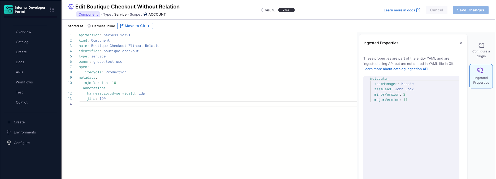

# Ingested Metadata in YAML Editor

In Harness IDP 2.0, the Git Experience (GitX) enables a seamless flow between the YAML editor in the UI and Git repositories. Entities such as services, systems, and resources are defined and version-controlled via YAML files stored in Git. However, many metadata properties—such as team ownership, versioning information, or quality scores—are frequently updated by external systems. These properties are ingested dynamically using the Ingestion API but are intentionally not written to the Git-backed YAML.

This is to avoid unnecessary commit noise and ensure live data can be attached to entities without cluttering Git history.

Starting with this release, the YAML editor in Harness IDP now includes a built-in view for displaying ingested metadata alongside the Git-synced YAML. This ensures users can see a complete picture of their service definitions—including dynamic data from tools like scanners or scorecards—without manually modifying the YAML file in Git.

This separation of Git-backed and ingested data preserves Git history accountability while providing transparency into system-managed properties. Users are still responsible for managing source-of-truth YAML in Git, while ingested metadata reflects runtime or tool-generated values that update independently of version control.

In the YAML editor, Harness now provides a way to view this ingested metadata without misleading users into thinking it’s Git-tracked. These properties are shown in a dedicated panel and not embedded directly within the YAML text.

The editor maintains a clean separation between Git-synced definitions and runtime metadata, while still offering full visibility to users.

Users can click the **Ingested Properties** button in the editor to open a side panel that shows dynamic metadata currently attached to the entity. This metadata appears in a YAML-like format but is read-only and is not committed to the Git repository.

### Behavior Summary

- Ingested metadata is attached via the Ingestion API and appears in the IDP UI.
- These properties do not appear in the Git YAML and are not committed.
- A side panel allows users to view them alongside the YAML editor.
- A static notice is shown to clarify that the data is not stored in Git.
- This ensures users are not confused about the origin or mutability of such metadata.

### Editing and Conflicts

In the metadata section (which includes annotations and custom properties), values can come from both the Git-tracked YAML and the Ingestion API. When the same property is defined in both places, the value ingested via the API takes precedence and will override the display in IDP views such as the side panel.

This override behavior happens only at the display/rendering level — for example, when viewing the side panel or when components are used in Scorecards. However, this does not affect the actual YAML stored in Git, which remains unchanged unless manually edited. The flows are isolated: manual UI/YAML edits follow one path, and ingested data follows another. If there's a conflict, the ingested value is prioritized during rendering and internal evaluation.

### Viewing Ingested Metadata

To view ingested properties in the YAML editor:

1. Open any component or service in edit mode.
2. Switch to the **YAML** view.
3. Click **Ingested Properties** on the right-hand side.
4. The panel will display the metadata ingested via API in a read-only YAML-like format.

For example, metadata like `teamManager`, `teamLead`, or `minorVersion`—which are not stored in Git—will be visible here.
