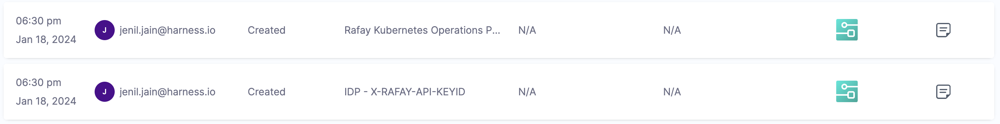
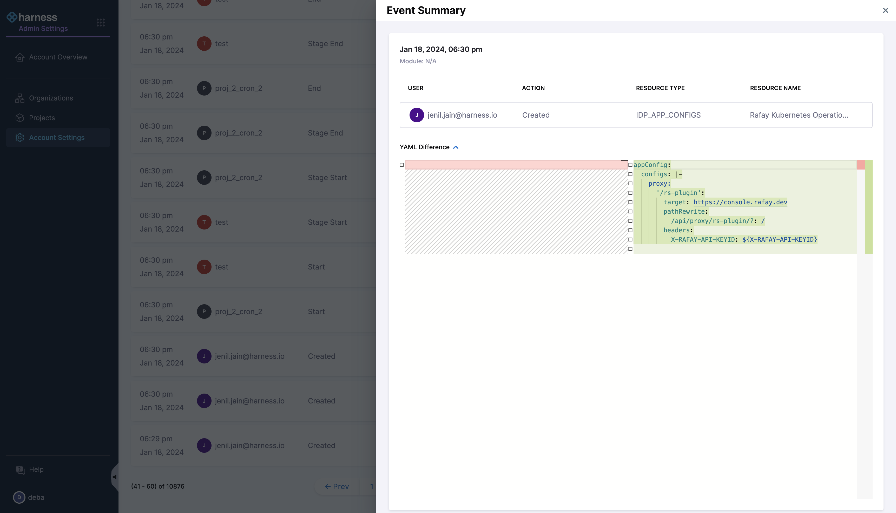

## Introduction

With Audit Trail in Harness, you can view and track changes to your Harness resources within your Harness account.

The audit data retention period is 2 years. Harness reserves the right to delete audit data after 2 years. You can request a longer retention period by contacting Harness. For example, if you require audit data for legal discoveries, etc., contact Harness, and we can help.

## IDP Events in Audit Trail

To access the Audit Trail, in your Harness project, navigate to **Account Settings > Audit Trail**. Follow the steps mentioned in [platform docs](https://developer.harness.io/docs/platform/governance/audit-trail/#step-view-an-audit-trail) for more details.

The Account Audit Trail includes the following IDP events:

| Resources                     | Audit Trail Events     |
|-------------------------------|------------------------|
| App Configs                   | Create, Update         |
| Environment Variables         | Create, Update         |
| Host URL / IP Address Details | Create, Update         |
| Scorecards                    | Create, Update, Delete |
| Checks                        | Create, Update, Delete |
| Access Control                | Update                 |
| Catalog Connector              | Create, Update         |
| Oauth Config                  | Create, Update         |
| URL Allow List                | Create, Update         |
| Layout                        | Update                 |
| Plugin                        | Enable, Disable        |
| Software Components           | Create, Delete         |

:::info

The audit trails on Plugins is dependent on other services' latest version, which are yet to be released, so it might take a week or two to make this available for our users. 

:::

In addition to above any changes to the catalog entities due to system refresh calls are being captured and tracked as audit events.

Each event in the Account Audit Trail list provides the following details:

1. **Action:** Describes the specific activity, such as logging in or deleting.
2. **Resource name and Type:** Identifies the resource type and its name where the event occurred. For example, monitored service, agent, or user.
3. **Organization and Project:** Name of the organization and the project in which the event occurred.

When you click on a resource name, you will be directed to the corresponding event page. For instance, clicking on a Check resource will take you to the Checks listing page, while clicking on a Catalog Connector resource will redirect you to the Connectors page.

To see more information about a particular event, select the messaging icon next to it. The Event Summary page appears, displaying the following information:

1. Date and time when the event occurred.
2. Username associated with the event.
3. Details of the activity. For example, an update.
4. Type and name of the resource.

You can also see a snapshot of changes in YAML format by expanding YAML Difference.

