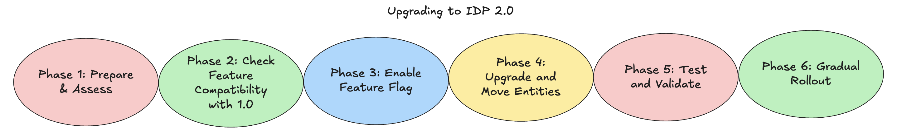

If you’re using Harness IDP 1.0, this guide will walk you through everything you need to know before upgrading to IDP 2.0—what’s new, what to watch out for, and how to make the switch smoothly without disrupting your current setup.



## Before You Upgrade (Checklist)

Before upgrading to **IDP 2.0**, carefully review the checklist below to understand key changes and ensure a smooth, well-planned migration.

1. **Review Breaking Changes**:
   Begin by thoroughly reviewing the [Breaking Changes](/docs/internal-developer-portal/idp-2o-overview/2-0-overview-and-upgrade-path.md#breaking-changes-in-idp-20) guide.
   IDP 2.0 introduces several significant updates that differ from the IDP 1.0 architecture. Since **rolling back is not straightforward**, it is essential to carefully evaluate all changes before proceeding.

2. **Evaluate Impact on Your Current Setup**:
   Assess how these changes—such as the new data model and removal of legacy entities—will affect your existing configuration.
   We recommend reviewing [Phase 1 of the Upgrade Path](/docs/internal-developer-portal/idp-2o-overview/migrating-idp-2o.md#phase-1-prepare--assess) for a clear understanding of what to expect and how to prepare.

3. **Confirm You're Ready**:
   Ensure your team is ready for onboarding by checking the [Feature Compatibility](/docs/internal-developer-portal/idp-2o-overview/2-0-overview-and-upgrade-path.md#feature-compatibility-matrix-10-vs-20) list and understanding [what is currently supported](/docs/internal-developer-portal/idp-2o-overview/2-0-overview-and-upgrade-path.md) in IDP 2.0.
   Since 2.0 is available to all users and not easily reversible, proceed only when confident in your readiness.

4. **Use a Test Account**:
   If possible, explore IDP 2.0 in a **dedicated test account** before deploying to production.
   Don’t have one? Reach out to [Harness Support](https://support.harness.io) to request access.

5. **Focus on Key Use Cases First**:
   Identify your team's **core use cases** where IDP 2.0 delivers the most value, and begin rollout there.
   A **gradual migration strategy** allows smoother adoption and easier troubleshooting.

6. **Connect with the Harness IDP Team**:
   Have questions or unique use cases? We’re here to help. Reach out to the [Harness IDP Team](https://support.harness.io) to get guidance tailored to your organization’s needs.

## Upgrade Path & Rollout Strategy

To help ensure a seamless transition from IDP 1.0 to 2.0, follow the structured seven-step upgrade process outlined below. Before you begin, make sure you’ve completed the prerequisite checklist above.

### Step 1: Prepare & Assess

Before upgrading to IDP 2.0, ensure you’ve reviewed the [Before You Upgrade Checklist](/docs/internal-developer-portal/idp-2o-overview/migrating-idp-2o.md#before-you-upgrade-checklist) and are fully prepared to onboard.

Please complete the following steps:

- **Review All Breaking Changes**:
  Go through the [breaking changes](/docs/internal-developer-portal/idp-2o-overview/2-0-overview-and-upgrade-path.md#breaking-changes-in-idp-20) introduced in IDP 2.0—including structural changes to the Catalog, introduction of platform-level Role-Based Access Control (RBAC), and enhancements to the Git Experience.

  > ⚠️ Rollback is not straightforward, so it's critical to thoroughly understand the scope and impact of these changes.

- **Evaluate Your Current Setup**:
  Analyze how these changes will affect your current configuration. Identify all impacted features, entities, and workflows. Here are a few scenarios to consider:

  - If you're using **Harness IDP 1.0 APIs** (Backstage Catalog APIs):
    These will continue to work temporarily but will be **deprecated by the end of October**. You’ll need to transition to the newer APIs.

  - If your current setup includes **System** or **Domain** entities:
    These are no longer supported in IDP 2.0. During the migration process, they will be **discarded**. To continue using these entities, you'll need to recreate them using the updated data model. We're working on introducing the System entity in IDP 2.0 soon.

  - If you used **`hidden`** or **`private`** tags for any entity or workflow:
    These tags are not supported in IDP 2.0. Instead, configure **RBAC** and recreate your entities at the appropriate scope (Account, Org, or Project) with correct roles and permissions.

---

### Step 2: Check Feature Compatibility with IDP 1.0

In addition to exploring new features, it’s essential to understand which IDP 1.0 features are still supported, changed, or deprecated.

- Use the [Feature Compatibility Matrix](/docs/internal-developer-portal/idp-2o-overview/2-0-overview-and-upgrade-path.md#feature-compatibility-matrix-10-vs-20) to compare features across versions.
- This helps ensure continuity of your existing workflows and smooth transition to IDP 2.0.

---

### Step 3: Enable IDP 2.0

Once you’re confident about upgrading:

- **Submit a Support Ticket**:
  Raise a ticket with [Harness Support](https://support.harness.io) to enable the `IDP_2_0` feature flag on your account.

- **Join an Upgrade Call (Early Access Customers)**:
  Our team will schedule a call with you to walk through the upgrade process and enable the feature flag.

- **Enable in a Test Environment First (Recommended)**:
  If you have a **test or staging environment**, enable IDP 2.0 there first. This allows your team to safely explore the new experience before enabling it in production.

---

### Step 4: Upgrade

Once the feature flag is enabled, your account will undergo the following changes:

#### 🗂️ Migration to Harness-native Data Model

- All your existing entities will automatically migrate to the new **Harness-native Data Model** under the **Account** scope as **inline entities**.
- Existing YAML files (`catalog-info.yaml`) will no longer be connected to these entities. You can either **discard them** or **retain them for archival** purposes.

#### 🔄 Migrating Workflows

- All **Workflows**, including those marked with the `hidden` tag, will automatically migrate to the Harness-native schema at the **Account level**.
- By default, all users will be able to **view** these workflows, but will **not** be able to **execute** them.

**Action Items:**

1. **Clean Up Experimental Workflows**:

   - Identify hidden or experimental workflows.
   - Move them to the **Project scope** (if any) if you don’t want all account users to see them:
     - Copy the workflow YAML.
     - Create a new workflow at the desired project level.
     - Delete the original Account-level workflow.

2. **Grant Execute Access for Remaining Workflows**: (Learn more about configuring [Workflows RBAC](/docs/internal-developer-portal/rbac/workflow-rbac.md))
   - Create a role named **"IDP Workflow Executors"** or modify an existing role.
   - Add **“Workflow - View and Execute”** permissions.
   - Do **not** include create/edit permissions to restrict modifications.
   - Assign this role to **“All Account Users”** with **“Account level resources”** (avoid “Account level including child scopes”).

#### 🔄 Migrating Catalog Entities

- All entities will migrate to the **Account level** as **inline entities**.
- Like workflows, existing `catalog-info.yaml` files will no longer be linked. These can be retained for reference or discarded.
- Once the **Git Experience** is released, you’ll be able to commit these entities to a Git repository as YAML files.

**Action Items:**

1. **Entity Cleanup & Restructuring:**

   - For **private or shared services**, reorganize them into appropriate **Projects or Org scopes**:
     - Copy the entity YAML.
     - Recreate it under the desired scope (e.g., Project).
     - Delete the original Account-level entity.

2. **Configure Catalog RBAC:** (Learn more about configuring [Catalog RBAC](/docs/internal-developer-portal/rbac/catalog-rbac.md))
   - To control access to these entities:
     - Start setting up **Catalog RBAC**.
     - Define appropriate roles and permissions for users who need access to account-level catalog entities.

#### 🔧 Move to Newer APIs (Post-Migration)

After upgrading to IDP 2.0, you can begin using the **newer API endpoints**. Although existing APIs will continue to work temporarily, they will be deprecated by **end of October**.

**Action Items:**

- For pipelines using the **"register catalog"** step or any **legacy IDP 1.0 APIs**, migrate to the new APIs:

  - Update the YAML directly (refer to the guide [here](/docs/internal-developer-portal/catalog/catalog-yaml.md)).
  - Or use the new `POST /entities` API endpoint (guide available here).

---

### Step 5: Test and Validate

- Validate UI behavior: create, update, and delete entities using the new UI experience.
- Test platform-level RBAC to ensure permissions are properly enforced.
- Verify the new Git Experience features, including webhook-based syncing and branching workflows.
- Confirm workflow behavior across different scopes (Account, Org, Project).

---

### Step 6: Gradual Rollout

- Begin rolling out the upgraded platform to selected teams or use-cases.
- Monitor for issues or regressions, and collect feedback from early users.

---

### Step 7: Store Entity YAMLs in Git

**Upgrading from IDP 1.0 to IDP 2.0 will result in all your entities being created as Inline Entities** (i.e., with all the Entity YAMLs stored in the Harness Database). In case you want to store these Entity YAMLs in Git and convert them from Inline to Remote Entities (i.e., with all the Entity YAMLs stored in Git), you can make use of the **Harness IDP Git Experience** feature. Here's how you can convert the entities:

- **Convert your entities and store YAMLs in Git from your Harness IDP UI directly.** Refer to these docs on [converting Inline IDP Entities to Remote Entities](/docs/internal-developer-portal/git-experience/gitx-journey.md#converting-inline-to-remote-entity).
- **Use the following script to convert your Inline Entities to Remote Entities directly in bulk.**

:::info Pre-requisites
Ensure you set the following variables before you run the script i.e. `HARNESS_ACCOUNT`, `X_API_KEY`, `CONNECTOR_REF`, `REPO_NAME` and `BRANCH_NAME`.
:::

```sh
#!/bin/bash

## API Call details (UPDATE REQUIRED)

API_BASE_URL="https://app.harness.io"  # Can also be yourcompany.harness.io if you have vanity URL
HARNESS_ACCOUNT="{HARNESS_ACCOUNT}"  # Use your Harness Account ID
X_API_KEY="{X_API_KEY}"  # Create a Harness API Key with IDP Catalog Create/Edit permissions

## Git Details (UPDATE REQUIRED)

CONNECTOR_REF="${CONNECTOR_REF}"  # e.g. account.connector_id - This is your Git Connector
REPO_NAME="${REPO_NAME}"
BRANCH_NAME="${BRANCH_NAME}"
KIND="component" # To give multiple kinds, use comma separated values (Example: kind="component,api,resource,workflow")
BASE_FILE_PATH=".harness/idp"

PAGE_SIZE=10
PAGE=0
HAS_MORE=true
while [ "$HAS_MORE" = true ]; do
  echo "Fetching page: $PAGE"

  response=$(curl -s -D GET "$API_BASE_URL/v1/entities?kind=$KIND&limit=$PAGE_SIZE&page=$PAGE" \
    -H "Harness-Account: $HARNESS_ACCOUNT" \
    -H "x-api-key: $X_API_KEY" \
    -H "Content-Type: application/json")

  entities=$(echo "$response")

  if [ -z "$entities" ]; then
    echo "No more entities found."
    break
  fi

  echo "$entities" | jq -c '.[]' | while read -r entity; do
    entity_ref=$(echo "$entity" | jq -r '.entity_ref')

    # Example: service:account.org.proj/identifier
    kind=$(echo "$entity_ref" | cut -d':' -f1)
    ref_part=$(echo "$entity_ref" | cut -d':' -f2)

    identifier=$(echo "$ref_part" | awk -F'/' '{print $2}')
    scope_part=$(echo "$ref_part" | awk -F'/' '{print $1}')

    IFS='.' read -r account orgIdentifier projectIdentifier <<< "$scope_part"

    echo "Processing entity:"
    echo "  Identifier: $identifier"
    echo "  Kind: $kind"
    echo "  OrgIdentifier: $orgIdentifier"
    echo "  ProjectIdentifier: $projectIdentifier"

    if [[ -z "$orgIdentifier" && -z "$projectIdentifier" ]]; then
      # Account scope
      filepath="$BASE_FILE_PATH/$kind/${identifier}.yaml"
    elif [[ -n "$orgIdentifier" && -z "$projectIdentifier" ]]; then
      # Org scope
      filepath="$BASE_FILE_PATH/$kind/orgs/${orgIdentifier}/${identifier}.yaml"
    else
      # Project scope
      filepath="$BASE_FILE_PATH/$kind/orgs/${orgIdentifier}/projects/${projectIdentifier}/${identifier}.yaml"
    fi

    echo "File path: $filepath"

    json_payload=$(jq -n \
      --arg branch "$BRANCH_NAME" \
      --arg repo "$REPO_NAME" \
      --arg connector "$CONNECTOR_REF" \
      --arg path "$filepath" \
      '{
        git_details: {
          branch_name: $branch,
          repo_name: $repo,
          connector_ref: $connector,
          file_path: $path
        },
        entity_move_operation_type: "INLINE_TO_REMOTE"
      }')

    # Make move-entity API call
    move_entity_response=$(curl -s -D POST "$API_BASE_URL/v1/entities/move/$scope_part/$kind/$identifier" \
      -H "Harness-Account: $HARNESS_ACCOUNT" \
      -H "x-api-key: $X_API_KEY" \
      -H "Content-Type: application/json" \
      -d "$json_payload")

      status=$(echo "$move_entity_response" | jq -r '.status')
      if [[ "ERROR" == "$status" ]]; then
        echo $move_entity_response
      else
        echo "Entity moved successfully: $entity_ref"
      fi
      echo "-----------------------------------------------------------------------------"
    done

  # Check if there are more pages
  entity_count=$(echo "$entities" | jq -c '. | length')
  if [ "$entity_count" -lt "$PAGE_SIZE" ]; then
    echo "Last page reached"
    HAS_MORE=false
  else
    PAGE=$((PAGE + 1))
  fi

  done
```

## Unlock These Features with the IDP 2.0 Upgrade

Upgrading to IDP 2.0 gives you access to powerful new capabilities, including:

- **Harness-native Platform Hierarchy**
- **Granular, platform-level RBAC**
- **Bi-directional Git sync for entity YAML files**
- **Simplified automation without manual YAML management**
- **Redesigned Catalog & Workflow UI**
- _...and many more exciting features!_

To explore these new features in detail, go to [IDP 2.0 Feature Highlights](/docs/internal-developer-portal/idp-2o-overview/2-0-overview-and-upgrade-path.md#whats-new-in-idp-20-feature-highlights).

### Try Out the New Features in IDP 2.0

Here's how you can get hands-on with the new IDP 2.0 functionality:

1. Get familiar with the **[Harness-native Data Model](/docs/internal-developer-portal/catalog/data-model.md)**
2. Learn about the new **[Catalog YAML structure](/docs/internal-developer-portal/catalog/catalog-yaml.md)**
3. **[Manage Catalog](/docs/internal-developer-portal/catalog/manage-catalog.md)**
   - Create entities directly from the Harness UI
   - Edit, share, and delete entities with ease
4. **[Manage Workflows](/docs/internal-developer-portal/flows/manage-workflow-2o.md)**
   - Create and configure workflows directly from the UI
5. Understand the **[Scopes, Roles, and Permissions](/docs/internal-developer-portal/rbac/scopes.md)** hierarchy in IDP 2.0
6. Configure **[Catalog RBAC](/docs/internal-developer-portal/rbac/catalog-rbac.md)**
7. Set up **[Workflow RBAC](/docs/internal-developer-portal/rbac/workflow-rbac.md)**
8. Use the **[Harness IDP Git Experience](/docs/internal-developer-portal/git-experience/gitx-journey.md)** feature to store entity YAMLs in Git.

<!-- ## FAQs -->

<!-- ## Resources

WIP

- API Docs
- Videos
- Learn the impact of IDP 2.0 on the future of harness IDP (Marketing blog)
- Entity Schema JSON -->
