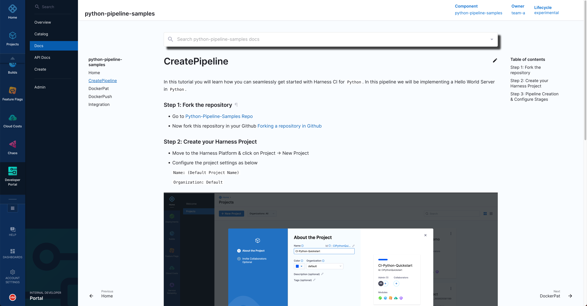

:::note
This module is currently available in Beta to limited customers. Contact Harness Support if you would like to try it out.
:::

Harness IDP lets developers **create** new software components in seconds following the company’s best practices. It lets them **manage** their software by presenting a developer-centric view of all the relevant information. And it lets them **explore** the internal software ecosystem of the company, discover tech docs, APIs, services to enable better collaboration.

Fully integrated into the Harness platform, IDP reduces the maintenance overhead and investment required from customers and is enterprise ready with our platform features.

## Service Onboarding Pipelines

Using Harness pipeline studio as a workflow orchestrator,
customers can use Harness IDP to create standard service
onboarding pipelines. Developers will fill in a few details and
a new backend service or an API or a website gets created
for them quickly. Developers focus on what they do the best,
writing features, while Platform Engineering gets to create
the Software Templates, automate processes and enforce
standards.

## Software Catalog

Software Catalog in Harness IDP is a centralized system
that helps customers keep track of ownership, metadata
and dependencies for all the software in their ecosystem
(services, websites, libraries, data pipelines, etc). Catalog
is built around the concept of metadata YAML files stored
together with the code, owned by respective teams.

## Extensibility via Plugins

Harness IDP comes with a set of curated plugins which allows
customers to pick and choose them based on the tools they
use. Using the plugins, customers can customize the view of
a Software Component based on its type and present all the
relevant information for developers in a single pane of glass.
Harness IDP’s plugin library is based on the hundreds of Open
Source Backstage plugins available in the marketplace.

## Technical Documentation

Using docs-like-code approach, Harness IDP allows documentation
to be surfaced along side the software component. Developers write
their docs in markdown, commit and update it alongside their code
allowing other developers to find them with least effort.
Docs-like-code ensure docs do not get stale while the “Docs” tab in
Catalog makes them discoverable and accessible by a single click.

## Search

The search feature in Harness IDP allows developers to
explore their entire software ecosystem just by using a
search bar. It lets them search through all the services,
APIs, libraries - their metadata, as well as their
documentation. Developers no longer have to rely on
“rumor-driven development” when they can search for
that exact service they are looking for and find the owner,
all on their Developer Portal.
