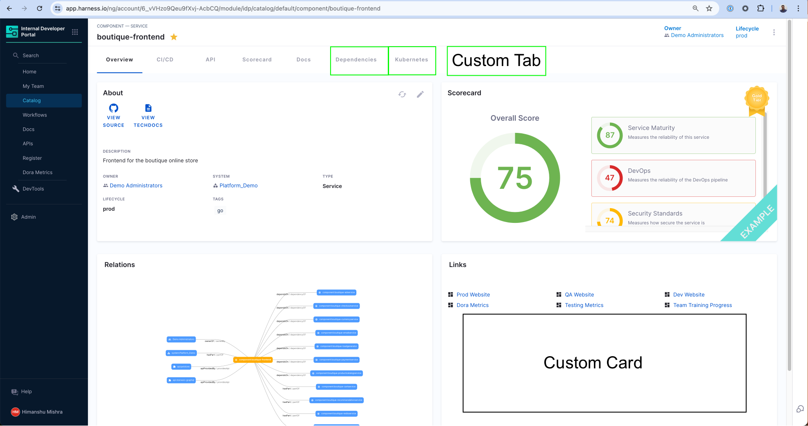
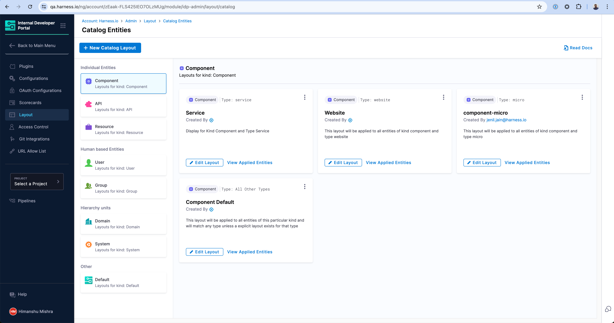
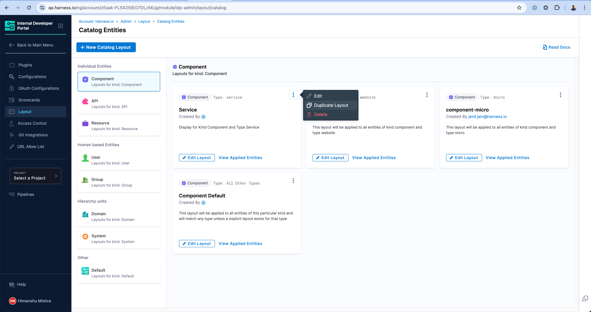
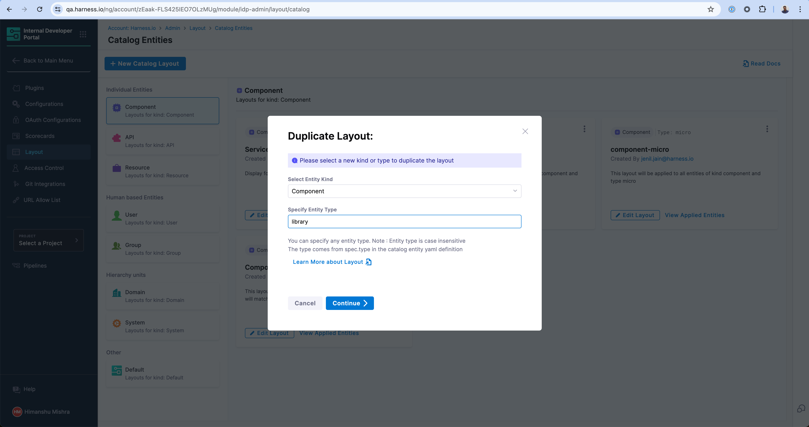

## Introduction

Every page that exists in the Software Catalog e.g. service, API, library, system etc. is uniquely designed to show the most relevant information to the developer for the particular type of application they are viewing. The views are powered by out-of-the-box components like the About card, Scorecard as well as the [Plugins](/docs/internal-developer-portal/plugins/overview) that are configured.

Once you enable a plugin or create a [custom plugin](/docs/internal-developer-portal/plugins/custom-plugins/overview), you can decide where to show the components exported the plugin by changing the Layout of the Catalog entity of the particular type. For example, if you enable the Grafana plugin, you might want to add a Tab called "Performance" and render the Grafana plugin in there.

Note that when you enable a plugin, we auto-update the default layouts, but you can always make changes by looking at what UI components are exported by that particular plugin. You can find this information under each and every plugin's documentation. [See an example for Dynatrace](http://localhost:3000/docs/internal-developer-portal/plugins/available-plugins/dynatrace#layout).



## Understanding Catalog Entity Kinds and Types

Every Catalog Layout is uniquely designed for a particular **Kind** and **Type** of application. For example, the most common catalog layout is for a microservice and is often represented as `Kind: Component` and `spec.type: service`. You can learn more about the [available kinds in the Catalog YAML docs](/docs/internal-developer-portal/catalog/yaml-file) and its [System Model](/docs/internal-developer-portal/catalog/system-model) to understand the different use-cases.

The `kind` of entities are fixed to those available out of the box (Component, API, Resource, etc.), however you can create any arbitrary `type` for these kinds of entities. Let's say you use the word "micro-frontends" to represent internal websites in your organization. In order to create this new type of Component, you can use `microfrontend` in the `spec.type` field of the Catalog Definition YAML and then create a unique layout for those types of applications.

## Layout Editor

You can access the layout of the Catalog Pages by going to the **Admin** section of IDP and navigating to the **Layout** section.




The Layouts are grouped by the `kind` of the Catalog entities and their use-cases in the sidebar. As you can see there are a number of layouts possible for a particular `kind`. For example, the first layout in the screen will match any Catalog entity with `kind: Component` and `spec.type: service`. Similarly, there is a different layout for `spec.type: website`. At the end, there is a catch-all layout which will be used for any other `type` which has not been explicitly created above.

### Creating a new Layout

You can create a new Layout for a new type of application by either duplicating an existing layout or clicking on the "New Catalog Layout" button above.



Enter a unique `type` that this layout will be applicable to. In this example, we're creating one for `library` to represent internal software libraries.



And voilà! Your new Layout is created which will specifically render for entities with `kind: Component` and `spec.type: library`.

## How to create a new Entity type

You can create any entity type by simply defining those in the Catalog Definition YAML (e.g. catalog-info.yaml) for the application. For example, if you are defining a new LLM Model and want to declare a new type `llm`, you can define this in the `catalog-info.yaml` under `spec.type` field and the new type will be available for you to use in Catalog filters as well as Layouts. Here is an example -

```yaml
apiVersion: backstage.io/v1alpha1
kind: Component
metadata:
  name: my-new-model
  description: Description of your model
  tags:
    - python
  links:
    - url: https://admin.example-org.com
      title: Admin Dashboard
      type: admin-dashboard
spec:
  type: llm-model
  lifecycle: production
  owner: team-a
  system: project-x
```

Read more on how to [register a Software Component in the Catalog](/docs/internal-developer-portal/get-started/quickstart-guides/register-a-new-software-component).

## Layout YAML Reference

Entity Page Layouts are defined in a hierarchical structure starting with the "page" key, representing the entity page. Each page consists of "tabs," an array that controls the rendered tabs for the entity page. Within each tab, there is a "contents" array responsible for rendering the contents within that specific tab.

- **"page"** represents the entity page and contains the configuration for the tabs.
- **"tabs"** is an array that defines the rendered tabs for the entity page.
- **"contents"** is an array that specifies the components rendered within a tab.
- **"component"** represents an individual component to be rendered.
- **"specs"** contains additional properties and configurations for the component.
- **"props"** specifies the props (properties) for the component.
- **"gridProps"** provides grid-related properties for arranging items in a grid structure.
- **"cases"** is a property specific to the "EntitySwitch" component, allowing conditional rendering based on specified conditions.

<details>

<summary>Example of an entity page layout</summary>

```yaml
page:
  name: EntityLayout
  tabs:
    - name: Overview
      path: /
      title: Overview
      contents:
        - component: EntityOrphanWarning
        - component: EntityProcessingErrorsPanel
        - component: EntityAboutCard
          specs:
            props:
              variant: gridItem
            gridProps:
              md: 6
        - component: EntityScoreCard
          specs:
            props:
              variant: gridItem
            gridProps:
              md: 6
        - component: EntityCatalogGraphCard
          specs:
            props:
              variant: gridItem
              height: 400
            gridProps:
              md: 6
              xs: 12
        - component: EntityLinksCard
          specs:
            props:
              variant: gridItem
              item: 400
            gridProps:
              md: 6
              xs: 12
    - name: ci-cd
      path: /ci-cd
      title: CI/CD
      contents:
        - component: EntitySwitch
          specs:
            cases:
              - if: isHarnessCiCdAvailable
                content:
                  component: EntityHarnessCiCdContent
              - content:
                  component: EmptyState
                  specs:
                    props:
                      title: No CI/CD available for this entity
                      missing: info
                      description: You need to add an annotation to your component if you want to enable CI/CD for it. You can read more about annotations in Backstage by clicking the button below.
    - name: API
      path: /api
      title: API
      contents:
        - component: EntityProvidedApisCard
          specs:
            gridProps:
              md: 6
        - component: EntityConsumedApisCard
          specs:
            gridProps:
              md: 6
    - name: Scorecard
      path: /scorecard
      title: Scorecard
      contents:
        - component: EntityScorecardContent
    - name: TechDocs
      path: /docs
      title: Docs
      contents:
        - component: EntityTechdocsContent
          specs:
            children:
              - component: TechDocsAddons
                specs:
                  children:
                    - component: ReportIssue
    - name: Deps
      path: /dependencies
      title: Dependencies
      contents:
        - component: EntityDependsOnComponentsCard
          specs:
            props:
              variant: gridItem
            gridProps:
              md: 6
        - component: EntityConsumedApisCard
          specs:
            props:
              variant: gridItem
            gridProps:
              md: 6
    - name: EntityKubernetesContent
      path: /kubernetes
      title: Kubernetes
      contents:
        - component: EntityKubernetesContent
          specs:
            props:
              refreshIntervalMs: 60000
```

</details>

## How to resize a card in Overview page

The Catalog pages use a 12-column grid system for responsive layouts. Where `md` is the recommended unit, and `md: 1` stands for 1/12th of the grid. See other possible breakpoints on [Material UI docs](https://mui.com/material-ui/react-grid/).

Recommendation: You can use `md: 6` for a card that occupies half width of a page and `md: 12` to assign full width.

Example -

```yaml
- component: EntityLinksCard
  specs:
    props:
      variant: gridItem
      item: 400
    gridProps:
      md: 6
```

## Troubleshooting

- Component Not Rendering: Check for correct `props`.
- Layout Issues: Adjust `gridProps` for responsive design.
