## Introduction

Homepage of IDP is meant to provide personalized view for developers, serving as a single pane of glass for all the necessary information required across tools and software systems in use, and it differs for different organization as well as different teams in an organization. So to help with varied use-cases, you can customize the homepage, add quick links in the headers, change text on the header, banner and cards according to your engineering org and make it useful for your developers.

## Available Customizations

The **Platform Admins** can customize the homepage under Layouts for 3 different categories **Header**, **Banner** and **Cards**. A preview of the changes with sample data is available while customizing the homepage. The cards can be of two width sizes, i.e., medium(6md) and large(12md).

### Header

- Under Header, you could add the personalized welcome message including quick links to important pages like Release Notes, Engineering Docs and Status Page for important service etc. 

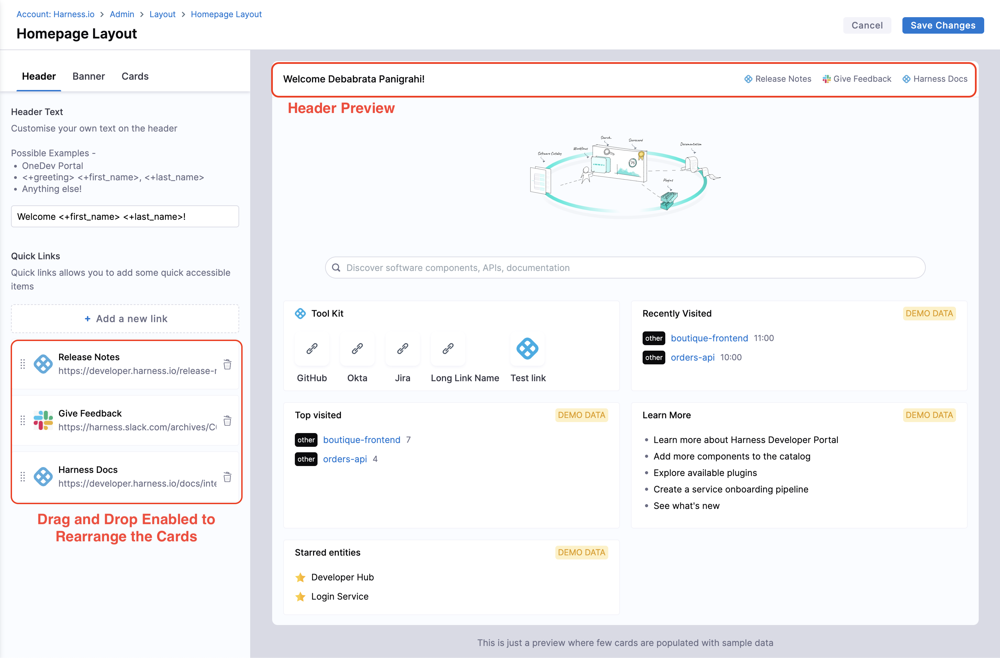

- For Header Text, enter the values in the field given, which could be dynamic as well as `<+first_name> <+last_name>`. 
- You can leave the header text static such as - `Welcome to Harness IDP!`
    - You can make it personalized such as - Welcome `<+first_name>!`
    - If your users have names of the format "last name, first name", then you can use Welcome `<+last_name>`, `<+first_name>`! Or you can name the portal a unique product name such as - `Welcome to MyPortal!` (maybe, a bit more creative than MyPortal).
    - There is a special variable called `<+greeting>` which resolves to Good Morning, Good Evening, etc. depending upon the timezone of the user. e.g. `<+greeting> <+first_name>`

- For Quick links you can upload a Custom Icon **(Recommended Size: 128x128px and file size: 200KB)** along with a name and a link. You can also drag and re-arrange the order of the links. It's ideal to add a few links to some central documents that you want your users to go to when they come to your Developer Portal. e.g. Onboarding Docs, Link to Slack, etc.

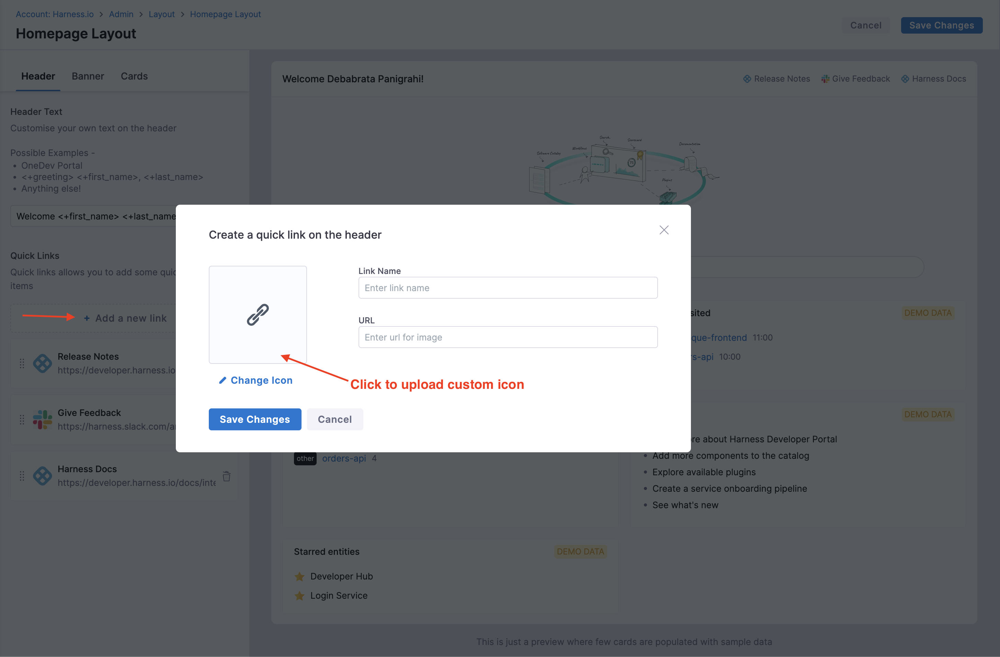

### Banner

- You can replace the existing banner on the IDP homepage by either an Image or a Video. You can as well disable the banner to allow more space for cards.

    - Image: Supported Types - `.jpg`, `.jpeg` and `.png`. Recommended Size of the image is 756x300px Maximum file size allowed is 10MB. You can also add a hyperlink to the image as well which will take users to the link when they click the banner. Suggestion - Add a cool banner for an upcoming engineering event that you want developers to be aware of!
    - Videos: Supported Types - Public Embedded Links e.g.; `https://www.youtube.com/embed/sVnI93bCr38?si=zobQ1YJMVVJMccaO`, `https://www.dropbox.com/scl/fo/5pu6lcznlqushows1gluk/AJtpk6i0ze_7Zr3Xr4xc2DE/distributed-work-with-dropbox.jpg?rlkey=d113ffnzhu8vseecxxe61ddk3&e=1&st=xzuy6mcy&raw=1` ; Rendered Size - `500x250px`. 

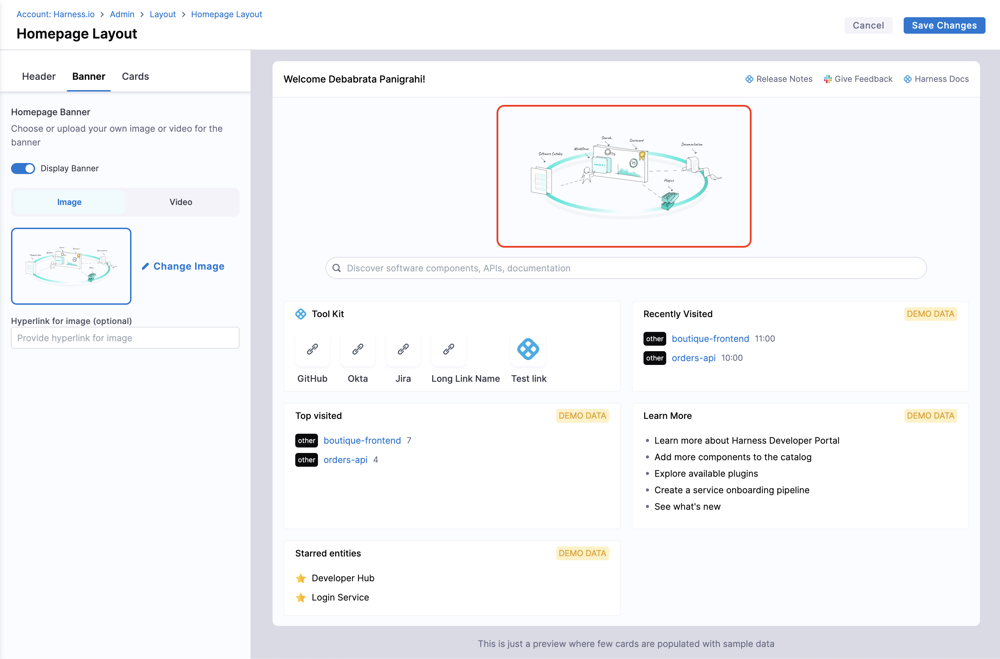

### Cards

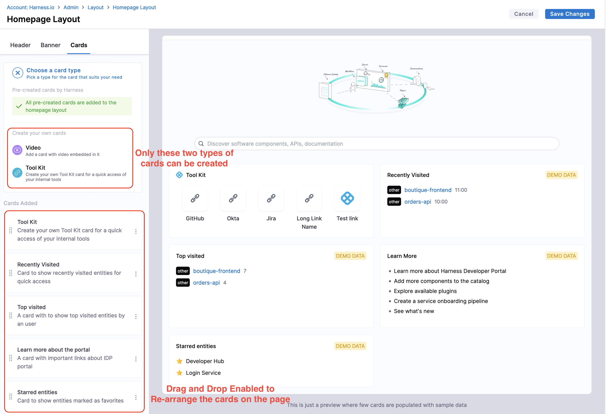

#### Default Cards

- The home page displays the following cards by default, and they can only be removed or rearranged by using drag-drop but can't be edited.

1. Recently Visited: The pages on IDP you visited recently.
2. Top Visited: Most viewed pages in IDP by a user.
3. Learn More: Important links to learn more on Harness IDP. 
4. Starred Entities: Your Starred Components, Workflows or TechDocs are displayed here. 

#### Other Cards

Apart from these, there are two more cards that can be added, removed or edited according to your requirements. 

### My Pull Requests Card

#### 1. GitHub

This GitHub PR card provides quick access to the pull requests you have created as well as the PRs you have to review. It shows PRs from all repositories you have access to, including both public and private repositories across multiple organizations.

The numbers displayed at the top, such as "15 Created," "1 Review Requests," and "1 Assigned" only reflect open pull requests, even though the card also contains information on closed pull requests, as seen by the "Closed (525)" tab.

- **How To Set up**: The access is configured thorough [OAuth Configurations in IDP](https://developer.harness.io/docs/internal-developer-portal/plugins/oauth-support-for-plugins), once the card is enabled on the Developer's Homepage you'll be redirected to GitHub to sign-in to populate this card. 

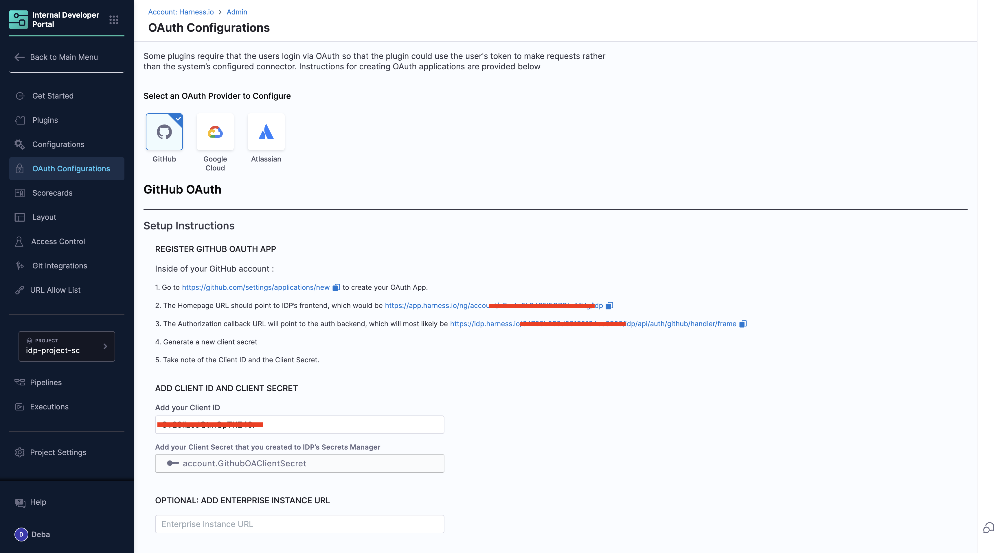
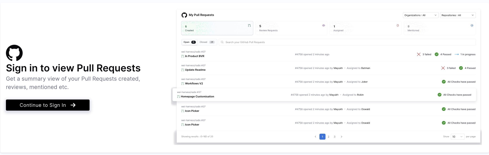

- **Access Control Explained**: 

- *IDP Admin Role*:- Set up and manage the organization-wide GitHub OAuth configuration and add the GitHub app credentials in IDP. Enable the My PR card on homepage
    - Scope: The OAuth App defines the access boundaries for the integration, such as which repositories, pull requests, and organizational resources will be visible.

- *Developers*: Sign-in using the pre-configured OAuth App to access personalized data once the "My PRs card" is available on the homepage. 
    - Scope: Access is limited to the repositories, pull requests, and issues they have permissions for within GitHub.

- **Value Addition**: It will display data across all repositories you have permissions for, making it easy to track your contributions, review requests, and assigned PRs in one place without switching contexts.

- **Limitation**: The real-time data is fetched in-case of an event(e.g., updating the org filters, re-loading the homepage), and it doesn't periodically update the values. 

Currently, the "My PRs" card only supports GitHub as a data source. Support for Harness Code Repository is coming soon. Other platforms, such as GitLab, Azure, and Bitbucket, are not yet supported. Let us know if you’d like to see support for these platforms in the future!

### My Tasks Card

#### 1. JIRA

This JIRA card offers a centralized view of your assigned tasks, ensuring easy tracking of work items. It provides a categorized summary of the tickets you're currently working on, tickets assigned for the sprint, including their current status, priority, and associated metadata.

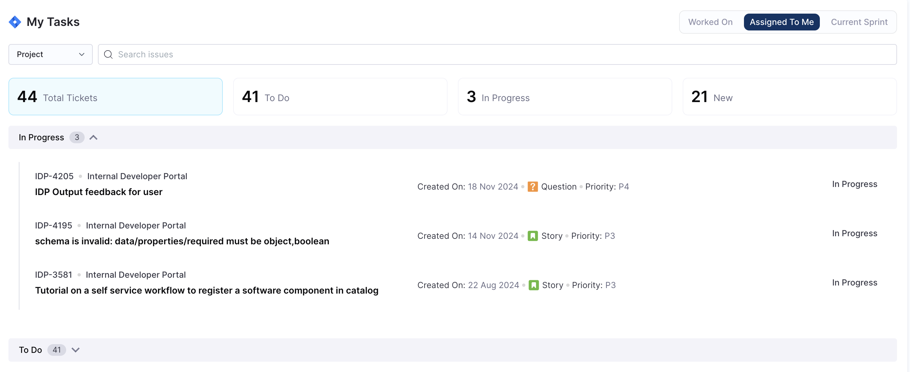

- **Key Features:**

1. Summary Metrics:
- Total Tickets: The total number of tasks assigned to you.
- To Do: Tasks that are pending and need to be started.
- In Progress: Tasks you are actively working on, or any status change has occurred for the ticket
- New: Tickets recently created(< 1 Week) and awaiting categorization or prioritization.

2. Filters for Better Focus:

- Worked On: Displays all the tickets you've worked on, regardless of their current status. Useful for tracking your progress across projects.
- Assigned To Me: A focused view of tasks specifically assigned to you.
- Current Sprint: Highlights tasks that are part of the active sprint.

- Project Filter: You can filter tickets according to the projects you have access to within your organization. 

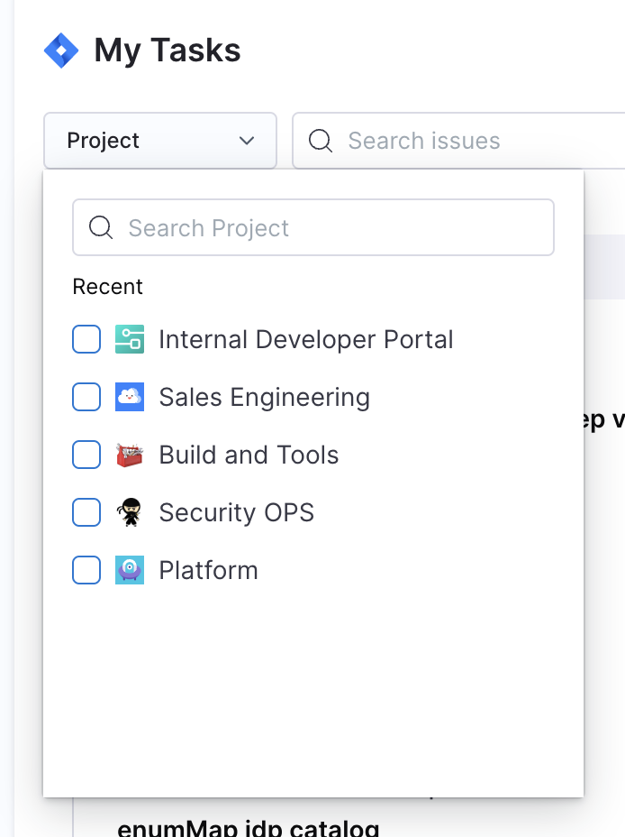

2. Each task card displays key details:
- Ticket ID (e.g., IDP-4205): You can click on this component and this will redirect you to the ticket in JIRA.  
- Project: The project the task belongs to (e.g., Internal Developer Portal).
- Title: A short description of the task. You can click on this component and this will redirect you to the ticket in JIRA.
- Type: Classification such as Question, Story, etc.
- Priority: Indicates urgency, such as P4 or P3.
- Created On: The date the ticket was created.
- Current Status: Clearly indicates if a ticket is in progress or another phase.

- **How to Set Up:**
Access to this JIRA card is authenticated via [OAuth Configurations in IDP](https://developer.harness.io/docs/internal-developer-portal/plugins/oauth-support-for-plugins). To populate your task list, you need to add your Atlassian OAuth App client secret and ID in the configurations page, then developers can login from the homepage. 

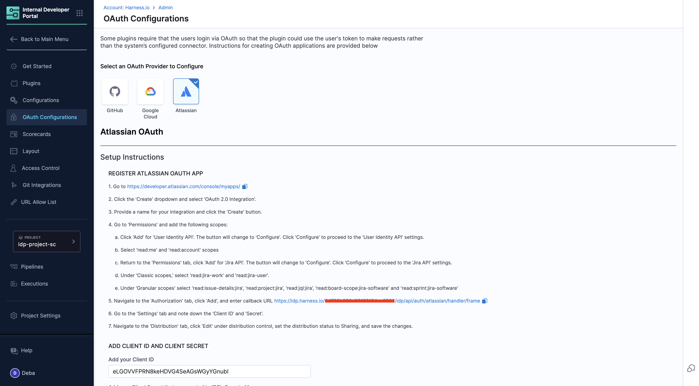

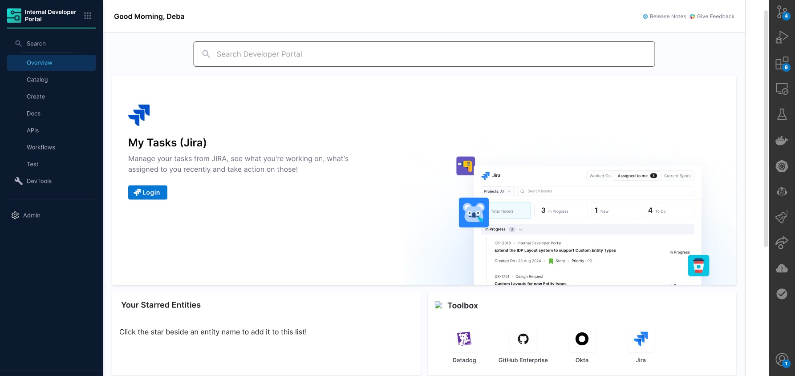

- **Access Control Explained**: 

- *IDP Admin Role*: Set up and manage the organization-wide JIRA OAuth configuration. Add the JIRA app credentials in IDP settings. Enable the "My JIRA Tickets" card on the Developer Homepage.
    - Scope: The OAuth App defines the access boundaries for the integration, such as which JIRA projects, tickets, and associated resources will be visible to developers. Admins configure the integration to ensure organization-wide availability while maintaining security and adherence to permissions.

- *Developer*: Sign in using the pre-configured OAuth App to access personalized data from JIRA. Utilize the "My JIRA Tickets" card on the homepage for real-time updates.
    - Scope: Access is limited to the JIRA projects, tickets, and associated data they have permissions for within the JIRA system. Developers only see tickets they are assigned to, tickets they created, or those they are mentioned in.

### Tool Kit

-  This card acts as a necessary bookmark for all the links visited by the developer quite frequently, e.g; JIRA Sprint Dashboard, QA Environments

-  You can add a new toolkit card with multiple links and the associated `custom icon` **(Recommended Size: 128x128px and file size: 200KB)** along with a name and a link.  

### Video

- You can add any videos as a card, and the supported types are public embedded links of the videos. 

:::info

Make sure to click on **Save Changes** for each time you want to save a new change otherwise the changes would be discarded and we show a dialog box with this warning when you try to exit the page without saving the changes. Also, the right side of the page is dedicated only for preview you can't edit anything there. 

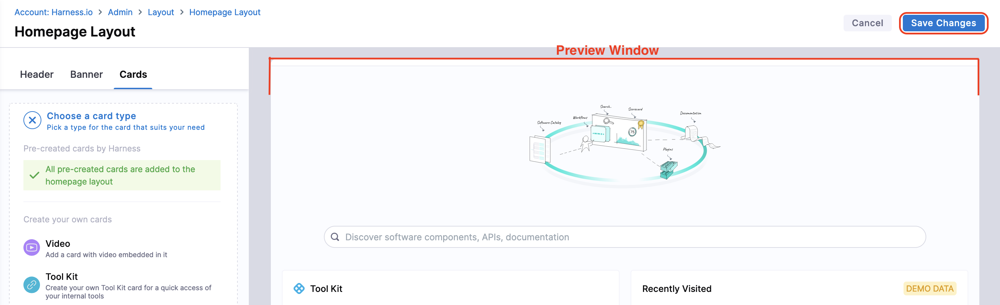

:::
