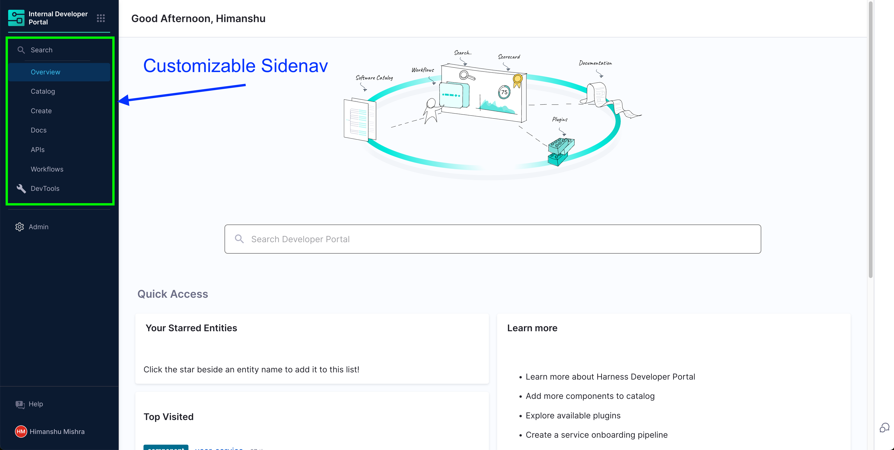
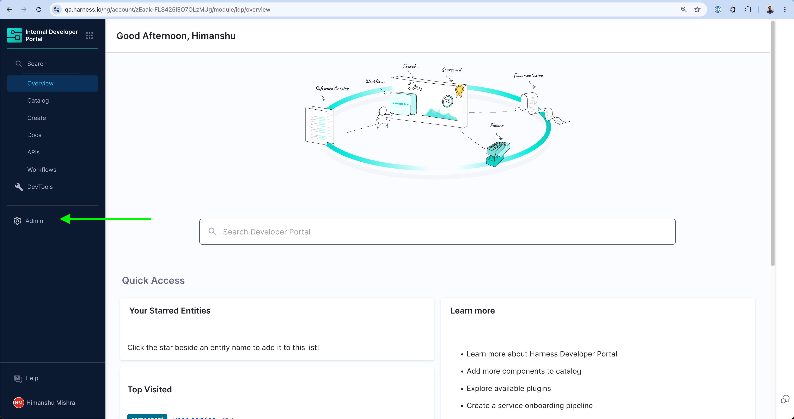
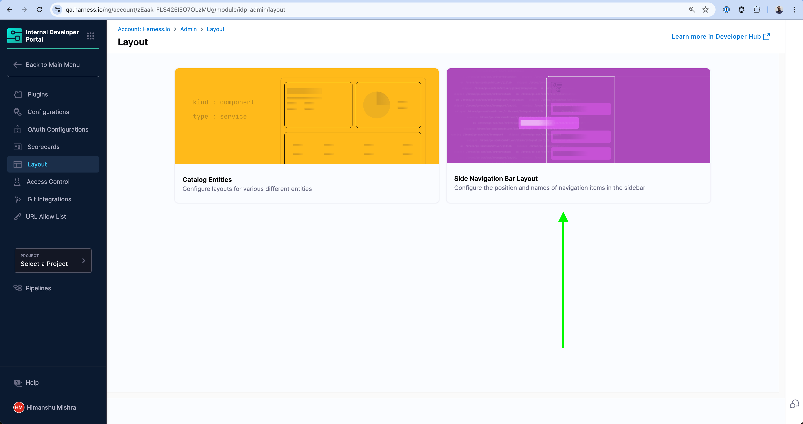
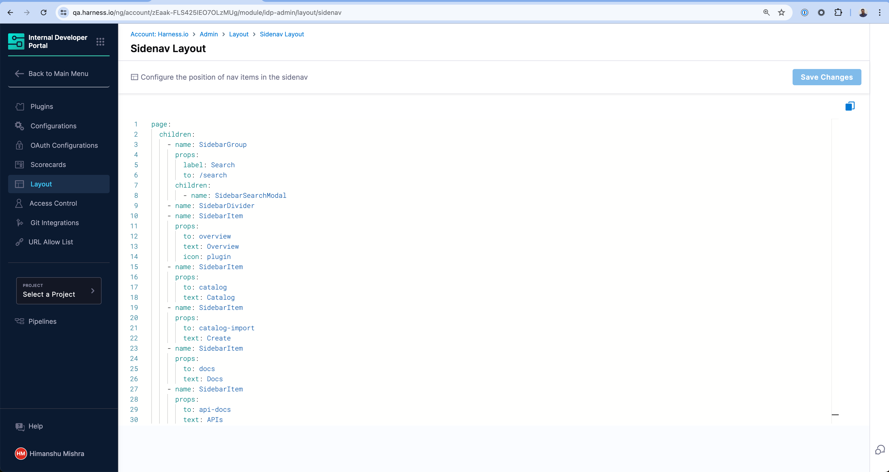

In Harness IDP, you as a platform admin can customize the sidebar navigation to ensure the end-users see what's important for them. This can be used to add new plugins, reorder existing items based on priority, add custom links to different tools for quick access, etc. The sidenav changes are reflected for everyone using Harness IDP and does not affect any other Harness modules.



## The Layout Editor

You can access the Sidenav Layout editor by navigating to Harness IDP and choosing Admin from the sidebar.



You can then choose Layout from the sidenav and choose the Sidebar Navigation Layout.





<details>
<summary>Example Sidenav Layout YAML</summary>

```yaml
page:
  children:
    - name: SidebarGroup
      props:
        label: Search
        to: /search
      children:
        - name: SidebarSearchModal
    - name: SidebarDivider
    - name: SidebarItem
      props:
        to: overview
        text: Home
    - name: SidebarItem
      props:
        to: catalog
        text: Catalog
    - name: SidebarItem
      props:
        to: create
        text: Workflows
    - name: SidebarItem
      props:
        to: docs
        text: Docs
    - name: SidebarItem
      props:
        to: api-docs
        text: APIs
    - name: SidebarItem
      props:
        to: catalog-import
        text: Register
    - name: SidebarDivider
```

</details>

## Add a new Link in the sidenav

Let's take an example of how you can add a new Custom Link to let's say your internal Sonarqube instance. This will open the link in a new tab.

```yaml
- name: SidebarItem
  props:
    to: https://mysonarqube.internal.net
    text: Sonarqube
```

## Change the default Catalog landing page

You can also update existing sidenav links to change the default landing behavior for users. Let's say you want users to see **Systems** by default when they click on **Catalog**. You can update the Catalog item with the following -

```yaml
- name: SidebarItem
  props:
    to: catalog?filters%5Bkind%5D=system
    text: Catalog
```

## Custom Plugins

If you have built a [Custom Plugin](/docs/internal-developer-portal/plugins/custom-plugins/overview) inside IDP and are exporting a full page component, you can link to the plugin from the sidenav as well.

```yaml
- name: SidebarItem
  props:
    to: EntityMyCustomPluginPage
    text: MyPlugin
```
