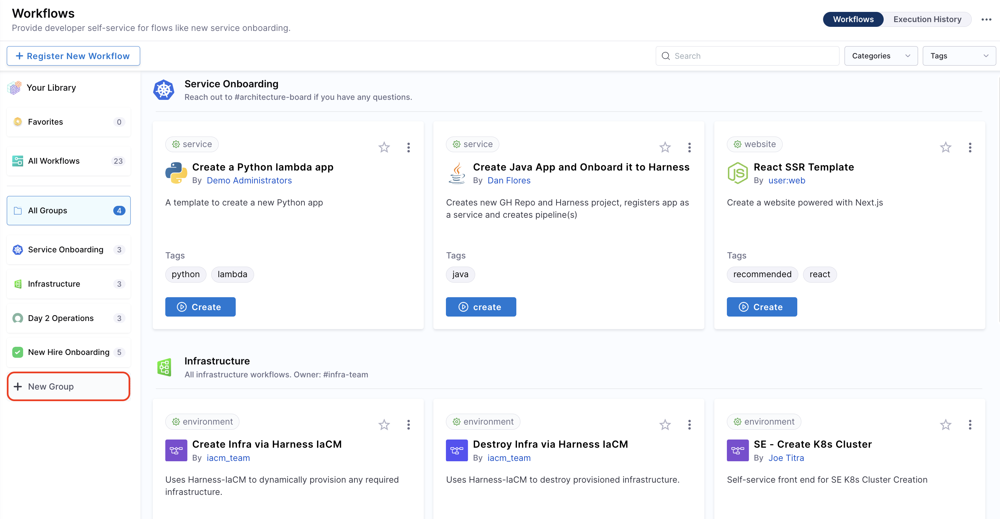
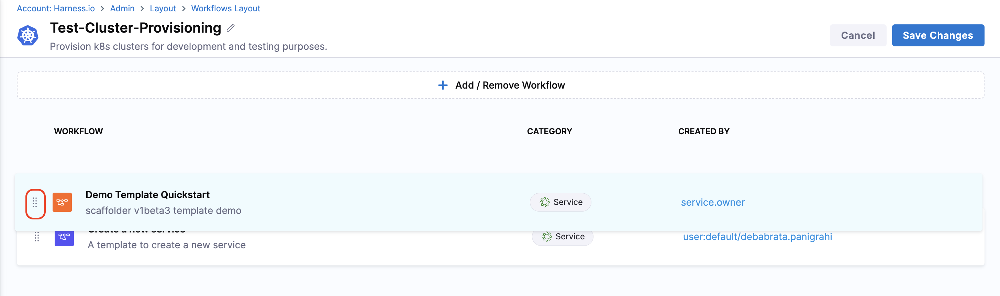
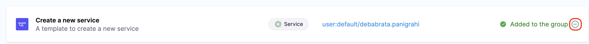
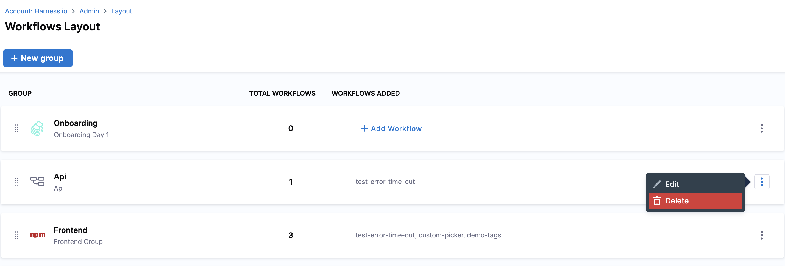
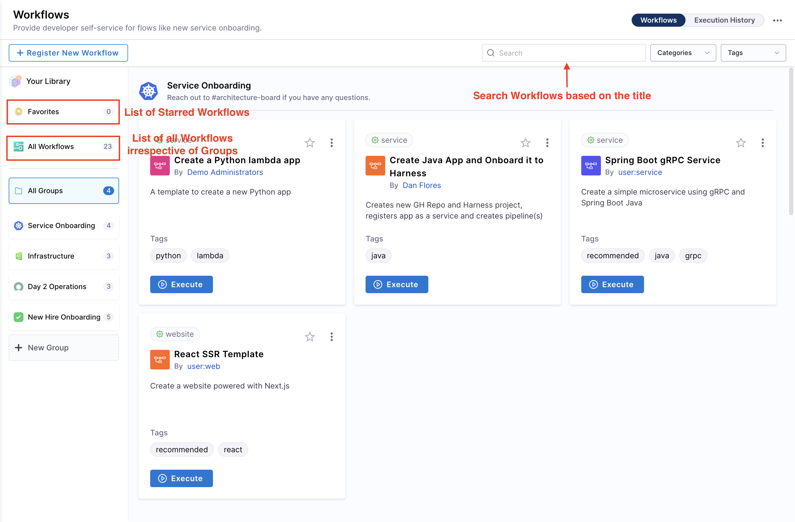
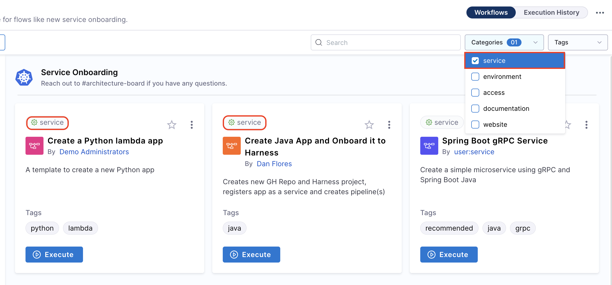
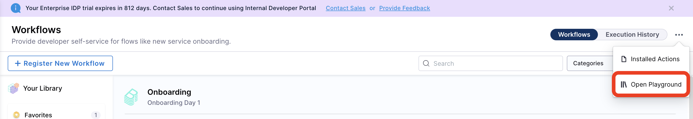

:::info

Workflows V2 is behind the Feature Flag `IDP_ENABLE_WORKFLOWSV2`, you need it to be enabled on your account to use the WOrkflows V2. 

:::

## Introduction

Introducing the new Workflows customization! Our previous workflows homepage, built by Backstage developers, didn’t fully align with customer expectations or our Flows (Scaffolder + Pipelines) system. Key features such as viewing workflow definitions, filtering executions by workflow, and enforcing granular access control were missing.

With the new update, you can now fully customize the workflows experience. Backstage Scaffolder’s default pages has neen replaced with our custom UI, giving you the power to customize the workflows page to meet your unique needs. 

## Available Customizations

**Platform Admins** can customize the **Workflows page** under **Layouts** by creating **groups** and adding workflows to each group. These groups can be further customized with a **name**, **icon**, and **description**, and they can be arranged in a specific order to determine how they appear on the Workflows page.

The option to create new groups is also available under the workflows page as well, which redirects you to the **Workflows Layout** under **Admin**. 

### Grouping Workflows

We can add a new **Group** under the **Layout** page.

- Start by clicking on the **+New Groups** icon. 
- Now add a name, description and icon for the Group, the name could be use-case based like backend, frontend, infra provision etc.

<DocImage title="Create New Groups" path={require('./static/create-group.png')} />

- Once the Group is created you can **add** new workflows under that and **save** the changes. 

<DocImage title="Add New Workflows" path={require('./static/add-remove-workflows.png')} />

- You can arrange the workflows, using drag and drop, in specific order to appear under the groups. 

### Removing Workflows from Groups

To remove workflows under a group, select the **add/remove** workflows option and remove the workflow, then **save** the changes. 

### Removing a Group

You can Remove a Group by clicking on the **three dots** on the Groups tabs and select **Delete**. 

## Navigating the New Workflows Page

1. **Regsiter New Workflow**: Register a new workflow in Harness IDP.
2. **Favourites**: List all the starred workflows
3. **All Workflows**: Lists all the workflows irrespective of the Groups they are part of.
4. **Search**: Search the list of workflows based on the workflows title. 
5. **Tags & Categories**: You can now filter workflows based on **tags** and **categories**. 

6. **Open Playground**: Template Editor is part of the **Open Playground**. 

