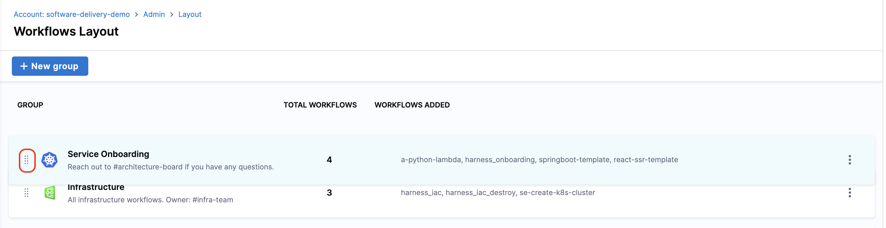

:::info

The new Workflows homepage is behind a Feature Flag `IDP_ENABLE_WORKFLOWSV2`. To enable the feature flag, please contact [Harness Support](mailto:support@harness.io)

:::

## Introduction

You can organize your IDP Workflows into groups such as Service Onboarding, Infrastructure Use Cases or Day 1 Onboarding using the Workflows Homepage Customization. You can also change the icons of individual groups and each Workflow. You can also change the primary button text from "Execute" to more suitable verbs such as "Create", "Delete" or "Run" with appropriate intent colors. Finally, you can change the order of the groups and Workflows within an individual group as well.

This will help you surface out the most useful Workflows for your developers, while rest of workflows will continue to live under "All Workflows" page.

<DocImage title="WorkflowsV2" path={require('./static/workflows-v2-overview.png')} />

## Available Customizations

**Platform Engineers** (users assigned with the role of [IDP Admin](https://developer.harness.io/docs/internal-developer-portal/rbac/resources-roles#1-idp-admin)) can customize the **Workflows homepage** under **IDP Admin -> Layouts -> Workflows** section by creating **groups** and adding Workflows to each group. These groups can be further customized using a **name**, **icon**, and **description** and they can be arranged in a specific order to determine how they appear on the Workflows homepage.

The option to create new groups is also available under the Workflows homepage which will take you to the **Layout -> Workflows** under **Admin**. 


### Grouping Workflows

We can add a new **Group** by navigating to **IDP Admin -> Layout -> Workflows**.

- Start by clicking on the **+New Group** icon. 
- Now add a Name for the group based on the use-cases. Such as
  - Backend
  - Frontend
  - Infrastructure
  - Day 1 Onboarding
  - Cloud 2.0 Intiative

- Add a **Description** of the group. Ensure you mention the purpose, who is the owner of the group and where can users reach out if they need help. Examples
  - Reach out to #architecture-board if you have any questions.
  - All infrastructure workflows. Owner: #infra-team
  - Reach out to #engops-self-service for support.

- Choose a meaningful **icon** for the group.

<DocImage title="Create New Groups" path={require('./static/create-group.png')} />

- Once the Group is created you can **add** new workflows under that and **save** the changes. 

<DocImage title="Add New Workflows" path={require('./static/add-remove-workflows.png')} />

- You can also arrange the Workflows, using drag and drop, in specific order to appear under the group. Use this to promote your recommended Golden Paths to your developers. For example, if you use both Java and Golang for backend services, but want to promote Java more, that should be your first Workflow.



### Removing Workflows from Groups

To remove workflows under a group, select the **add/remove** workflows option and remove the workflow, then **save** the changes. 


### Removing a Group

You can Remove a Group by clicking on the **three dots** on the Groups tabs and select **Delete**. 


### Customizing a Workflow using Icons and Action Button

You can now add an **icon** and change the **action** button **name** and **color** according to the use case. 

- **Icons:** Under the `metadata` add `icon` and [mention a name](https://github.com/harness-community/idp-samples/blob/678537d76978267dcf1b137c17634b0e381afab3/icons-actions-buttons.yaml#L7) from the [list of icons](/docs/internal-developer-portal/layout-and-appearance/workflows-page-customization#icons-supported-in-harness-idp) under **IDP-Admin -> Layout -> Workflow**. 

```YAML {6}
...
## Example Workflow Definition
metadata:
  name: delete-infrastructure
  title: Delete Infrastructure
  icon: python
spec:
...
```

- **Button:** Under the `metadata` field add `actionButton:` and [provide the values](https://github.com/harness-community/idp-samples/blob/678537d76978267dcf1b137c17634b0e381afab3/icons-actions-buttons.yaml#L8-L10) for `intent`(updates the color of the button) and `text` (could be anything according to the use-case e.g., Create, Run, Stop, Delete etc.). Here's the supported list of intent/colors.

| Supported Intent | Colors |
|------------------|--------|
| primary/default  | BLUE   |
| `success`        | GREEN  |
| `warning`        | YELLOW |
| `danger`         | RED    |

- [Source YAML](https://github.com/harness-community/idp-samples/blob/main/icons-actions-buttons.yaml)

```YAML {6-8}
...
## Example Workflow Definition
metadata:
  name: delete-infrastructure
  title: Delete Infrastructure
  actionButton:
    intent: warning
    text: Run
spec:
...
```

## Navigating the HomePage

1. **Register New Workflow**: [Register](https://developer.harness.io/docs/internal-developer-portal/get-started/workflow-quickstart#register-template-in-idp) a new workflow in Harness IDP.
2. **Favourites**: List all the starred workflows
3. **All Workflows**: Lists all the workflows irrespective of the groups they are part of.
4. **Search**: Search the list of workflows based on the workflows title. 
5. **Tags & Categories**: You can filter workflows based on **tags** and **categories**. Category is defined by [`spec.type`](https://github.com/harness-community/idp-samples/blob/678537d76978267dcf1b137c17634b0e381afab3/icons-actions-buttons.yaml#L13) in Workflow definition YAML. 


6. **Workflows Details**: The three dots on each workflows now allows you to **View**, **Edit** and **Refresh**(updates Workflow with the latest changes in definition YAML) the YAMLs.  


7. **Open Playground**: Template Editor is part of the **Open Playground**, where you can you can preview your workflows changes live. 


## Extended Reading

### Icons Supported in Harness IDP

- Go to Icons under **IDP-Admin -> Layout**, and highlight the icon name you want to add, it will be copied and now you can add it under the `metadata.icon` in the Workflow definition YAML. 


