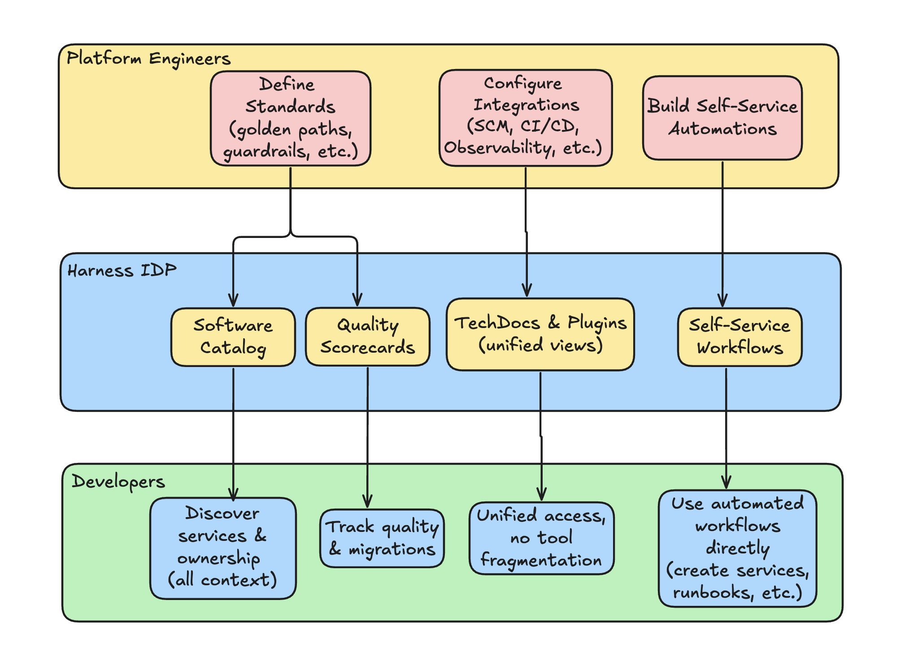
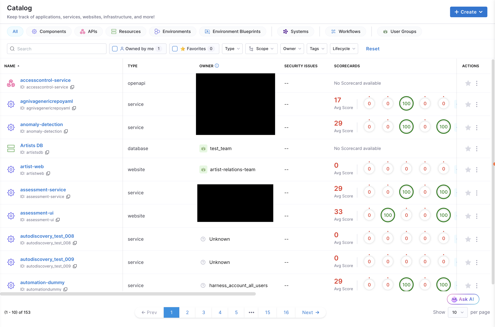
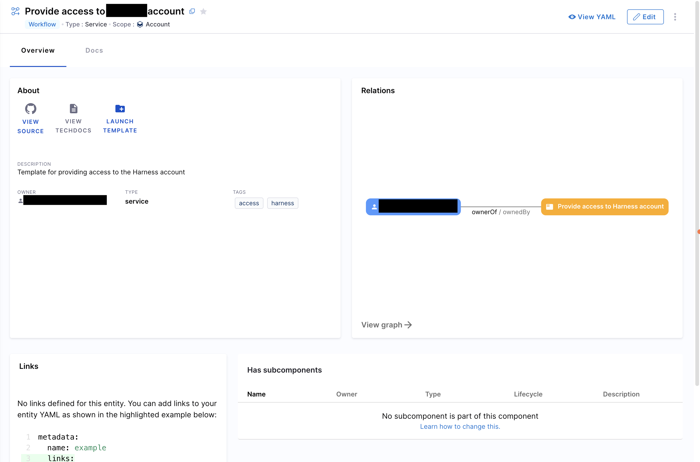
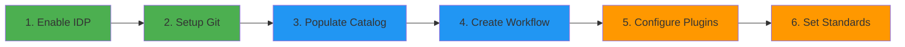

import Tabs from '@theme/Tabs';
import TabItem from '@theme/TabItem';

**Harness Internal Developer Portal (IDP) is a unified platform that empowers developers to build, discover, and manage software while platform engineers automate standards and governance.**

Harness IDP enables you to:

- *Create* new software components quickly while adhering to your company's best practices.
- *Manage* the software you own with a developer-centric view of service health, deployments, and alerts.
- *Explore* your organization's entire software ecosystem to discover technical documentation, APIs, and services.

Fully integrated with the Harness platform, Harness IDP boosts **developer productivity** and satisfaction while reducing **maintenance overhead** for platform engineering teams, enabling your organization to ship faster with higher quality.

---

## What is Harness IDP?

An Internal Developer Portal (IDP) is a centralized platform that brings together all the tools, services, and knowledge developers need to build and ship software efficiently. It serves as the **single source of truth** for your organization's software ecosystem.

To read more about the Harness IDP core product pillars, go to [Product Pillars](/docs/internal-developer-portal/overview.md#product-pillars). 

Here's a quick overview of **how Harness IDP works**:

Here's how Harness IDP boosts developer productivity and reduce overhead toil for platform engineers:

- **For Platform Engineers:** Automate developer workflows with built-in standards and guardrails. Build *golden paths* that free your team from repetitive tasks, enforce best practices across all services, and scale your platform; all while maintaining control and governance.
- **For Developers:** Get productive faster with *self-service access* to everything you need. Create new services in minutes using pre-approved templates, discover any API or documentation instantly, and access all your tools from one unified interface; no more context switching or waiting on tickets.
---

## Product Pillars

Harness IDP is built on some core pillars that work together to deliver a complete and productive developer experience. Here's how each pillar helps you:

<Tabs>
<TabItem value="catalog" label="Software Catalog" default>

#### Your Single Source of Truth for All Software Assets

The Software Catalog provides a **centralized registry** of all your services, APIs, libraries, and infrastructure components. Track ownership, dependencies, and metadata in **one searchable location**.

**Key Capabilities:**
- Discover any service or API instantly with powerful Catalog search. 
- Visualize service dependencies and relationships, with all the context in one place. 
- Track service ownership and contact information. 
- Auto-import and populate Catalog from Git and Harness CD. 

[Learn more about Software Catalog →](/docs/internal-developer-portal/catalog/software-catalog)

</TabItem>

<TabItem value="workflows" label="Workflows">

#### Automate Service Onboarding and Day-2 operations

Self-Service Workflows eliminate repetitive tasks by providing developers with **golden path templates** for common operations. Platform engineers build the workflows once, and developers use them repeatedly.

**Key Capabilities:**
- Create new services from pre-approved templates. 
- Provision infrastructure and cloud resources automatically. 
- Configure CI/CD pipelines without manual setup. 
- Execute day-to-day operations with a simple form. 

[Learn more about Workflows →](/docs/internal-developer-portal/flows/overview)

</TabItem>

<TabItem value="scorecards" label="Scorecards">

#### Measure and enforce Software Quality standards

Scorecards help you **define, track, and improve Software Quality** across your organization. Set standards for security, reliability, documentation, and DevOps maturity, then measure compliance automatically. Get **automated visibility** into which services meet your standards and which need improvement.

**Key Capabilities:**
- Define quality checks and maturity standards. 
- Measure compliance across all services. 
- Track improvement over time with trends. 
- Enforce production readiness gates. 

[Learn more about Scorecards →](/docs/internal-developer-portal/scorecards/scorecard)

</TabItem>

<TabItem value="plugins" label="Plugins">

#### Enrich your Software Catalog with contextual metadata

Plugins display additional **metadata** about software components and entities **directly in the catalog**, showing information like CI/CD pipelines, alerts, incidents, and more; all without leaving the portal.

**Key Capabilities:**
- View CI/CD pipeline status, deployment history, and build information about software components directly in the Catalog.
- Monitor alerts, incidents, and service health in real-time.
- Upload and use custom plugins tailored to your internal tools.
- Continuously expanding plugin library with new integrations.

[Learn more about Plugins →](/docs/internal-developer-portal/plugins/overview)

</TabItem>

<TabItem value="techdocs" label="TechDocs">

#### Documentation that lives with your Code

TechDocs enables a docs-as-code approach where documentation lives alongside your source code in Git. Write docs in **Markdown**, commit them alongside your source code, and publish automatically. Your team can discover and access documentation instantly through the **Docs tab** in the Catalog, no more outdated wikis or scattered knowledge.

**Key Capabilities:**
- Write documentation in Markdown alongside your code.
- Support for MkDocs plugins including Material theme, diagrams, and code documentation.
- Search across all documentation.
- Version docs alongside code for consistency.

[Learn more about TechDocs →](/docs/internal-developer-portal/techdocs/enable-docs)

</TabItem>
</Tabs>

---

## Get Started

Ready to get started with Harness IDP? Follow these simple steps:

<Tabs>
<TabItem value="platform-engineers" label="For Platform Engineers" default>

1. **Enable Harness IDP** - [Setup guide](/docs/internal-developer-portal/get-started/setup-git-integration#prerequisites)
2. **Setup Git Integrations** - [Configure Git](/docs/internal-developer-portal/get-started/setup-git-integration)
3. **Populate Your Catalog** - [Add services](/docs/internal-developer-portal/get-started/catalog-2o)
4. **Create Your First Workflow** - [Build workflows](/docs/internal-developer-portal/get-started/workflows-2o)
5. **Configure Plugins** - [Enable plugins](/docs/internal-developer-portal/plugins/overview)
6. **Define Quality Standards** - [Create scorecards](/docs/internal-developer-portal/scorecards/scorecard)
7. **Invite Developers** - [Track adoption](/docs/internal-developer-portal/adoption/how-to-track-adoption)

</TabItem>

<TabItem value="developers" label="For Developers">

1. **Explore the Catalog** - [Browse services](/docs/internal-developer-portal/catalog/software-catalog)
2. **Create Your First Service** - [Use workflows](/docs/internal-developer-portal/get-started/workflows-2o)
3. **Register Existing Services** - [Add to catalog](/docs/internal-developer-portal/get-started/catalog-2o)
4. **Improve Service Quality** - [View scorecards](/docs/internal-developer-portal/scorecards/scorecard)
5. **Contribute Documentation** - [Enable TechDocs](/docs/internal-developer-portal/techdocs/techdocs)

</TabItem>
</Tabs>

---

## Video Overview

Watch this 4-minute demo to see Harness IDP in action:

<DocVideo src="https://www.youtube.com/embed/r9urqE--aNs?si=GsophnYs-IlLfao2" />

For a personalized demo tailored to your organization's needs, [schedule a live demo](https://www.harness.io/demo/internal-developer-portal) with our team.

---
