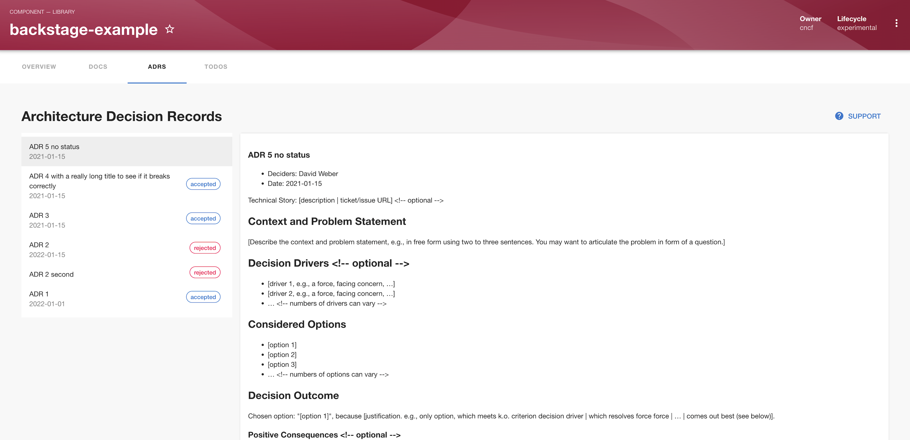

| Plugin details |                                                                                |
| -------------- | ------------------------------------------------------------------------------ |
| **Created by** | [Phil Kuang](https://github.com/kuangp)                                                      |
| **Category**   | Discovery                                                                        |
| **Source**     | [GitHub](https://github.com/backstage/community-plugins/tree/main/workspaces/adr/plugins/adr) |
| **Type**       | Open-source plugin                                                             |


## Configuration

### Application configuration YAML

_No action required_

- This is a frontend plugin without any authentication configured hence no configuration required. 


### Secrets

- No secrets are required for this plugin as there are no authentication configured. 

## Layout

_No action required_

This plugin exports a  single page. The following configuration is set by default in **Layout** under **Admin** for **Service** and you do not need to change anything:

```YAML
    - name: EntityAdrContent
      path: /adrs
      title: ADRs
      contents:
        - component: EntitySwitch
          specs:
            cases:
              - if: isAdrAvailable
                content:
                  component: EntityAdrContent
```

This plugin exports the `EntityAdrContent` that you can show on the sidenav.  The following configuration can be set in **Layout** under **Admin** for **Sidenav**:

```YAML
    - name: SidebarItem
      props:
        to: adrs
        text: ADRs
        iconName: Extension
```

## Annotations

To configure the plugin for a service in the software catalog, set one of the following annotations in its `catalog-info.yaml` definition file.

The following configuration is recommended:

```YAML
metadata:
  annotations:
    backstage.io/adr-location: <RELATIVE_PATH_TO_ADR_FILES_DIR>
```
The value for `backstage.io/adr-location` should be a path relative to your `catalog-info.yaml` file or a absolute URL to the directory which contains your ADR markdown files.

For example, if you have the following directory structure, you would set `backstage.io/adr-location: docs/adrs:`

```YAML
repo-root/
  README.md
  src/
  catalog-info.yaml
  docs/
    adrs/
      0001-use-adrs.md
      0002-use-cloud.md
```



## Custom ADR formats

By default, this plugin will parse ADRs according to the format specified by the [Markdown Architecture Decision Record (MADR) v2.x template](https://github.com/adr/madr/tree/2.1.2) or the [Markdown Any Decision Record (MADR) 3.x template](https://github.com/adr/madr/tree/3.0.0). 

## Support

The plugin is owned by the Backstage Community and managed in this [repository](https://github.com/backstage/community-plugins/tree/main/workspaces/adr) as an open-source project. Create a GitHub issue to report bugs or suggest new features for the plugin.

