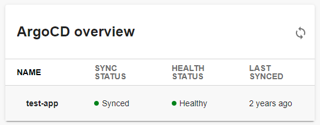

| Plugin details |                                                                                              |
| -------------- | -------------------------------------------------------------------------------------------- |
| **Created by** | [Roadie](https://roadie.io/)                                                                |
| **Category**   | Image                                                                                        |
| **Source**     | [GitHub](https://github.com/RoadieHQ/roadie-backstage-plugins/tree/main/plugins/frontend/backstage-plugin-argo-cd#argo-cd-plugin-for-backstage) |
| **Type**       | Open-source plugin                                                                           |



## Configuration

### Application configuration YAML

This plugin requires a backend proxy configuration to make calls to your argo-cd instance with authentication.

- Under the **Plugins** tab in **Admin**, go to `app-config.yaml` and **Edit YAML** to configure your `username` along with the `url` to your argo instance in the format as shown below.

```YAML
# app-config.yaml
argocd:
  username: your-username
  password: ${ARGOCD_PASSWORD}
  appLocatorMethods:
    - type: 'config'
      instances:
        - name: argoInstance1
          url: https://argoInstance1.com
          token: ${ARGOCD_AUTH_TOKEN}
```

### Secrets

- You need to add the `ARGOCD_PASSWORD` and `ARGOCD_AUTH_TOKEN`(Optional) as a Harness Secret. Also if both are mentioned `ARGOCD_PASSWORD` will take precedence. 

- **Create secret in Harness** to store API token, click on “New Secret Text” and enter values as shown below.


## Layout

_No action required_

This plugin exports a UI card that you can show on the **Overview** tab of a service or any other layout page. The following configuration is set by default in **Layout** under **Catalog Entities** for **Service** and you do not need to change anything:

```yaml
- component: EntityArgoCDOverviewCard
```

## Annotations

- Details of your argo-cd instance are correlated to IDP entities using an annotation added in the entity's `catalog-info.yaml` file.

```YAML
metadata:
  annotations:
    argocd/app-name: <your-app-name>
```

## Support

The plugin is owned by RedHat and managed in this [repository](https://github.com/RoadieHQ/roadie-backstage-plugins/tree/main/plugins/frontend/backstage-plugin-argo-cd#argo-cd-plugin-for-backstage) as an open-source project. Create a GitHub issue to report bugs or suggest new features for the plugin.
