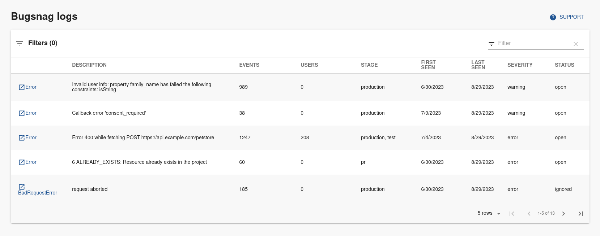

| Plugin details |                                                                                |
| -------------- | ------------------------------------------------------------------------------ |
| **Created by** | Roadie                                                                       |
| **Category**   | Monitoring                                                                     |
| **Source**     | [GitHub](https://github.com/RoadieHQ/roadie-backstage-plugins/tree/main/plugins/frontend/backstage-plugin-bugsnag) |
| **Type**       | Open-source plugin                                                             |

## Configuration

### Application configuration YAML

_No action required_

This plugin requires a backend proxy configuration to make calls to Bugsnag with authentication. The following configuration is set by default and you do not need to change anything:

```yaml
proxy:
  ...
  '/bugsnag/api':
    target: 'https://api.bugsnag.com'
    headers:
        Authorization: '${BUGSNAG_PERSONAL_TOKEN}'
        X-version: '2'
```

### Secrets

Since the `BUGSNAG_PERSONAL_TOKEN` variable is used in the application configuration, you must generate a Personal Auth Token and set it as the value of `token "BUGSNAG_PERSONAL_TOKEN"`, make sure to add the `token` prefix to the PAT. For instructions on how to create a Personal Auth Token, [read the instructions](https://bugsnagapiv2.docs.apiary.io/#introduction/authentication/personal-auth-tokens-(recommended)).

### Delegate proxy

_No action required_

This plugin does not require a delegate proxy to be set up because Bugsnag is publicly accessible.

## Layout

_No action required_

This plugin exports a UI card that you can show on the **Overview** tab of a service or any other layout page. Go to **Admin** > **Layout**, select **Service** in the dropdown menu, and then you could find following already added:

```yaml
- component: EntityBugsnagErrorsOverviewTable
```



## Annotations

To configure the plugin for a service in the software catalog, set one of the following annotations in its `catalog-info.yaml` definition file.

The following configuration is recommended:

```yaml
metadata:
  annotations:
    bugsnag.com/project-key: <organization-name>/<project-name>
```

Note that you must use the full names, not the slugs. These values can be found in Bugsnag settings dashboard, under organization and project settings.

## Support

The plugin is currently owned by Roadie and managed in the [Roadie Backstage Plugin Repository](https://github.com/RoadieHQ/roadie-backstage-plugins/tree/main/plugins/frontend/backstage-plugin-bugsnag) as an open-source project. Create a GitHub issue to report bugs or suggest new features for the plugin.
