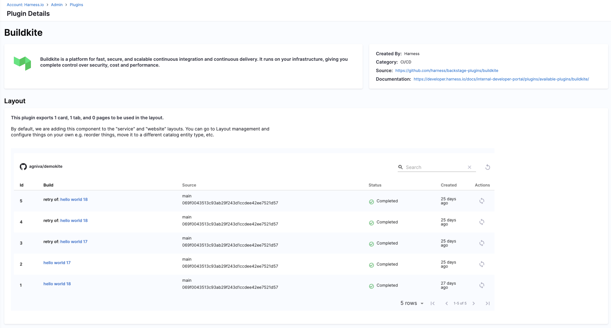

# Buildkite 

## Overview

The Buildkite plugin enables developers to view and interact with their CI/CD pipeline runs directly within the Harness Internal Developer Portal (IDP). It surfaces real-time build statuses, allows rebuilding builds, and helps teams monitor their pipelines on a per-entity basis.



## Plugin Metadata

| Field         | Value |
|---------------|-------|
| **Created by** | Backstage Community |
| **Category**   | Developer Experience |
| **Source**     | [GitHub](https://github.com/RoadieHQ/roadie-backstage-plugins/tree/main/plugins/frontend/backstage-plugin-buildkite) |
| **Type**       | Open-source plugin |

## Configuration

### Application Configuration YAML


```yaml
proxy:
  endpoints:
    '/buildkite/api':
      target: https://api.buildkite.com/v2
      headers:
        Authorization: Bearer ${BUILDKITE_API_TOKEN}
      pathRewrite:
        '^/api/proxy/buildkite/api' : ''
````


### Secrets

To authorize requests to the Buildkite API, the plugin requires an access token (`BUILDKITE_TOKEN`)

The token should have `read_builds` and `read_pipelines` permissions.


## Layout

This plugin renders as a **tab under the CI/CD section** in the entity page.


```yaml
- name: EntitySwitch
  path: /ci-cd
  title: CI/CD
  contents:
    - component: EntitySwitch
      specs:
        cases:
          - if: isBuildkiteAvailable
            content:
              component: EntityBuildkiteContent
```


## Annotations

To connect a component to a Buildkite pipeline, add the following annotation in your `component-info.yaml`:

```yaml
metadata:
  annotations:
    buildkite.com/project-slug: your-org/your-pipeline
```


