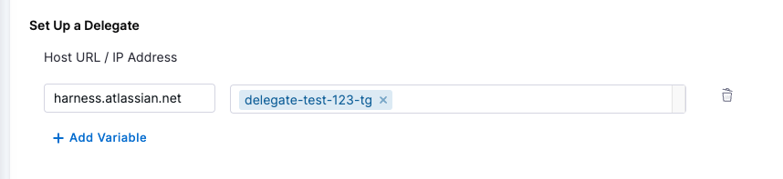

| Plugin details |                                      |
| -------------- |--------------------------------------|
| **Created by** | [K-Phoen](https://github.com/K-Phoen) |
| **Category**   | Search                               |
| **Source**     | [GitHub](https://github.com/K-Phoen/backstage-plugin-confluence/tree/main/plugins/search-confluence-backend)                           |
| **Type**       | Open-source plugin                   |

## Configuration

### Application configuration YAML

This plugin requires a backend configuration to make calls to Confluence with authentication. In the following configuration, replace `<your-org-name>` with the Confluence instance project (for example https://mycompany.atlassian.net). 

Replace `<list-of-spaces>` with a comma-separated list of the Confluence spaces that you want to include in the search. Enclose the list in brackets, as follows: `spaces: [ENG, IT, OPS]`. For the spaces you specify, indexing occurs every 12 hours. If the list is empty, the plugin does not index spaces. 

Replace  `<your-username>` with the user name. 

```yaml
confluence:
  wikiUrl: https://<your-org-name>.atlassian.net/wiki
  spaces: [<list-of-spaces>]
  auth:
    username: <your-username>
    password: ${CONFLUENCE_TOKEN}
```

### Secrets

Since the `CONFLUENCE_TOKEN` variable is used in the application configuration, you must generate a Confluence API key and set it as the value of `CONFLUENCE_TOKEN`. For information about how to generate an API key, go to the [instructions](https://support.atlassian.com/atlassian-account/docs/manage-api-tokens-for-your-atlassian-account/).

### Delegate proxy

If your Confluence website is self-hosted or has an IP address allowlist, include the base URL `mycompany.atlassian.net` in the delegate proxy section. If your Confluence instance is hosted on a public cloud and can be accessed directly using a token, skip this section.
After adding the host, you can select one or more delegates that have access to the host.

:::note

When adding the host, include only the host name. Remove the protocol (HTTP/HTTPS) associated with it.

:::



## Layout

This plugin provides components that are included on the search results page. It does not export any components to be used in the layout section of the IDP Admin UI.

## Annotations

This plugin does not require annotations.

## Support

The plugin is owned by [K-Phoen](https://github.com/K-Phoen) and managed in the [K-Phoen plugins repository](https://github.com/K-Phoen/backstage-plugin-confluence) as an open-source project. Create a GitHub issue to report bugs or suggest new features for the plugin.
