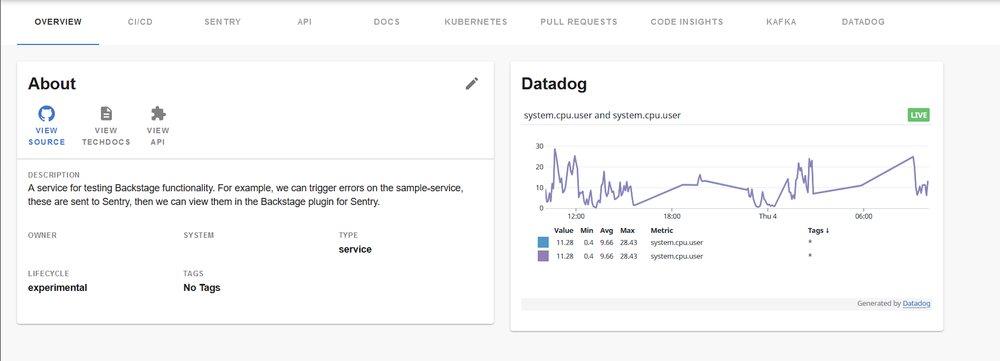

| Plugin details |                                                                                |
| -------------- | ------------------------------------------------------------------------------ |
| **Created by** | [RoadieHQ](https://github.com/RoadieHQ)                                                      |
| **Category**   | Monitoring                                                                        |
| **Source**     | [GitHub](https://github.com/RoadieHQ/roadie-backstage-plugins/tree/main/plugins/frontend/backstage-plugin-datadog) |
| **Type**       | Open-source plugin                                                             |


## Configuration

### Application configuration YAML

_No action required_

- This is a frontend plugin without any authentication configured hence no configuration required. 


### Secrets

- No secrets are required for this plugin as there are no authentication configured. 

## Layout

_No action required_

This plugin exports a UI tab that you can use as a new **Datadog** tab for a service or for any other layout page. The following configuration is set by default in **Layout** under **Admin** for **Service** and you do not need to change anything:

```YAML
    - name: EntityDatadogContent
      path: /datadog
      title: Datadog
      contents:
        - component: EntityDatadogContent
```

This plugin exports the `EntityDatadogGraphCard` that you can show on the **Overview** tab of a service or any other layout page.  The following configuration is set by default in **Layout** under **Admin** for **Service** and you do not need to change anything:

```YAML
- component: EntityDatadogGraphCard
```



## Annotations

To configure the plugin for a service in the software catalog, set one of the following annotations in its `catalog-info.yaml` definition file.

The following configuration is recommended:

```YAML
datadoghq.com/dashboard-url: <<DATADOGURL>>
```
You need to obtain the [dashboard URL](https://docs.datadoghq.com/dashboards/sharing/#share-a-dashboard-by-public-url) from Datadog that you will add in the above annotation. 

## Support

The plugin is owned by Roadie and managed in this [repository](https://github.com/RoadieHQ/roadie-backstage-plugins/tree/main/plugins/frontend/backstage-plugin-datadog) as an open-source project. Create a GitHub issue to report bugs or suggest new features for the plugin.

