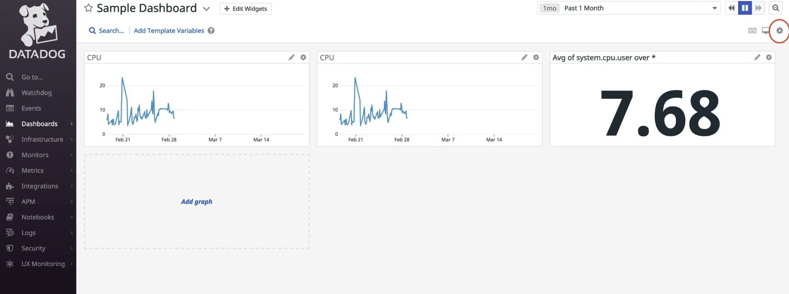
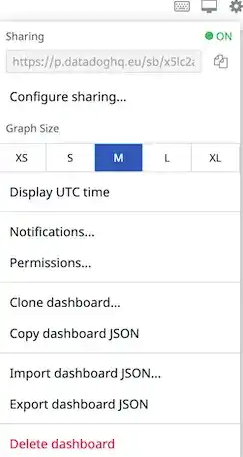

| Plugin details |                                                                                |
| -------------- | ------------------------------------------------------------------------------ |
| **Created by** | [RoadieHQ](https://github.com/RoadieHQ)                                                      |
| **Category**   | Monitoring                                                                        |
| **Source**     | [GitHub](https://github.com/RoadieHQ/roadie-backstage-plugins/tree/main/plugins/frontend/backstage-plugin-datadog) |
| **Type**       | Open-source plugin                                                             |


## Configuration

### Application configuration YAML

_No action required_

- This is a frontend plugin without any authentication configured hence no configuration required. 


### Secrets

- No secrets are required for this plugin as there are no authentication configured. 

## Layout

_No action required_

This plugin exports a UI tab that you can use as a new **Datadog** tab for a service or for any other layout page. The following configuration is set by default in **Layout** under **Admin** for **Service** and you do not need to change anything:

```YAML
    - name: EntityDatadogContent
      path: /datadog
      title: Datadog
      contents:
        - component: EntityDatadogContent
```

This plugin exports the `EntityDatadogGraphCard` that you can show on the **Overview** tab of a service or any other layout page.  The following configuration is set by default in **Layout** under **Admin** for **Service** and you do not need to change anything:

```YAML
- component: EntityDatadogGraphCard
```


## Annotations

To configure the plugin for a service in the software catalog, you need to add specific annotations to its `catalog-info.yaml` definition file. Below are the steps to configure these annotations.

### Embedding a Datadog Dashboard in Backstage

#### Steps to Get the Dashboard URL

1. Navigate to the dashboards list by hovering over **Dashboards** on the page’s left-hand side and selecting **Dashboard List**.

2. Select a dashboard from this list.

3. Within the chosen dashboard, click the Settings cog on the right-hand side of the screen, circled in red.



4. Copy the URL from the **Sharing** text box.



5. Use this URL as the value for the `datadoghq.com/dashboard-url` annotation.

Add the annotations and the values from Datadog to your component’s metadata file.

```YAML
## Example catalog-info.yaml
apiVersion: backstage.io/v1alpha1
kind: Component
metadata:
  name: sample-service
  description: |
    A sample service
  annotations:
    datadoghq.com/site: datadoghq.com ## non-default top level domain
    datadoghq.com/dashboard-url: <<DATADOGURL>>
...
```

:::info
### Setting the Datadog Domain

By default, the Datadog embedded graph uses `datadoghq.eu` as its top-level domain unless specified otherwise. If you are using a different domain, you must specify it using the `datadoghq.com/site annotation`.

```YAML
...
datadoghq.com/site: datadoghq.com
...
```
:::

## Support

The plugin is owned by Roadie and managed in this [repository](https://github.com/RoadieHQ/roadie-backstage-plugins/tree/main/plugins/frontend/backstage-plugin-datadog) as an open-source project. Create a GitHub issue to report bugs or suggest new features for the plugin.

