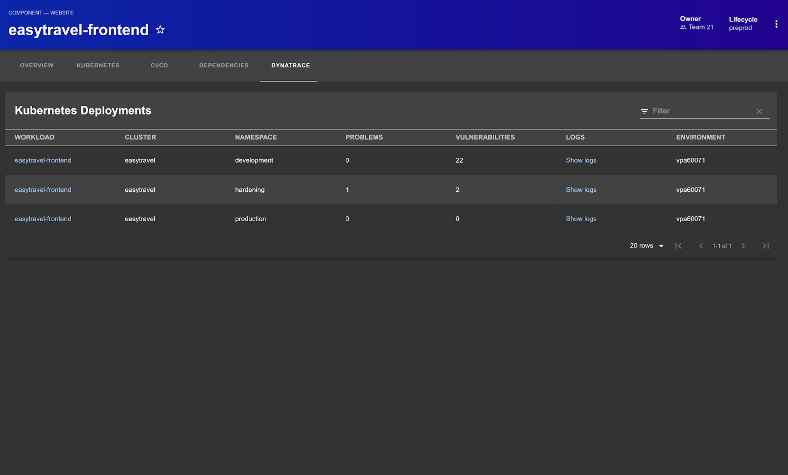

| Plugin details |                                                                                |
| -------------- | ------------------------------------------------------------------------------ |
| **Created by** | [Dynatrace](https://www.dynatrace.com/)                                                      |
| **Category**   | Monitoring                                                                        |
| **Source**     | [GitHub](https://github.com/backstage/community-plugins/tree/main/workspaces/dynatrace/plugins/dynatrace#dynatrace) |
| **Type**       | Open-source plugin                                                             |


## Configuration

### Application configuration YAML

- This plugin requires a proxy endpoint for Dynatrace. Update the following configuration with Dynatrace Target URL, API Token and base URL. 

```YAML
proxy:
  /dynatrace:
    target: https://example.dynatrace.com/api/v2
    pathRewrite:
      /api/proxy/dynatrace/?: /
    headers:
      Authorization: Api-Token ${DYNATRACE_TOKEN}
dynatrace:
  baseUrl: https://example.apps.dynatrace.com
```

### Secrets

Dynatrace API access token (see documentation), with the following permissions:

1. `entities.read`
2. `problems.read`
3. `DataExport` and/or `ExternalSyntheticIntegration` and/or `ReadSyntheticData`

## Layout

_No action required_

This plugin exports a UI tab that you can use as a new **Dynatrace** tab for a service or for any other layout page. The following configuration is set by default in **Layout** under **Admin** for **Service** and you do not need to change anything:

```YAML
- name: DynatraceTab
    path: /dynatrace
    title: Dynatrace
    contents:
    - component: DynatraceTab
```



## Annotations

To configure the plugin for a service in the software catalog, set one of the following annotations in its `catalog-info.yaml` definition file.

The following configuration is recommended:

1. View Recent Application Problems

To show information from Dynatrace for a catalog entity, add the following annotation to catalog-info.yaml:

```YAML
metadata:
  annotations:
    dynatrace.com/dynatrace-entity-id: DYNATRACE_ENTITY_ID
```

The `DYNATRACE_ENTITY_ID` can be found in Dynatrace by browsing to the entity (a service, synthetic, frontend, workload, etc.). It will be located in the browser address bar in the id parameter and has the format `ENTITY_TYPE-ENTITY_ID`, where `ENTITY_TYPE` will be one of `SERVICE`, `SYNTHETIC_TEST`, or other, and `ENTITY_ID` will be a string of characters containing uppercase letters and numbers.

2. Viewing Recent Synthetics Results

To show recent results from a Synthetic Monitor, add the following annotation to catalog-info.yaml:

```YAML
metadata:
  annotations:
    dynatrace.com/synthetics-ids: SYNTHETIC_ID, SYNTHETIC_ID_2, ...
```

The annotation can also contain a comma or space separated list of Synthetic Ids to surface details for multiple monitors!

The `SYNTHETIC_ID` can be found in Dynatrace by browsing to the Synthetic monitor. It will be located in the browser address bar in the resource path - `https://example.dynatrace.com/ui/http-monitor/HTTP_CHECK-1234` for an Http check, or `https://example.dynatrace.com/ui/browser-monitor/SYNTHETIC_TEST-1234` for a browser clickpath.


## Support

The plugin is owned by Backstage and managed in this [repository](https://github.com/backstage/community-plugins/tree/main/workspaces/dynatrace/plugins/dynatrace#dynatrace) as an open-source project. Create a GitHub issue to report bugs or suggest new features for the plugin.

