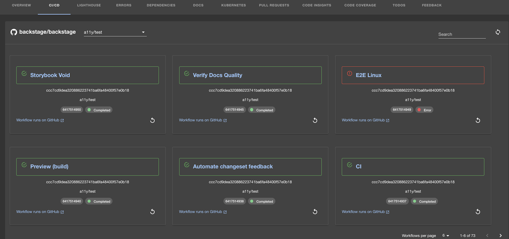

| Plugin details |                                                                                     |
| -------------- | ----------------------------------------------------------------------------------- |
| **Created by** | Spotify                                                                             |
| **Category**   | CI/CD                                                                               |
| **Source**     | [GitHub](https://github.com/backstage/community-plugins/tree/main/workspaces/github-actions/plugins/github-actions#github-actions-plugin) |
| **Type**       | Open-source plugin                                                                  |

## Configuration

### Application configuration YAML

_No action required_

This plugin does not require you to add application configuration.

### Secrets

This plugin requires the user to log in using the configured GitHub OAuth application. Make sure that you have a GitHub OAuth application created and configured in IDP. For instructions to configure a GitHub OAuth app, go to [OAuth support for plugins](../oauth-support-for-plugins.md).

### Delegate proxy

_No action required_

This plugin does not require a delegate proxy to be set up because GitHub is publicly accessible.

## Layout

This plugin exports a UI tab that you can use as a new CI/CD tab for a service or for any other layout page. Go to **Admin** > **Layout**, select **Service** in the dropdown menu, and then you could find the following YAML code auto-ingested in the **CI/CD** section:

```yaml
- name: ci-cd
  path: /ci-cd
  title: CI/CD
  contents:
    - component: EntitySwitch
      specs:
        cases:
          - if: isGithubActionsAvailable
            content:
              component: EntityGithubActionsContent
          - content:
              component: EmptyState
              specs:
                props:
                  title: No CI/CD available for this entity
                  missing: info
                  description: You need to add an annotation to your component if you want to enable CI/CD for it. You can read more about annotations in Backstage by clicking the button below.
```

The `isGithubActionsAvailable` condition is met when the `github.com/project-slug` annotation is present in the software components's `catalog-info.yaml` definition file.



## Annotations

If the `catalog-info.yaml` descriptor file for the component is stored in GitHub, the `github.com/project-slug` is automatically added as the `org/repo` where the file is stored, as follows. However, you can manually configure or override this setting:

```yaml
metadata:
  annotations:
    github.com/project-slug: org/repo
```

## Support

The plugin is owned by Spotify and managed in the [Backstage repository](https://github.com/backstage/community-plugins/tree/main/workspaces/github-actions/plugins/github-actions#github-actions-plugin) as an open-source project. Create a GitHub issue to report bugs or suggest new features for the plugin.
