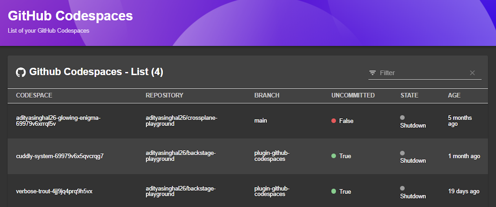
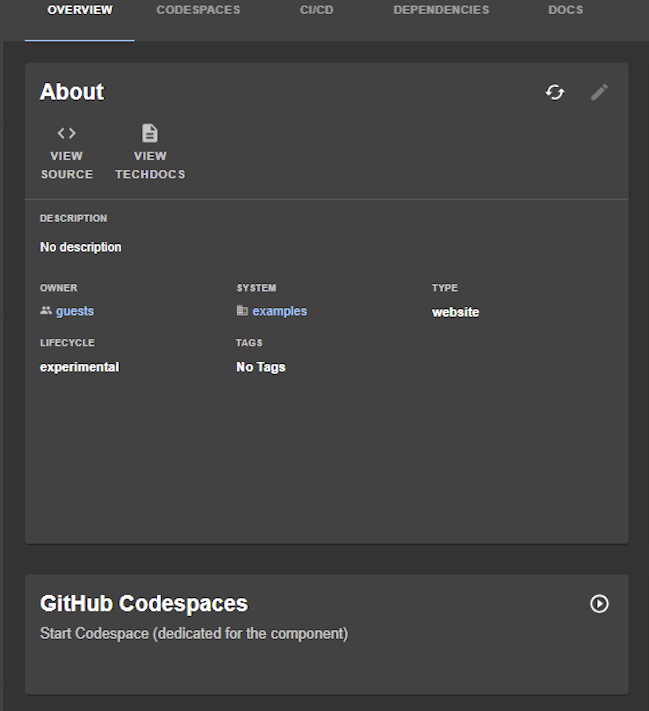

| Plugin details |                                                                                     |
| -------------- | ----------------------------------------------------------------------------------- |
| **Created by** | Aditya Singhal                                                                             |
| **Category**   | Development                                                                              |
| **Source**     | [GitHub](https://github.com/adityasinghal26/backstage-plugins/tree/main/plugins/github-codespaces) |
| **Type**       | Open-source plugin                                                                  |

:::info
### Limitations

- Any Codespace started using `EntityGithubCodespacesWidget` or `EntityGithubCodespacesCard` action will **create a new codespace with the exact same display name as the entity name**.
- Once the Codespace is created, you can **only start** the Codespace from the Widget/Card action.
- The plugin **does not support GitHub Enterprise** yet. 

:::

## Configuration

### Application configuration YAML

_No action required_

This plugin does not require you to add application configuration.

### Secrets

This plugin requires the user to log in using the configured GitHub OAuth application. Make sure that you have a GitHub OAuth application created and configured in IDP. For instructions to configure a GitHub OAuth app, go to [OAuth support for plugins](../oauth-support-for-plugins.md).

### Delegate proxy

_No action required_

This plugin does not require a delegate proxy to be set up because GitHub is publicly accessible.

## Layout

This plugin exports a page and two card on the overview page, one to start a Codespace and another with a list of already active Codespace. Go to **Admin** > **Layout**, select **Service** in the dropdown menu, and then you could find the following YAML code auto-ingested:

```yaml
...
    - name: Overview
      path: /
      title: Overview
      contents:
        - component: EntityGithubCodespacesCard
          specs:
            gridProps:
              md: 6
        - component: EntityGithubCodespacesWidget
          specs:
            gridProps:
              md: 6
...
    - name: EntityGithubCodespacesContent
      path: /github-codespaces-entity
      title: CodespacesEntityContent
      contents:
        - component: EntitySwitch
          specs:
            cases:
              - if: isGithubCodespacesAvailable
                content:
                  component: EntityGithubCodespacesContent
    - name: EntityGithubCodespacesRepoContent
      path: /github-codespaces-repo
      title: CodespacesRepoContent
      contents:
        - component: EntitySwitch
          specs:
            cases:
              - if: isGithubCodespacesAvailable
                content:
                  component: EntityGithubCodespacesRepoContent
...
```

The `isGithubCodespacesAvailable` condition is met when the `github.com/project-slug` annotation is present in the software components's `catalog-info.yaml` definition file.





## Annotations

If the `catalog-info.yaml` descriptor file for the component is stored in GitHub, the `github.com/project-slug` is automatically added as the `org/repo` where the file is stored, as follows. You can as well add annotation for a custom [devcontainer](https://docs.github.com/en/codespaces/setting-up-your-project-for-codespaces/adding-a-dev-container-configuration/introduction-to-dev-containers) configuration with relative path of `devcontainer.json` file from root of the repository. However, you can manually configure or override this setting:

```yaml
metadata:
  annotations:
    github.com/project-slug: org/repo
     github.com/devcontainer-path: .devcontainer/devcontainer.json
```

## Support

The plugin is owned by an individual [Aditya Singhal](https://github.com/adityasinghal26) and managed in this [Repository](https://github.com/adityasinghal26/backstage-plugins/tree/main/plugins/github-codespaces) as an open-source project. Create a GitHub issue to report bugs or suggest new features for the plugin.
