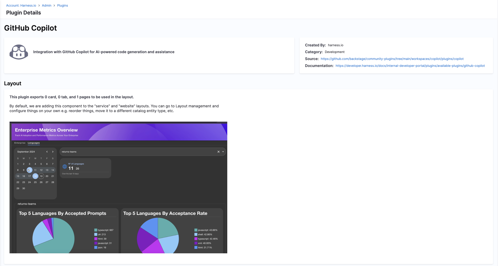

# GitHub Copilot 

## Overview

The **Github Copilot plugin** provides GitHub Copilot Enterprise insights directly within Harness IDP. It helps visualize Copilot usage metrics such as:

- Suggestion acceptance rates  
- Language-wise usage distribution  
- Overall Copilot activity  



These insights help engineering teams assess the adoption and effectiveness of GitHub Copilot across their services.


## Plugin Metadata

| Field         | Value                |
|---------------|----------------------|
| **Created by** | Backstage Community  |
| **Category**   | Developer Experience |
| **Source**     | [GitHub](https://github.com/backstage/community-plugins/tree/main/workspaces/copilot/plugins/copilot)               |
| **Type**       | Open-source plugin   |


## Configuration

### Application Configuration YAML


```yaml
copilot:
  schedule:
    frequency:
      hours: 2
    timeout:
      minutes: 2
    initialDelay:
      seconds: 15
  host: github.com # or github.myenterprise.com
  # organization: ${{COPILOT_ORG}}  # eg: githubOrg - GitHub organization name
  # enterprise: ${{COPILOT_ENT}}  # Optional - only if using GitHub Enterprise
```
Use `${{ }}` to securely inject values via Harness Secret Manager or delegate-based secret backends. If you're using secrets, declare variables to above and in the variables section below the config.


:::info 
Update the `host`, `enterprise`, and `organization` values to match your GitHub Copilot Enterprise setup.
:::

:::note 
The plugin pulls data using GitHub REST APIs and requires **authorization via a token** which depends on the [Git Integration](https://developer.harness.io/docs/internal-developer-portal/get-started/setup-git-integration#connector-setup) setup done at IDP under "Configure" -> "Git Integrations" page, make sure to use the same host as one that's configured in the Git integration

:::

:::note 
If you are using `copilot.enterprise` in GitHub Copilot plugin config, note that the Enterprise API for Copilot only works with a "classic PAT" (personal access token). This means you will need to configure a Git connector in IDP, under "Configure" -> "Git Integrations" in your Harness account, with authorization using a [username and token](https://developer.harness.io/docs/platform/connectors/code-repositories/ref-source-repo-provider/git-hub-connector-settings-reference/#authentication).
:::

### Delegate Proxy (Optional)

Set up a **delegate proxy** if:

* GitHub APIs are not directly accessible from Harness SaaS.
* The GitHub token (secret) is not stored in the built-in Secret Manager.

#### Steps:

1. Add the host (`github.com`) under *Host URL or IP Address*.
2. Use a delegate with access to GitHub and your Secret Manager.
3. Provide delegate selector tags if needed.

Use a **single delegate tag** for consistency.


## Layout Integration

This plugin exports:

* ✅ 1 Page
* ❌ 0 Cards
* ❌ 0 Tabs

#### To add the page to the portal layout:

Since its not added by default, you need to update your layout config in the Admin Panel under `Layout > Sidenav Layout` manually, like so:

```yaml
- name: SidebarItem
  props:
    to: copilot
    text: CoPilot
```


## Annotations

* No specific annotations are required.

