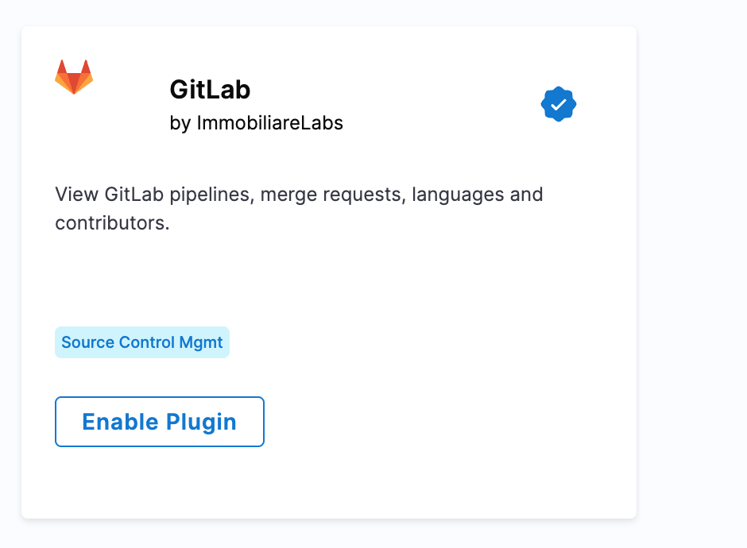
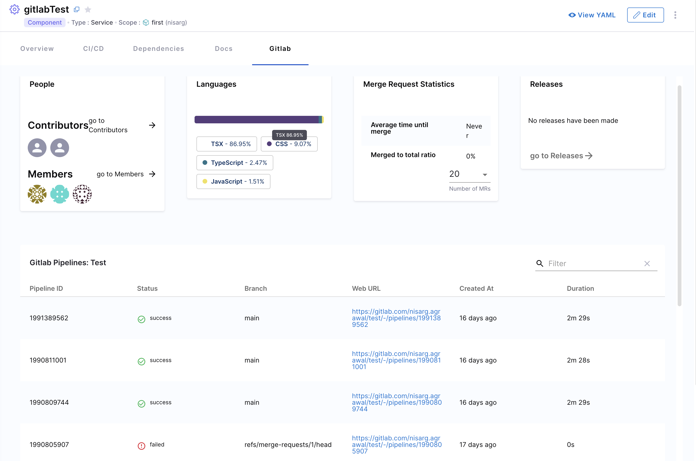

| Plugin details |                                                    |
| -------------- | -------------------------------------------------- |
| **Created by** | [ImmobiliareLabs](https://github.com/immobiliare)        |
| **Category**   | Agile Planning                                     |
| **Source**     | [GitHub](https://github.com/immobiliare/backstage-plugin-gitlab) |
| **Type**       | Open-source plugin                                 |

## What does this plugin do?

The GitLab plugin connects your Internal Developer Portal to your GitLab repositories. It allows you to:

- See project summaries and activities
- View merge requests and commits
- Access project documentation directly from your catalog
- Track project issues and milestones

## Setting up the plugin

### Step 1: Basic configuration

Add the following to your application configuration file (`app-config.yaml`):

```yaml
gitlab:
  defaultCodeOwnersPath: .gitlab/CODEOWNERS  # Path to your CODEOWNERS file
  defaultReadmePath: .gitlab/README.md       # Path to your README file
  allowedKinds: ['Component', 'Resource']    # Catalog types that can use this plugin
  proxySecure: false                         # Set to true if using HTTPS
  useOAuth: false                           # Set to true if using GitLab OAuth
```

### Step 2: Managing authentication

You'll need to set up a GitLab connector in Harness to authenticate with your GitLab instance. This connector allows secure communication between Harness IDP and your GitLab repositories. You can configure it with a Personal Access Token (recommended), basic authentication, or OAuth. For detailed setup instructions, see the [GitLab connector documentation](https://developer.harness.io/docs/platform/connectors/code-repositories/connect-to-code-repo/#connect-to-gitlab).

### Step 3: Network access setup

If your GitLab instance isn't directly accessible from Harness:

1. Set up a delegate HTTP proxy by providing:
   - Host URL (without protocol or trailing slashes)
   - Example: `gitlab.mycompany.com`

2. Delegate selection:
   - Use specific delegate tags if needed
   - For best results, use a single delegate with access to your GitLab instance

## Using the plugin

### Available components

This plugin provides:
- 7 UI cards for displaying GitLab data
- 1 tab for detailed views

These components are automatically added to "service" and "website" layouts in your catalog. You can customize their placement through Layout management.



### Linking catalog entities to GitLab projects

By default, the plugin looks for GitLab project information based on where your catalog file is located. You can override this by adding annotations to your catalog entities:

```yaml
metadata:
  annotations:
    # Option 1: Use project ID (numeric identifier)
    gitlab.com/project-id: '1234'  # Must be in quotes, found in Project Settings > General
    
    # Option 2: Use project slug (more readable)
    gitlab.com/project-slug: 'group-name/project-name'
    
    # Option 3: Specify a custom GitLab instance
    gitlab.com/instance: 'gitlab.internal.company.com'
```

Choose the annotation that works best for your environment and organizational structure.

## Troubleshooting

If you encounter issues with the GitLab plugin:

- **Authentication problems**: Verify your GitLab token has the correct permissions
- **Missing data**: Check that your catalog entity has the proper annotations
- **Connection issues**: Ensure network connectivity between Harness and GitLab

For additional help, check the [plugin documentation](https://github.com/immobiliare/backstage-plugin-gitlab) or create an issue on GitHub with details about your configuration.