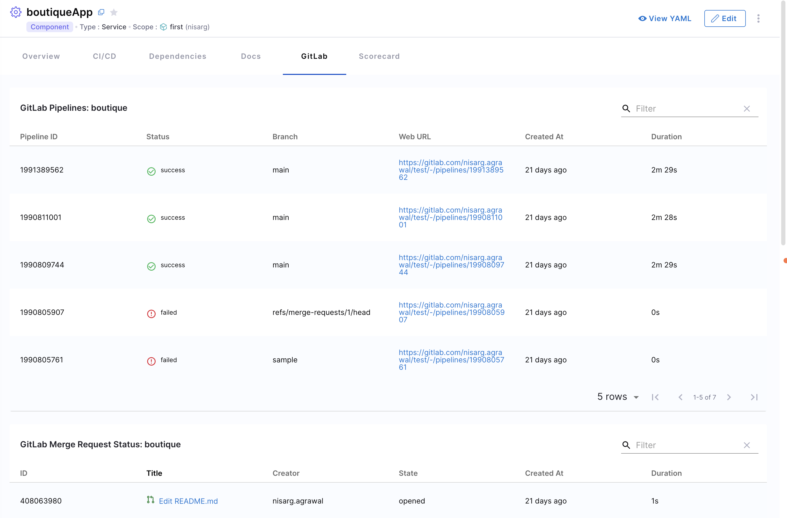

| Plugin details |                                                    |
| -------------- | -------------------------------------------------- |
| **Created by** | [ImmobiliareLabs](https://github.com/immobiliare)        |
| **Category**   | Agile Planning                                     |
| **Source**     | [GitHub](https://github.com/immobiliare/backstage-plugin-gitlab) |
| **Type**       | Open-source plugin                                 |

## What does this plugin do?

The GitLab plugin connects your Internal Developer Portal to your GitLab repositories. It allows you to:

- See project summaries and activities
- View merge requests and commits
- Access project documentation directly from your catalog
- Track project issues and milestones
- View Pipeline status for a project

## Setting up the plugin

### Step 1: Basic configuration

Add the following to your application configuration file (`app-config.yaml`):

```yaml
gitlab:
  defaultCodeOwnersPath: .gitlab/CODEOWNERS  # Path to your CODEOWNERS file
  defaultReadmePath: .gitlab/README.md       # Path to your README file
  allowedKinds: ['Component', 'Resource']    # Catalog types that can use this plugin
  proxySecure: false                         # Set to true if using HTTPS
```

### Step 2: Managing authentication

You'll need to set up a GitLab connector in Harness to authenticate with your GitLab instance. This connector allows secure communication between Harness IDP and your GitLab repositories. You can configure it with a Personal Access Token (recommended), basic authentication, or OAuth. 

Go to **Harness IDP** -> **Configure** -> **Git Integrations** and add a new GitLab connector integration. 

For detailed setup instructions, see the [GitLab connector documentation](https://developer.harness.io/docs/platform/connectors/code-repositories/connect-to-code-repo/#connect-to-gitlab).

This connector is used to authenticate with your GitLab instance and retrieve data about your projects, including their pipelines, issues, and merge requests. Once your connector integration status is verified, the following connection setup will be automatically added to your `app-config.yaml`: 
```YAML
integrations:
    gitlab:
        - host: gitlab.com
          token: ${GITLAB_TOKEN} # Automatically setup with your connector integration
```

### Step 3: Network access setup

If your GitLab instance isn't directly accessible from Harness:

1. Set up a delegate HTTP proxy by providing:
   - Host URL (without protocol or trailing slashes)
   - Example: `gitlab.mycompany.com`

2. Delegate selection:
   - Use specific delegate tags if needed
   - For best results, use a single delegate with access to your GitLab instance

## Using the plugin

### Available components

This plugin provides 7 UI components for displaying GitLab data and 1 tab layout structure for detailed views. 

The UI components are: 
- **Pipelines Table**: Lists recent pipelines for the project
- **Merge Requests Table**: Lists recent merge requests 
- **README Card**: Renders the project README
- **People Card**: Lists the owners and contributors of a project
- **Languages Card**: Lists the languages used for a project
- **Merge Requests Stats Card**: Shows the merge requests statistics overview
- **Releases Card**: List the last releases 

#### Layout Options
This plugin exposes a default tab layout structure for the GitLab plugin using the ``EntityGitlabContent`` component. This adds a default GitLab tab to the plugin layout. 
You can also customise the plugin layout for your Catalog entities using the **Layout Editor**. Go to **Configure** -> **Layout** -> **Catalog Entities**. Select the entity type for which you want to customise the layout structure and add the plugin components in the layout editor. 

:::info
It's recommended to have the ``EntityGitlabPipelinesTable`` component as the default top component in your plugin layout. To learn more about these components, go to [GitLab Plugin Documentation](https://github.com/immobiliare/backstage-plugin-gitlab). 
:::



### Linking catalog entities to GitLab projects

By default, the plugin looks for GitLab project information based on where your catalog file is located. You can override this by adding annotations to your catalog entities:

```yaml
metadata:
  annotations:
    # Option 1: Use project ID (numeric identifier)
    gitlab.com/project-id: '1234'  # Must be in quotes, found in Project Settings > General
    
    # Option 2: Use project slug (more readable)
    gitlab.com/project-slug: 'group-name/project-name'
    
    # Option 3: Specify a custom GitLab instance
    gitlab.com/instance: 'gitlab.internal.company.com'
```

Choose the annotation that works best for your environment and organizational structure.

## Troubleshooting

If you encounter issues with the GitLab plugin:

- **Authentication problems**: Verify your GitLab token has the correct permissions
- **Missing data**: Check that your catalog entity has the proper annotations
- **Connection issues**: Ensure network connectivity between Harness and GitLab

For additional help, check the [plugin documentation](https://github.com/immobiliare/backstage-plugin-gitlab) or create an issue on GitHub with details about your configuration.