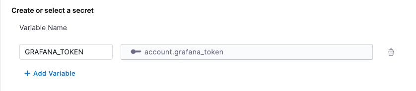
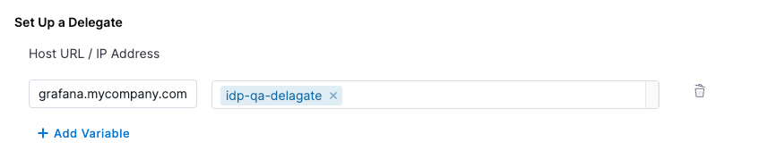

| Plugin details |                                                                                |
| -------------- | ------------------------------------------------------------------------------ |
| **Created by** | K-Phoen                                                                        |
| **Category**   | Monitoring                                                                     |
| **Source**     | [GitHub](https://github.com/K-Phoen/backstage-plugin-grafana/) |
| **Type**       | Open-source plugin                                                             |

## Configuration

### Application configuration YAML

This plugin requires a backend proxy configuration to make calls to Grafana with authentication. 
In the following configuration, replace `<grafana-url>` with the grafana instance (for example https://grafana.mycompany.com) and similarly replace public domain as well.
Make sure that the slash `/` is not added at the end. 

If unified alerting is enabled in grafana, then mark `unifiedAlerting` as true

```yaml
proxy:
  /grafana/api:
    target: https://<grafana-url>
    pathRewrite:
      api/proxy/grafana/api/?: /
    headers:
      Authorization: Bearer ${GRAFANA_TOKEN}
grafana:
  domain: https://<grafana-monitoring-url>
  unifiedAlerting: false
```

### Secrets

Since the `GRAFANA_TOKEN` variable is used in the application configuration, you must generate a Grafana API key and set it as the value of `GRAFANA_TOKEN`. For instructions on how to create a Grafana API key, [read the instructions](https://grafana.com/docs/grafana/latest/developers/http_api/auth/#create-api-token).



### Delegate proxy

If your Grafana instance is self-hosted or has an IP address allowlist, include the base URL `grafana.mycompany.com` in the delegate proxy section. If your Grafana instance is hosted on a public cloud and can be accessed directly using a token, skip this section.
After adding the host, you can select one or more delegates that have access to the host.

:::note

When adding the host, include only the host name. Remove the protocol (HTTP/HTTPS) associated with it.

:::



## Layout

This plugin exports three UI cards that you can show on the **Overview** tab of a service or any other layout page. Go to **Admin** > **Layout**, select **Service** in the dropdown menu, and then add the following in the **Overview** section:

```yaml
- component: EntityGrafanaDashboardsCard
  specs:
    gridProps:
      md: 6
- component: EntityGrafanaAlertsCard
  specs:
    gridProps:
      md: 6
- component: EntityOverviewDashboardViewer
  specs:
    gridProps:
      md: 6
```

## Annotations

To configure the plugin for a service in the software catalog, set the following annotations in its `catalog-info.yaml` definition file.

The following selector will return dashboards under the folder `folder-id` and `folder-name`

```yaml
metadata:
  annotations:
    grafana/dashboard-selector: "folderUrl == 'https://<grafana-url>/dashboards/f/<folder-id>/<folder-name>'"
```

Supported variables:
* `title`: title of the dashboard
* `tags`: array of tags defined by the dashboard
* `url`: URL of the dashboard
* `folderTitle`: title of the folder in which the dashboard is defined
* `folderUrl`: URL of the folder in which the dashboard is defined

Supported binary operators:
* `||`: logical or
* `&&`: logical and
* `==`: equality (=== operator in Javascript)
* `!=`: inequality (!== operator in Javascript)
* `@>`: inclusion (left.includes(right) in Javascript)

Supported unary operators:
* `!`: logical negation

Annotation to embed the overview dashboard referenced by its URL

```yaml
metadata:
  annotations:
    grafana/overview-dashboard: 'http://grafana/d/qSfS51a4z/some-dashboard?orgId=1&kiosk'
```

If Grafana's [Unified Alerting](https://grafana.com/blog/2021/06/14/the-new-unified-alerting-system-for-grafana-everything-you-need-to-know/) is enabled, alerts are selected by a label defined on them:

```yaml
metadata:
  annotations:
    grafana/alert-label-selector: "service=awesome-service"
```

If Grafana's [Unified Alerting](https://grafana.com/blog/2021/06/14/the-new-unified-alerting-system-for-grafana-everything-you-need-to-know/) is NOT enabled, alerts are selected by a tag present on the dashboards defining them.

```yaml
metadata:
  annotations:
    grafana/tag-selector: "my-tag"
```

[Read more](https://github.com/K-Phoen/backstage-plugin-grafana/blob/main/docs/dashboards-on-component-page.md)

## Support

The plugin is owned by K-Phoen and managed in the [K-Phoen's Plugin repository](https://github.com/K-Phoen/backstage-plugin-grafana/) as an open-source project. Create a GitHub issue to report bugs or suggest new features for the plugin.
