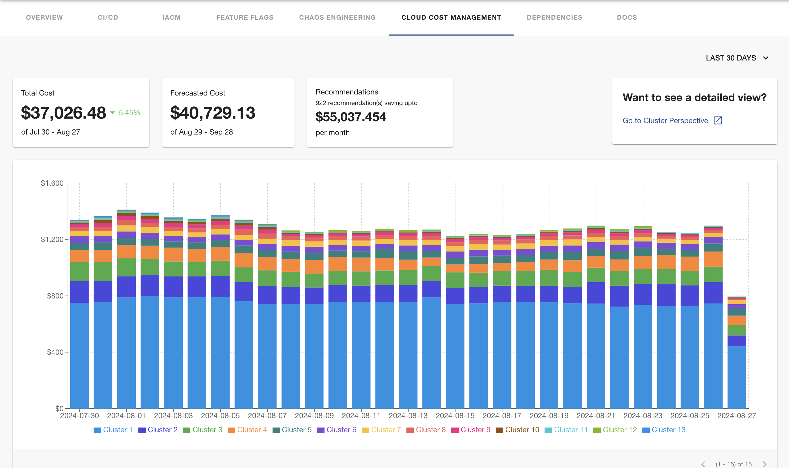

| Plugin details |                                                        |
| -------------- | ------------------------------------------------------ |
| **Created by** | Harness                                                |
| **Category**   | Infrastructure                                         |
| **Source**     | [GitHub](https://github.com/harness/backstage-plugins) |
| **Type**       | Open-source plugin                                     |

## Configuration

### Application configuration YAML

_No action required_

This plugin requires a backend proxy configuration to make calls to Harness APIs with authentication. The following configuration is set by default and you do not need to change anything:

```YAML
proxy:
  endpoints:
    '/harness/prod':
      target: https://app.harness.io/
      pathRewrite:
        '/api/proxy/harness/prod/?': '/'
      allowedHeaders:
        - authorization
        - Harness-Account
```

### Secrets

No secrets are required for this plugin because both IDP and CCM are part of the Harness Software Delivery Platform.

### Delegate proxy

_No action required_

This plugin does not require a delegate proxy to be set up.

## Layout

_No action required_

This plugin exports a card on the Overview Page and a UI tab that you can use as a new CCM tab or for any other layout page. The following configuration is set by default in **Layout** under **Admin** for **Service** and you do not need to change anything:

```YAML
- name: ccm
  path: /ccm
  title: Cloud Cost Management
  contents:
    - component: EntityCcmContent
```

Also you could add a conditional like `isHarnessCcmAvailable` which is met when `harness.io/perspective-url` annotation is present in the software components's `catalog-info.yaml` definition file.

```YAML
- name: ccm
  path: /ccm
  title: Cloud Cost Management
  contents:
    - component: EntitySwitch
      specs:
        cases:
          - if: isHarnessCcmAvailable
            content:
              component: EntityCcmContent
```




## Annotations

To configure the plugin for a service in the software catalog, set one or both of the following annotations in its `catalog-info.yaml` definition file, you can fetch the Perspective URL from the [Perspectives](https://developer.harness.io/docs/cloud-cost-management/use-ccm-cost-reporting/ccm-perspectives/create-cost-perspectives#perspectives) page:

```YAML
apiVersion: backstage.io/v1alpha1
kind: Component
metadata:
  # ...
  annotations:
    harness.io/perspective-url: |
      PerspectiveA: https://url-details/perspectives/perspectiveId/name/perspectiveName
      PerspectiveB: <harness_ccm_perspective_url>
spec:
  type: service
  # ...
```

## Support

The plugin is owned by Harness and managed in the [Harness plugins repository](https://github.com/harness/backstage-plugins) as an open-source project. Create a GitHub issue to report bugs or suggest new features for the plugin.
