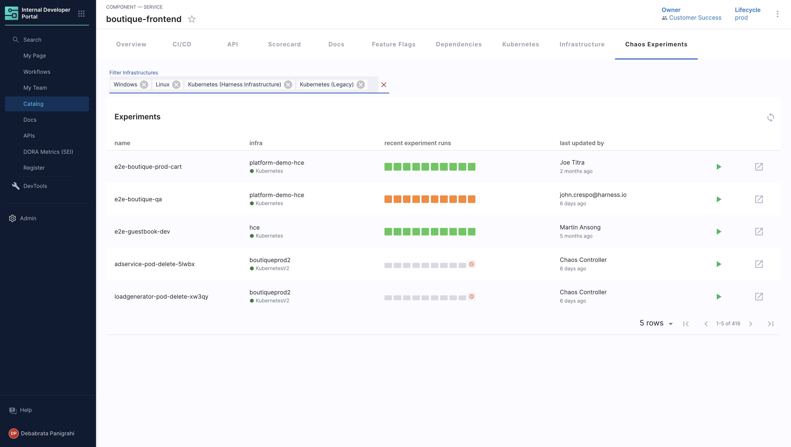

| Plugin details |                                                        |
| -------------- | ------------------------------------------------------ |
| **Created by** | Harness                                                |
| **Category**   | Chaos Engineering                                      |
| **Source**     | [GitHub](https://github.com/harness/backstage-plugins) |
| **Type**       | Open-source plugin                                     |

## Configuration

### Application configuration YAML

_No action required_

This plugin requires a backend proxy configuration to make calls to Harness APIs with authentication. The following configuration is set by default and you do not need to change anything:

```yaml
proxy:
  "/harness/prod":
    target: "https://app.harness.io/"
    pathRewrite:
      "/api/proxy/harness/prod/?": "/"
    allowedHeaders:
      - authorization
```

### Secrets

No secrets are required for this plugin because both IDP and Chaos Engineering are part of the Harness software delivery platform.

### Delegate proxy

_No action required_

This plugin does not require a delegate proxy to be set up.

## Layout

_No action required_

This plugin exports a UI tab that you can use as a new "Chaos Experiments" tab for Chaos Engineering Experiments or for any other layout page.  The following configuration is set by default in **Layout** under **Admin** for **Service** and you do not need to change anything:

```yaml
- name: chaos
  path: /chaos
  title: Chaos Experiments
  contents:
    - component: EntityHarnessChaosContent
```

Also you could add a conditional like `isHarnessChaosAvailable`  which is met when `harness.io/project-url` and `harness.io/network-map-tags` annotations are present in the software components's `catalog-info.yaml` definition file.

```YAML
- name: chaos
  path: /chaos
  title: Chaos Experiments
  contents:
    - component: EntitySwitch
      specs:
        cases:
          - if: isHarnessChaosAvailable
            content:
              component: EntityHarnessChaosContent
```



## Annotations

To configure the plugin for a service in the software catalog, set one or both of the following annotations in its `catalog-info.yaml` definition file.

```yaml
apiVersion: backstage.io/v1alpha1
kind: Component
metadata:
  # ...
  annotations:
    harness.io/project-url: <harness_project_url>
    harness.io/network-map-tags: |
      <nm-name_1>: <nm-label_1>
      <nm-name_2>: <nm-label_2>
spec:
  type: service
  # ...
```

## Support

The plugin is owned by Harness and managed in the [Harness plugins repository](https://github.com/harness/backstage-plugins) as an open-source project. Create a GitHub issue to report bugs or suggest new features for the plugin.
