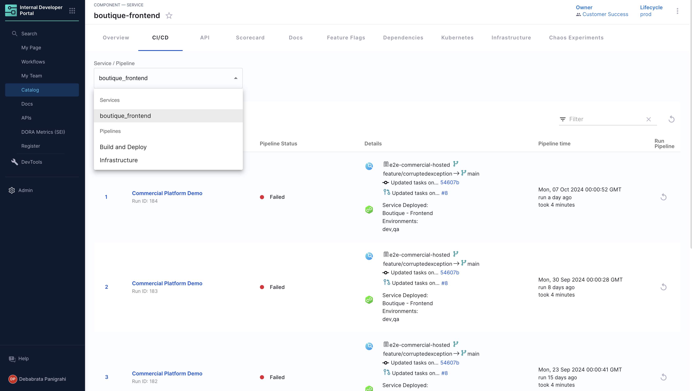

| Plugin details |                                                        |
| -------------- | ------------------------------------------------------ |
| **Created by** | Harness                                                |
| **Category**   | CI/CD                                                  |
| **Source**     | [GitHub](https://github.com/harness/backstage-plugins) |
| **Type**       | Open-source plugin                                     |

## Configuration

### Application configuration YAML

_No action required_

This plugin requires a backend proxy configuration to make calls to Harness APIs with authentication. The following configuration is set by default and you do not need to change anything:

```yaml
proxy:
  "/harness/prod":
    target: "https://app.harness.io/"
    pathRewrite:
      "/api/proxy/harness/prod/?": "/"
    allowedHeaders:
      - authorization
```

### Secrets

No secrets are required for this plugin because both IDP and CI/CD are part of the Harness software delivery platform.

### Delegate proxy

_No action required_

This plugin does not require a delegate proxy to be set up.

## Layout

_No action required_

This plugin exports a UI tab that you can use as a new CI/CD tab for a service or for any other layout page. Go to **Admin** > **Layout**, select **Service** in the dropdown menu, and then add the following YAML code in the **CI/CD** section:

```yaml
- name: ci-cd
  path: /ci-cd
  title: CI/CD
  contents:
    - component: EntitySwitch
      specs:
        cases:
          - if: isHarnessCiCdAvailable
            content:
              component: EntityHarnessCiCdContent
          - content:
              component: EmptyState
              specs:
                props:
                  title: No CI/CD available for this entity
                  missing: info
                  description: You need to add an annotation to your component if you want to enable CI/CD for it. You can read more about annotations in Backstage by clicking the button below.
```

The `isHarnessCiCdAvailable` condition is met when one of the following annotations is present in the software components's `catalog-info.yaml` definition file.

- `harness.io/pipelines`
- `harness.io/services`
- `harness.io/project-url` (deprecated)



## Annotations

To configure the plugin for a service in the software catalog, set one or both of the following annotations in its `catalog-info.yaml` definition file, [follow the information on how to fetch the URLs for annotation](https://github.com/harness/backstage-plugins/blob/main/plugins/harness-ci-cd/PluginConfiguation.md):

```yaml
apiVersion: backstage.io/v1alpha1
kind: Component
metadata:
  # ...
  annotations:
    # optional annotation
    harness.io/pipelines: |
      CI: <harness_ci_pipeline_url>
      CD: <harness_cd_pipeline_url>
    # here labelA / labelB (example: CI/CD) denotes the value you will see in dropdown in execution list.
    # optional annotation
    harness.io/services: |
      serviceA: <harness_service_url>
      serviceB: <harness_service_url>
spec:
  type: service
  # ...
```

## Support

The plugin is owned by Harness and managed in the [Harness plugins repository](https://github.com/harness/backstage-plugins) as an open-source project. Create a GitHub issue to report bugs or suggest new features for the plugin.
