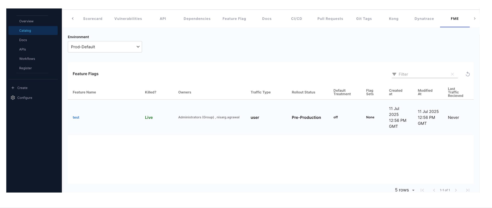

# Harness Feature Management & Experimentation

| Plugin details |                                                        |
| -------------- | ------------------------------------------------------ |
| **Created by** | Harness                                                |
| **Category**   | Feature Management                                     |
| **Source**     | [GitHub](https://github.com/harness/backstage-plugins) |
| **Type**       | Open-source plugin                                     |


## Configuration

### Application configuration YAML

This plugin requires a backend proxy configuration to make calls to the Split.io API with authentication. Add the following configuration to your app-config.yaml file:

```yaml
proxy:
  endpoints:
    /harnessfme:
      target: https://api.split.io/
      pathRewrite:
        /api/proxy/harnessfme/?: /
      headers:
        Authorization: Bearer ${SPLIT_API_TOKEN}
```

### Secrets

This plugin requires a Split API token for authentication. The token is referenced as `${SPLIT_API_TOKEN}` in the proxy configuration.

To obtain and manage your API tokens, refer to the [Harness Feature Management API Keys documentation](https://developer.harness.io/docs/feature-management-experimentation/management-and-administration/account-settings/api-keys/).

### Delegate proxy

_No action required_

This plugin does not require a delegate proxy to be set up because Split.io API is publicly accessible.

## Layout

To add the FME tab to your service component pages, go to **Admin** > **Layout**, select **Service** in the dropdown menu, and add the following YAML code:

```yaml
- name: EntityHarnessFMEFeatureFlagContent
  path: /harnessfme
  title: FME
  contents:
    - component: EntityHarnessFMEFeatureFlagContent
```

This will add a Feature Management & Experimentation tab to services that have the proper FME annotations configured.



## Annotations

To connect a service in your software catalog with its corresponding Harness FME project, add the following annotations to its `catalog-info.yaml` definition file:

```yaml
metadata:
  annotations:
    harnessfme/projectId: <project_id>
    harnessfme/accountId: <account_id>
```

Replace `<project_id>` with your Split project ID and `<account_id>` with your Split account ID. These annotations allow the plugin to fetch the appropriate feature flags and experiments for the service.

## Support

The plugin is owned by Harness and managed in the [Harness plugins repository](https://github.com/harness/backstage-plugins) as an open-source project. Create a GitHub issue to report bugs or suggest new features for the plugin.