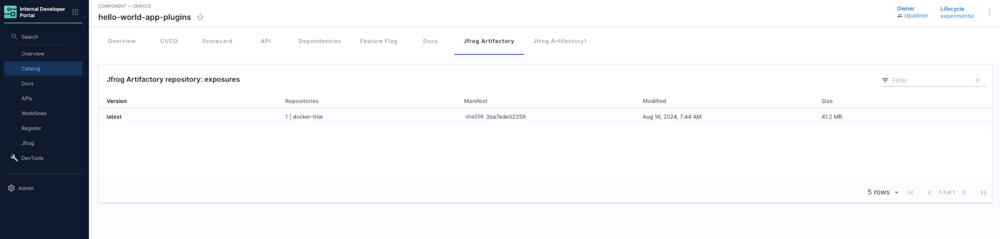
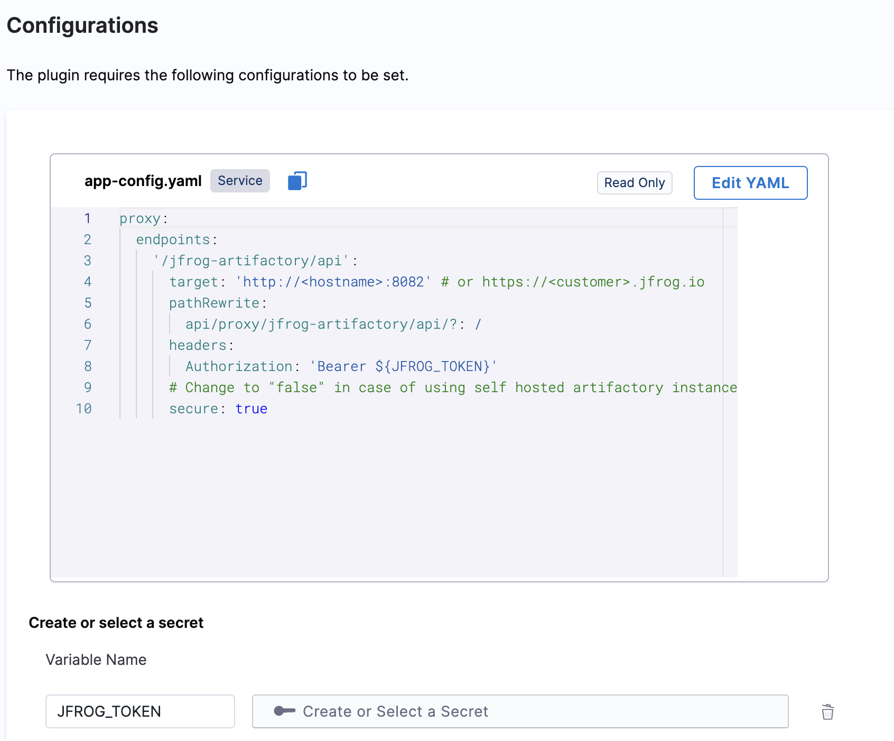
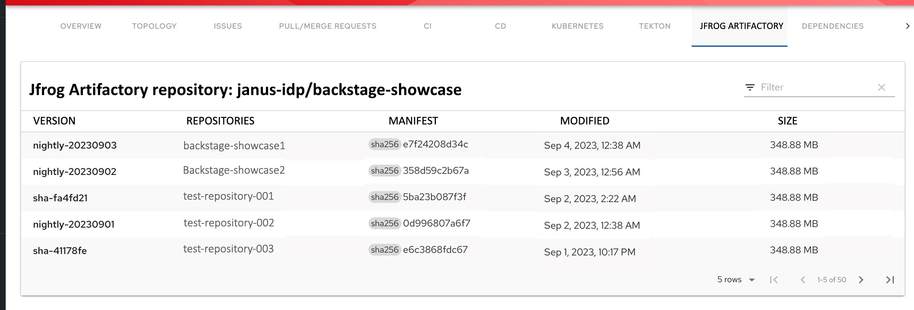

| Plugin details |                                                                                              |
| -------------- | -------------------------------------------------------------------------------------------- |
| **Created by** | [RedHat](https://redhat.com/)                                                                |
| **Category**   | Image                                                                                        |
| **Source**     | [GitHub](https://github.com/janus-idp/backstage-plugins/tree/main/plugins/jfrog-artifactory) |
| **Type**       | Open-source plugin                                                                           |



## Configuration

### Application configuration YAML

This plugin requires a backend proxy configuration to make calls to JFrog with authentication.

- Under the **Plugins** tab in **Admin**, go to `app-config.yaml` and **Edit YAML** to configure your jfrog endpoint in the **target** field in the format as shown below.

```YAML
# app-config.yaml
proxy:
  endpoints:
    '/jfrog-artifactory/api':
      target: 'http://<hostname>:8082' # or https://<customer>.jfrog.io
      pathRewrite:
        api/proxy/jfrog-artifactory/api/?: /
      headers:
        Authorization: 'Bearer ${JFROG_TOKEN}'
      # Change to "false" in case of using self hosted artifactory instance with a self-signed certificate
      secure: true
```



### Secrets

- You need to add the JFROG_TOKEN as a Harness Secret.

- **Create secret in Harness** to store API token, click on “New Secret Text” and enter values as shown below.


## Layout

_No action required_

_No action required_

This plugin exports a UI tab that you can use as a new **JFrog** tab for a service or for any other layout page. The following configuration is set by default in **Layout** under **Catalog Entities** for **Service** and you do not need to change anything:

```YAML
- name: JfrogArtifactoryPage
  path: /jfrog-artifactory
  title: Jfrog Artifactory
  contents:
    - component: JfrogArtifactoryPage
```



## Annotations

- Artifact details are correlated to IDP entities using an annotation added in the entity's `catalog-info.yaml` file.

```YAML
metadata:
  annotations:
    'jfrog-artifactory/image-name': '<IMAGE-NAME>'
```

## Support

The plugin is owned by RedHat and managed in this [repository](https://github.com/janus-idp/backstage-plugins/tree/main/plugins/jfrog-artifactory) as an open-source project. Create a GitHub issue to report bugs or suggest new features for the plugin.
