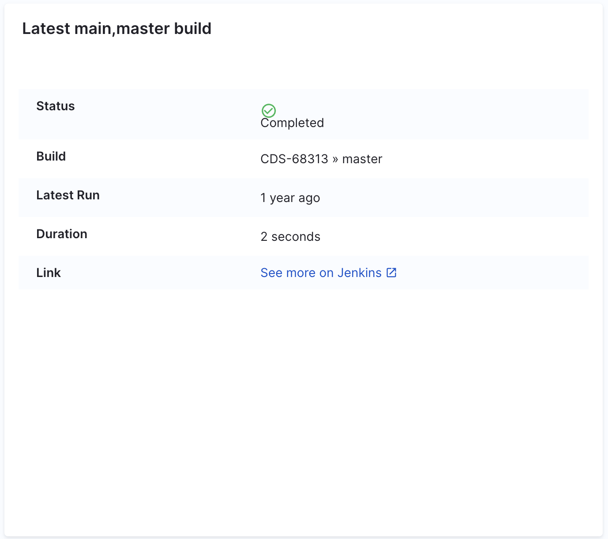

| Plugin details |                                                                              |
| -------------- | ---------------------------------------------------------------------------- |
| **Created by** | [@timja](https://github.com/timja)                                           |
| **Category**   | CI/CD                                                                        |
| **Source**     | [GitHub](https://github.com/backstage/community-plugins/tree/main/workspaces/jenkins/plugins/jenkins#jenkins-plugin-alpha) |
| **Type**       | Open-source plugin                                                           |

## Configuration

:::info
As part of our [March-v0.41.0 release](/release-notes/internal-developer-portal), we've upgraded the Jenkins Plugin to its latest version, introducing support for [additional parameters](/docs/internal-developer-portal/plugins/available-plugins/jenkins.md#optional-parameters-in-backend-config) in the backend configuration. If you already have the plugin enabled, you can now optionally include these new parameters as needed.
:::

### Application Configuration YAML

This plugin requires a backend configuration to make calls to your Jenkins instance with authentication. Update the following configuration with your Jenkins URL and a username:

```yaml
jenkins:
  instances:
    - name: default
      baseUrl: "<your-jenkins-url>"
      username: "<your-jenkins-username>"
      apiKey: ${JENKINS_TOKEN}
```
### Additional Parameters

With the latest Jenkins Plugin upgrade, support for additional parameters has been introduced in the backend configuration. You can include these parameters as needed. These parameters serve specific roles in configuring Jenkins instances.

#### 1. `projectCountLimit`

This parameter sets the maximum number of Jenkins projects (jobs) that the plugin will process or retrieve for a given Jenkins instance. It helps manage performance and load by limiting the number of projects fetched. The `projectCountLimit` is optional, and if not specified, the **default limit is 50**.

#### Example:
```yaml
jenkins:
  baseUrl: https://jenkins.example.com
  username: backstage-bot
  projectCountLimit: 100
  apiKey: 123456789abcdef0123456789abcedf012
```
In this example, the plugin will process up to 100 projects from the specified Jenkins instance.

#### 2. `allowedBaseUrlOverrideRegex`

This parameter specifies a regular expression pattern used to securely override the `baseUrl` defined in the configuration using values from the catalog annotations. This provides flexibility while adding security, ensuring only approved URLs can override the base configuration.

#### Example Configuration:

**Backend Config**
```yaml
jenkins:
  instances:
    - name: departmentFoo
      baseUrl: https://departmentFoo.example.com
      username: backstage-bot
      projectCountLimit: 100
      apiKey: 123456789abcdef0123456789abcedf012
      allowedBaseUrlOverrideRegex: https://.*\.example\.com
```

In this configuration, the `allowedBaseUrlOverrideRegex` permits URL overrides matching any subdomain of `example.com`.

**Catalog Annotation Example:**
```yaml
apiVersion: backstage.io/v1alpha1
kind: Component
metadata:
  name: artist-lookup
  annotations:
    jenkins.io/job-full-name: departmentFoo:teamA/artistLookup-build
    jenkins.io/override-base-url: https://other.example.com
```

Here, the `jenkins.io/override-base-url` annotation specifies an alternate Jenkins base URL (`https://other.example.com`) for this particular entity. The plugin will use this URL if it matches the defined `allowedBaseUrlOverrideRegex`. The plugin performs validation by ensuring the URL provided matches at least one regex pattern specified in the backend configuration.

### Secrets

Since the `JENKINS_TOKEN` variable is used in the application configuration, you must generate a Jenkins API token and set it as the value of `JENKINS_TOKEN`.

### Delegate proxy

If your Jenkins instance is available on the public internet, this plugin does not require a delegate proxy to work. However, if the Jenkins instance is behind a network firewall, ensure that you have a [Harness Delegate](/docs/platform/delegates/delegate-concepts/delegate-overview) running in your network. You can enter the host name or IP address of your Jenkins instance and select the delegate that should have access to the Jenkins instance. The delegate serves as an HTTP proxy for communications between IDP and your Jenkins instance.

## Layout

This plugin exports a UI tab that you can use as a new CI/CD tab for a service or for any other layout page. Go to **Admin** > **Layout**, select **Service** in the dropdown menu, and then add the following YAML code in the **CI/CD** section:

```yaml
- name: ci-cd
  path: /ci-cd
  title: CI/CD
  contents:
    - component: EntitySwitch
      specs:
        cases:
          - if: isJenkinsAvailable
            content:
              component: EntityJenkinsContent
          - content:
              component: EmptyState
              specs:
                props:
                  title: No CI/CD available for this entity
                  missing: info
                  description: You need to add an annotation to your component if you want to enable CI/CD for it. You can read more about annotations in Backstage by clicking the button below.
```

The `isJenkinsAvailable` condition is met when the `jenkins.io/github-folder` annotation is present in the software component's `catalog-info.yaml` definition file.



## Annotations

To configure the plugin for a service in the software catalog, set the following annotation in its `catalog-info.yaml` definition file:

```yaml
metadata:
  annotations:
    jenkins.io/github-folder: "folder-name/project-name"
```

## Support

The plugin is owned by [@timja](https://github.com/timja) and managed in the [Backstage repository](https://github.com/backstage/community-plugins/tree/main/workspaces/jenkins/plugins) as an open-source project. Create a GitHub issue to report bugs or suggest new features for the plugin.
