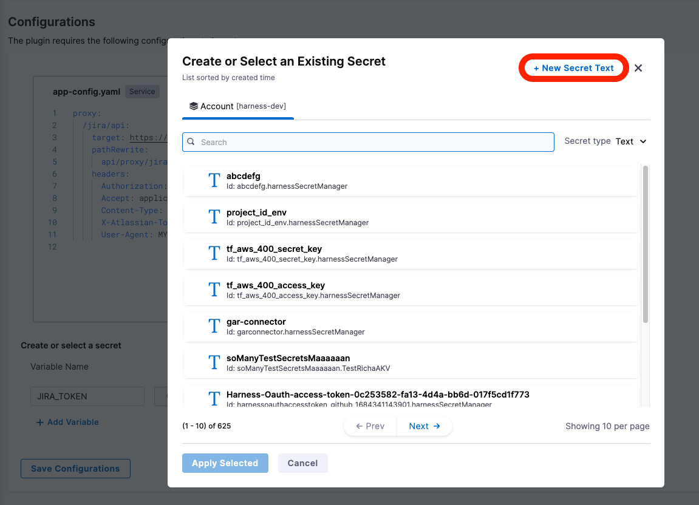
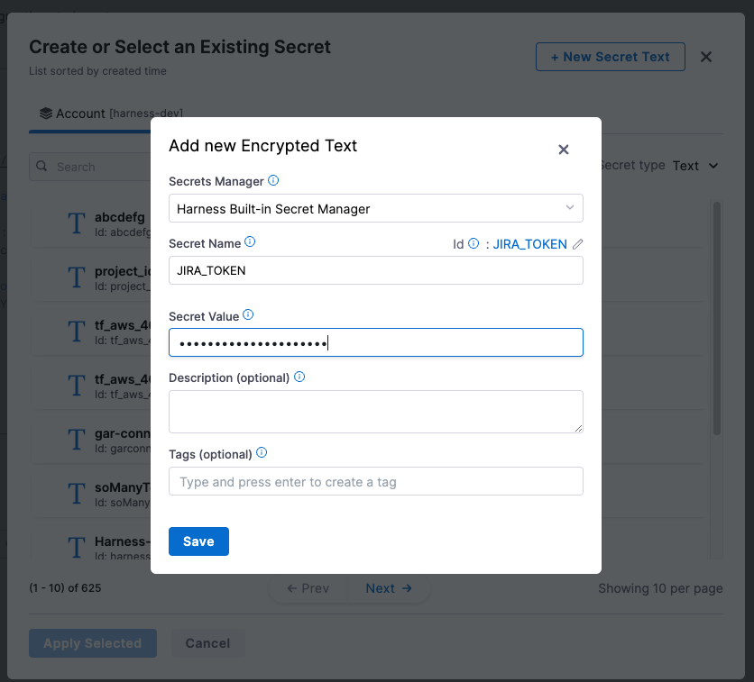
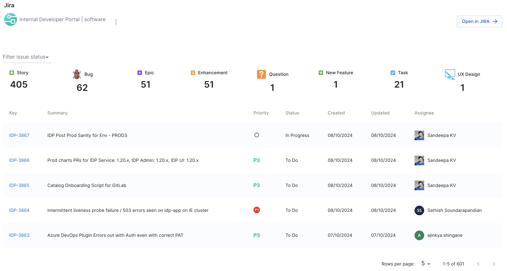

| Plugin details |                                                    |
| -------------- | -------------------------------------------------- |
| **Created by** | [Roadie](https://roadie.io)                        |
| **Category**   | Agile Planning                                     |
| **Source**     | [GitHub](https://roadie.io/backstage/plugins/jira) |
| **Type**       | Open-source plugin                                 |

## Configuration

### Application configuration YAML

This plugin requires a backend proxy configuration to make calls to Jira with authentication. In the following configuration, replace `<your-jira-url>` with the Jira instance project (for example https://mycompany.atlassian.net):

```yaml
proxy:
  "/jira/api":
    target: "<your-jira-url>"
    pathRewrite:
      "api/proxy/jira/api/?": "/"
    headers:
      Authorization: ${JIRA_TOKEN}
      Accept: "application/json"
      Content-Type: "application/json"
      X-Atlassian-Token: "nocheck"
      User-Agent: "MY-UA-STRING"
```

### Secrets

Since the `JIRA_TOKEN` variable is used in the application configuration, you must generate a Jira API key and set it as the value of `JIRA_TOKEN`. For information about how to generate a Jira API key, go to the [instructions](https://id.atlassian.com/manage-profile/security/api-tokens).

- Select **Create API token**, give some label  and copy the generated token
- **Base64 encode API token**: We need to prefix the token with the Jira user email and base64 encode it.
```sh
echo -n "jira-mail@example.com:hTBgqVcrcxRYpT5TCzTA9C0F" | base64
```

:::info

**base64** encoding is mandatory for the API Token and you need to add your `email address` followed by `:` as a prefix to the token generated eg: `jira-mail@example.com:hTBgqVcrcxRYpT5TCzTA9C0F`

:::

- **Create secret in Harness to store API token**: Once token is generated, click on the “input field” next to `JIRA_TOKEN` and you will see a pop-up to create or chose exiting secret



- To create new secret, click on **New Secret Text** and enter values like below. Make sure you save Secret Value with “Basic” as prefix. 


:::info
Example of the secret to be added: `Basic xxxxYYYYYYXXXxxxxxxxYxx==`
:::



- After selecting the new secret, click on **Save Configurations** and then followed by **Enable Plugin** button. This will take few seconds to reflect the changes in the components.

### Delegate proxy

_No action required_

This plugin does not require a delegate proxy to be set up because Jira is publicly accessible.

## Layout

This plugin exports a UI card that you can show on the **Overview** tab of a service or any other layout page. Go to **Admin** > **Layout**, select **Service** in the dropdown menu, and then add the following in the **Overview** section:

```yaml
- component: EntityJiraOverviewCard
```

You can also make the card appear conditionally for services (only if Jira is configured for the service) by replacing the card with a switch case, as follows:

```yaml
- component: EntitySwitch
  specs:
    cases:
      - if: isJiraAvailable
        content:
          component: EntityJiraOverviewCard
```



## Annotations

To configure the plugin for a service in the software catalog, set one of the following annotations in its `catalog-info.yaml` definition file:

```yaml
metadata:
  annotations:
    jira/project-key: <example-jira-project-key>
    jira/component: <example-component> # optional, you might skip this value to fetch data for all components
```

## Support

The plugin is owned by [Roadie](https://roadie.io) and managed in the [Roadie plugins repository](https://github.com/roadieHQ/roadie-backstage-plugins) as an open-source project. Create a GitHub issue to report bugs or suggest new features for the plugin.
