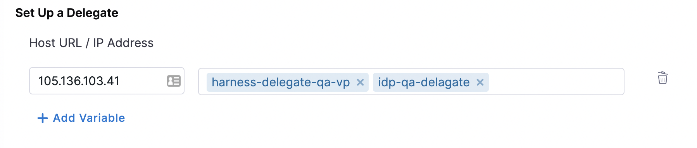

| Plugin details |                                                                                 |
| -------------- | ------------------------------------------------------------------------------- |
| **Created by** | Spotify                                                                         |
| **Category**   | Monitoring                                                                      |
| **Source**     | [GitHub](https://github.com/backstage/backstage/tree/master/plugins/kubernetes) |
| **Type**       | Open-source plugin                                                              |

## Configuration

### Application configuration YAML

The plugin supports two types of application configuration.

#### Authentication using a Kubernetes service account (default)

```yaml
kubernetes:
  serviceLocatorMethod:
    type: "multiTenant"
  clusterLocatorMethods:
    - type: "config"
      clusters:
        - url: "<your-base-url>"
          name: "<your-cluster-name>"
          authProvider: "serviceAccount"
          skipTLSVerify: true
          skipMetricsLookup: false
          serviceAccountToken: ${K8S_SA_TOKEN}
```

#### Authentication using Google Cloud Platform (GCP) credentials.

```yaml
kubernetes:
  serviceLocatorMethod:
    type: "multiTenant"
  clusterLocatorMethods:
    - type: "config"
      clusters:
        - url: "<your-base-url>"
          name: "<your-cluster-name>"
          authProvider: "google"
          skipTLSVerify: true
          skipMetricsLookup: false
```

In both cases, replace `<your-base-url>` with the base URL of the target cluster. Replace `<your-cluster-name>` with a name that identifies the target cluster.

### Secrets

If you are using a service account to authenticate, ensure that a secret variable `K8S_SA_TOKEN` is set with the Kubernetes service account key.

If you are using GCP credentials to authenticate, you do not have to add a variable. Instead, configure the [Google OAuth provider](../oauth-support-for-plugins.md) on the **OAuth Configurations** page to enable the plugin to use the logged-in user's credentials when making requests.

### Delegate proxy

If the target cluster is on a private network, ensure that you include the host portion of the cluster's base URL in this section. If the cluster is not on a private network, skip this section.

After adding the host, you can select one or more delegates that have access to the host. If you leave the delegate selectors field empty, it is assumed that all delegates in the account have access to the host/cluster.

:::note

When adding the host, include only the host name. Remove the protocol (HTTP/HTTPS) and any port number associated with it.

:::



## Layout

This plugin exports a UI tab that you can use as a new **Kubernetes** tab for a service or for any other layout page. Go to **Admin** > **Layout**, select **Service** in the dropdown menu. and then add the following in a new **Kubernetes** section:

```yaml
- name: kubernetes
  path: /kubernetes
  title: Kubernetes
  contents:
    - component: EntityKubernetesContent
```

## Annotations

There are several annotations supported by the Kubernetes plugin, and you can use them in your service's `catalog-info.yaml` descriptor file to link to a Kubernetes entity. For details, go to the [plugin docs](https://backstage.io/docs/features/kubernetes/configuration#surfacing-your-kubernetes-components-as-part-of-an-entity).

## Support

The plugin is owned by Spotify and managed in the [Backstage repository](https://github.com/backstage/backstage/tree/master/plugins/kubernetes) as an open-source project. Create a GitHub issue to report bugs or suggest new features for the plugin.
