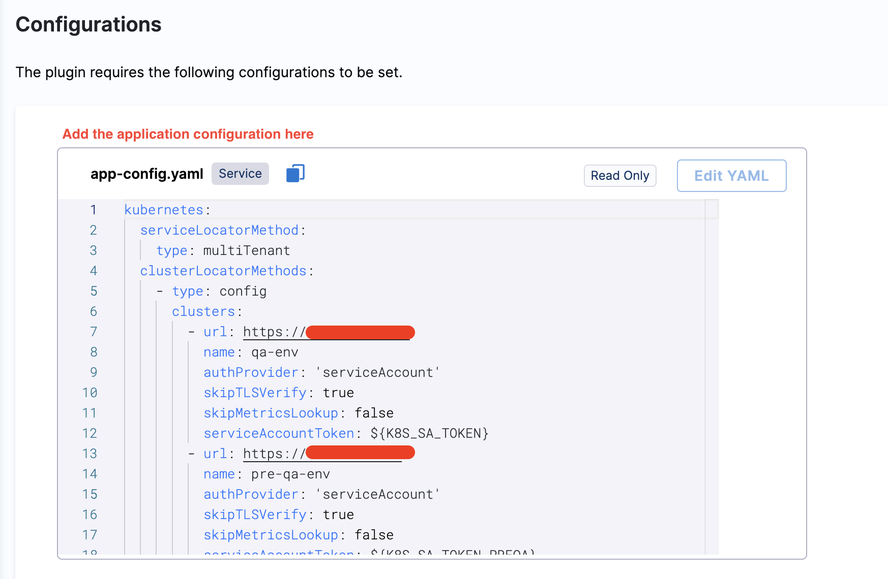
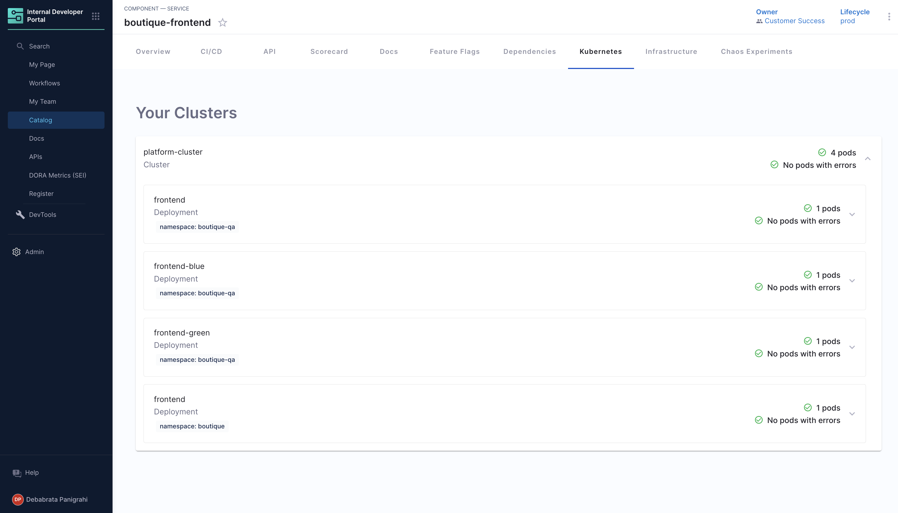
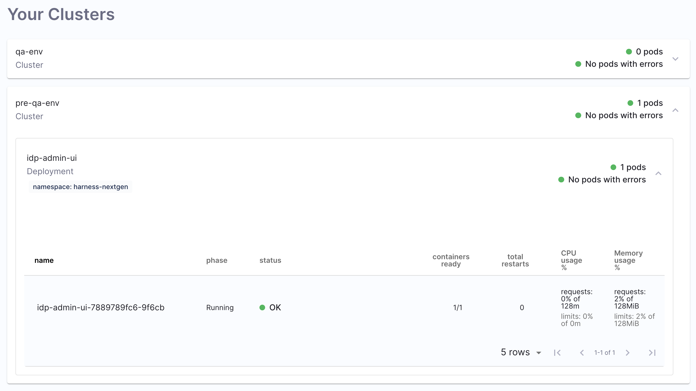
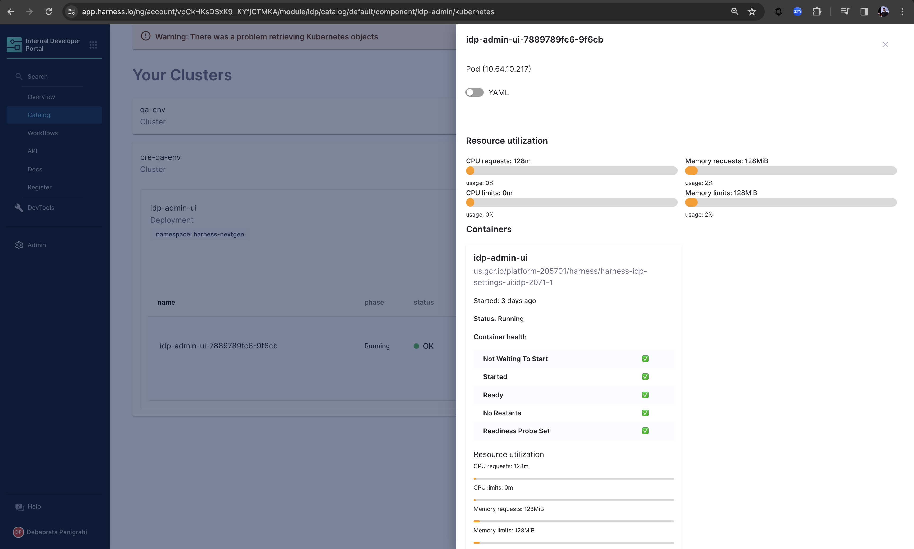
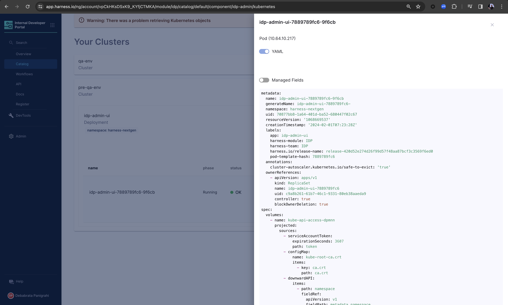
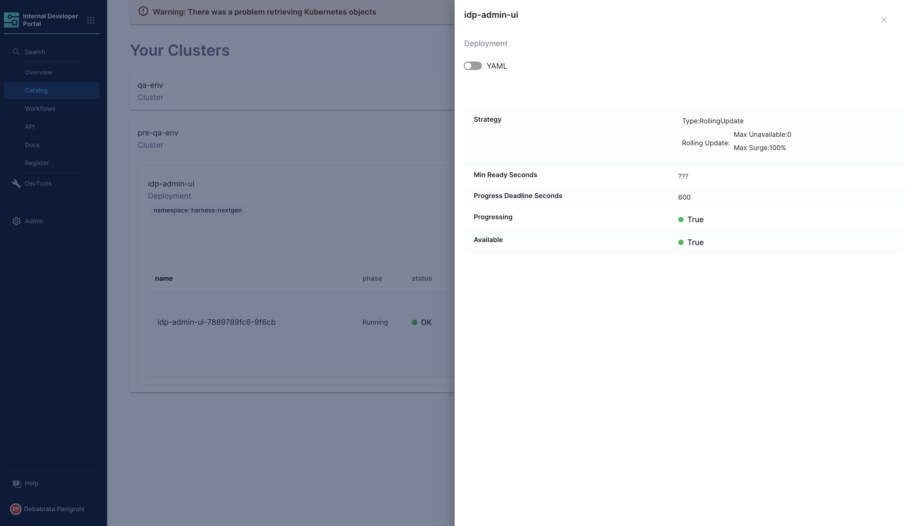

| Plugin details |                                                                                 |
| -------------- | ------------------------------------------------------------------------------- |
| **Created by** | Spotify                                                                         |
| **Category**   | Monitoring                                                                      |
| **Source**     | [GitHub](https://github.com/backstage/backstage/tree/master/plugins/kubernetes) |
| **Type**       | Open-source plugin                                                              |

## Configuration

### Application configuration YAML

The plugin supports two types of application configuration, which needs to be updated by the user in the **Configurations**



#### Authentication using a Kubernetes service account (default)

```yaml
kubernetes:
  serviceLocatorMethod:
    type: "multiTenant"
  clusterLocatorMethods:
    - type: "config"
      clusters:
        - url: "<your-base-url>"
          name: "<your-cluster-name>"
          authProvider: "serviceAccount"
          skipTLSVerify: true
          skipMetricsLookup: false
          serviceAccountToken: ${K8S_SA_TOKEN}
```

#### Authentication using Google Cloud Platform (GCP) credentials.

```yaml
kubernetes:
  serviceLocatorMethod:
    type: "multiTenant"
  clusterLocatorMethods:
    - type: "config"
      clusters:
        - url: "<your-base-url>"
          name: "<your-cluster-name>"
          authProvider: "google"
          skipTLSVerify: true
          skipMetricsLookup: false
```

In both cases, replace `<your-base-url>` with the base URL of the target cluster. Replace `<your-cluster-name>` with a name that identifies the target cluster.

### Secrets

If you are using a service account to authenticate, ensure that a secret variable `K8S_SA_TOKEN` is set with the Kubernetes service account key.

Please make sure, the `Service Account` token generated above must have a `ClusterRole` with permissions as mentioned below in the example reference YAML.

```YAML
apiVersion: rbac.authorization.k8s.io/v1
kind: ClusterRole
metadata:
 name: idp-clusterrole
 namespace: <namespace_name>
rules:
  - apiGroups: [""]
    resources: ["pods", "services", "configmaps", "namespaces", "limitranges"]
    verbs: ["get", "list", "watch"]
  - apiGroups: ["apps"]
    resources: ["deployments", "replicasets", "statefulsets","daemonsets"]
    verbs: ["get", "list", "watch"]
  - apiGroups: ["batch"]
    resources: ["jobs", "cronjobs"]
    verbs: ["get", "list", "watch"]
  - apiGroups: ["metrics.k8s.io"]
    resources: ["pods"]
    verbs: ["get", "list", "watch"]
  - apiGroups: ["networking.k8s.io"]
    resources: ["ingresses", "networkpolicies"]
    verbs: ["get", "list", "watch"]
  - apiGroups: ["autoscaling"]
    resources: ["horizontalpodautoscalers"]
    verbs: ["get", "list", "watch"]
  - apiGroups: [""]
    resources: ["pods/log"]
    verbs: ["get", "list"]
```

If you are using GCP credentials to authenticate, you do not have to add a variable. Instead, configure the [Google OAuth provider](../oauth-support-for-plugins.md) on the **OAuth Configurations** page to enable the plugin to use the logged-in user's credentials when making requests.

### Delegate proxy

If the target cluster is on a private network, ensure that you include the host portion of the cluster's base URL in this section. If the cluster is not on a private network, skip this section.

After adding the host, you can select one or more delegates that have access to the host. If you leave the delegate selectors field empty, it is assumed that all delegates in the account have access to the host/cluster.

:::note

When adding the host, include only the host name. Remove the protocol (HTTP/HTTPS) and any port number associated with it.

:::


## Layout

This plugin exports a UI tab that you can use as a new **Kubernetes** tab for a service or for any other layout page. Go to **Admin** > **Layout**, select **Service** in the dropdown menu. and then add the following in a new **Kubernetes** section:

```yaml
- name: kubernetes
  path: /kubernetes
  title: Kubernetes
  contents:
    - component: EntityKubernetesContent
```



## Annotations

There are several annotations supported by the Kubernetes plugin, and you can use them in your service's `catalog-info.yaml` descriptor file to link to a Kubernetes entity. For details, go to the [plugin docs](https://backstage.io/docs/features/kubernetes/configuration#surfacing-your-kubernetes-components-as-part-of-an-entity).

### Adding the entity annotation

In order for IDP to detect that an entity has Kubernetes components, the following annotation should be added to the entity's `catalog-info.yaml`:

```YAML
annotations:
  'backstage.io/kubernetes-id': dice-roller
```
### Adding the namespace annotation
Entities can have the `backstage.io/kubernetes-namespace` annotation, this will cause the entity's Kubernetes resources to by looked up via that namespace.

```YAML
annotations:
  'backstage.io/kubernetes-namespace': dice-space
```

### Labeling Kubernetes components
In order for Kubernetes components to show up in the software catalog as a part of an entity, Kubernetes components themselves can have the following label:

```YAML
'backstage.io/kubernetes-id': <BACKSTAGE_ENTITY_NAME>
```

### Label selector query annotation
You can write your own custom label selector query that Backstage will use to lookup the objects (similar to `kubectl --selector="your query here"`). Review the labels and selectors Kubernetes documentation for more info.

```YAML
'backstage.io/kubernetes-label-selector': 'app=my-app,component=front-end'
```
## Troubleshooting

### Kubernetes is not showing up on Service Entities

This can be debugged by checking if the Service Account token has appropriate permissions or not. 

The Kubernetes tab will not show anything when the catalog info annotation does not match the related Kubernetes resource. We recommend you add the following labels to your resources and use the label selector annotation as follows:

`backstage.io/kubernetes-id: <entity-service-name>` for get k8s service-related objects. [See the plugin code](https://github.com/backstage/backstage/blob/a1f587c/plugins/kubernetes-backend/src/service/KubernetesFetcher.ts#L119)

```YAML
# k8s related yaml (service.yaml, deployment.yaml, ingress.yaml)
metadata:
  creationTimestamp: '2022-03-13T13:52:46.000Z'
  labels:
    app: <k8s-app-name>
    env: <environment>
    backstage.io/kubernetes-id: <service-entity-name>
  name: <k8s-app-name>
  namespace: <namespace>
```

`k8s-app-name` and `service-entity-name` could be different, but if you would like to have consistent names between k8s and backstage, we recommend use same name and the catalog info annotations would use label selector:

```YAML
# catalog-info.yaml (backstage)
annotations:
  backstage.io/kubernetes-label-selector: '<label-selector>'
```

## Use of K8s Plugin

The Plugin displays the information on your cluster and health of the pods under these clusters, including information on namespace and CPU and Memory usage. 



You can as well have a detailed view of your containers and pods, including the YAML view.






## Support

The plugin is owned by Spotify and managed in the [Backstage repository](https://github.com/backstage/backstage/tree/master/plugins/kubernetes) as an open-source project. Create a GitHub issue to report bugs or suggest new features for the plugin.
