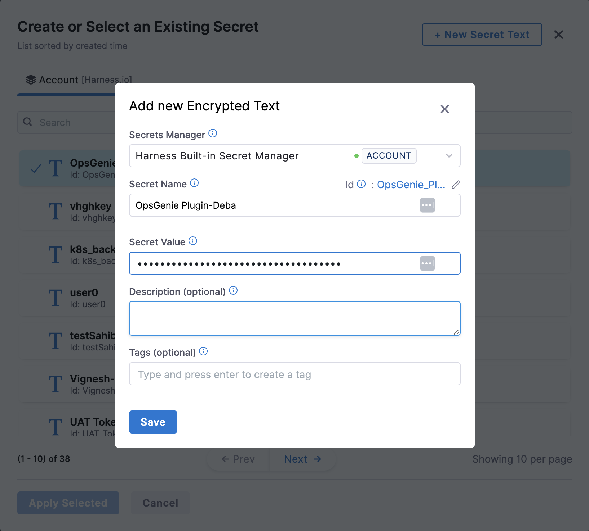
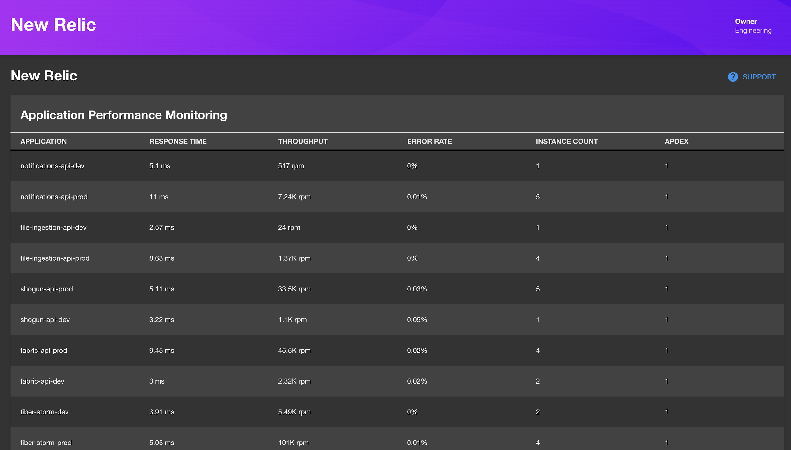

| Plugin details |                                                                                |
| -------------- | ------------------------------------------------------------------------------ |
| **Created by** | [timwheelercom](https://github.com/timwheelercom)                                                      |
| **Category**   | Monitoring                                                                        |
| **Source**     | [GitHub](https://github.com/backstage/community-plugins/tree/main/workspaces/newrelic/plugins/newrelic) |
| **Type**       | Open-source plugin                                                             |


## Configuration

### Application configuration YAML

This plugin requires a backend proxy configuration to make calls to Opsgenie with authentication.

- Under the **Plugins** tab in **Admin**, go to `app-config.yaml` and **Edit YAML** to configure your opsgenie instance in the **target** field and add your **domain** in the format as shown below.

```yaml
# app-config.yaml
proxy:
  endpoints:
    '/newrelic/apm/api':
      target: https://api.newrelic.com/v2
      pathRewrite:
        api/proxy/newrelic/apm/api?: /
      headers:
        X-Api-Key: ${NEW_RELIC_REST_API_KEY}
      allowedHeaders:
        - link
```

### Secrets

- There is some types of api key on new relic, to this use must be `User` type of key. Read more about how to find or generate this key in [New Relic's Documentation](https://docs.newrelic.com/docs/apis/get-started/intro-apis/types-new-relic-api-keys#rest-api-key).

- **Create secret in Harness** to store API token, click on “New Secret Text” and enter values as shown below.



## Layout

_No action required_

- This plugin exports a page that you can use as a **New Relic** page on the **sidenav** to view New Relic Application Performance Monitoring (APM) data such as:
    1. Application Name
    2. Response Time (ms)
    3. Throughput (rpm)
    4. Error Rate
    5. Instance Count
    6. Apdex Score
  
- Since the plugin shows all the data in a single view and is not related to any one particular service, a sidenav is more appropriate and is added by default than a tab.
 
- The following configuration is set by default in **Layout** under **Sidenav Layout** and you do not need to change anything:

```yaml
- name: SidebarItem
  props:
    to: NewRelicPage
    text: NewRelic
```



## Annotations

_Not-Required_

## Support

The plugin is owned by Backstage Community and managed in this [repository](https://github.com/backstage/community-plugins/tree/main/workspaces/newrelic/plugins/newrelic) as an open-source project. Create a GitHub issue to report bugs or suggest new features for the plugin.

