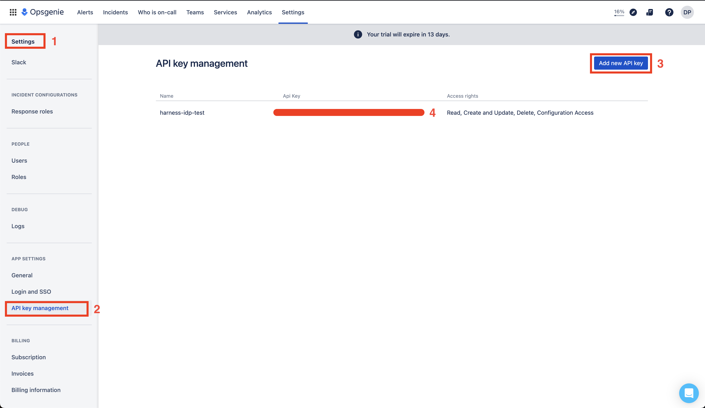

| Plugin details |                                                                                |
| -------------- | ------------------------------------------------------------------------------ |
| **Created by** | [Kévin Gomez](https://github.com/K-Phoen)                                                      |
| **Category**   | Monitoring                                                                        |
| **Source**     | [GitHub](https://github.com/K-Phoen/backstage-plugin-opsgenie/) |
| **Type**       | Open-source plugin                                                             |


## Configuration

### Application configuration YAML

This plugin requires a backend proxy configuration to make calls to Opsgenie with authentication.

- Under the **Plugins** tab in **Admin**, go to `app-config.yaml` and **Edit YAML** to configure your Opsgenie instance in the **target** field and add your **domain** in the format as shown below.

```yaml
# app-config.yaml
proxy:
    endpoints:
      '/opsgenie/api':
        target: https://api.eu.opsgenie.com
        pathRewrite:
          /api/proxy/opsgenie/api/?: /
        headers:
          Authorization: GenieKey ${OPSGENIE_TOKEN}
  
opsgenie:
  domain: https://myorganization.app.opsgenie.com/
```


### Secrets

- In your Opsgenie application Go to **Settings** under **App Settings** select **API key management** and **Add new API key**.



- **Create secret in Harness** to store API token, click on “New Secret Text” and enter values as shown below.


## Layout

1. The `OpsGeniePage` routable extension component which produces a standalone page with the following capabilities:
- view a summary of who is currently on call
- view and search a list of active alerts with the option of acknowledging or closing alerts directly from Backstage
- view and search a list of incidents
- view incident-related analytics

The following configuration needs to set by users in **Layout** under **Admin** for **Sidenav** to get the Opsgenie page. 

```yaml
- name: SidebarItem
    props:
    to: opsgenie
    text: Incidents
- name: SidebarDivider
- name: SidebarDivider
```


2. The `EntityOpsgenieAlertsCard` component which can display recent alerts for a specific component.

This plugin exports the above-mentioned card that you can show on the **Overview** tab of a service or any other layout page.  The following configuration is set by default in **Layout** under **Admin** for **Service** and you do not need to change anything:

```yaml
- component: EntityOpsgenieAlertsCard
    specs:
    gridProps:
        md: 6
- component: EntityOpsgenieOnCallListCard
    specs:
    gridProps:
        md: 6
```

## Annotations

To configure the plugin for a service in the software catalog, set one of the following annotations in its `catalog-info.yaml` definition file.

The following configuration is recommended:

```yaml
opsgenie.com/component-selector: 'tag:"service:hello_world"'
opsgenie.com/team: 'Your_team_name'
```
In the above annotation, you need to add the `tag` for your alerts and the `team name`. 


[Read more](https://github.com/K-Phoen/backstage-plugin-opsgenie/blob/master/docs/index.md#usage)

## Support

The plugin is owned by Kévin Gomez and managed in this [repository](https://github.com/K-Phoen/backstage-plugin-opsgenie/) as an open-source project. Create a GitHub issue to report bugs or suggest new features for the plugin.

